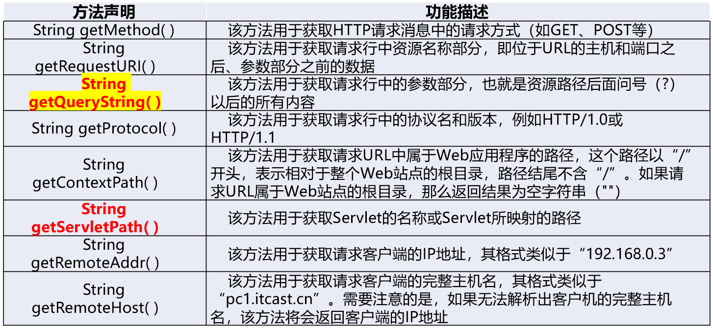

# JSP内置对象

## JSP动作元素

### 包含文件元素<jsp:include >


**与include指令的区别**


### 请求转发元素<jsp:forward >

<jsp:forward >动作元素可以将当前请求转发到**其他Web资源（HTML页面、JSP页面和Servlet等）**，执行请求转发之后，**语句之后的代码将不再执行**，而是执行该元素指定的目标页面。语法格式如下： 

```jsp
<jsp:forward page="relativeURL"/><!--page属性用于指定请求转化到的资源的路径-->
```

```jsp
<jsp:forward page="data.jsp">    
    <jsp:param name="username" value="admin"/><!--携带参数username，值为admin，可通过EL表达式获取-->
</jsp:forward>
```

**特点**：执行后不会再执行后面的代码，而且**跳转后地址不会改变**

## JSP隐式对象

在JSP页面中，有一些对象需要频繁使用，如果每次都重新创建这些对象则会非常麻烦。为了简化Web应用程序的开发，JSP2.0规范中提供了9个隐式（内置）对象，它们是**JSP默认创建**的，可以直接在JSP页面中使用。


## HttpServletRequest对象

### request

request主要用于处理客户端请求（可以通过request将一个页面的数据递到另外一个页面）


### request对象获取请求行信息




### request对象获取请求头信息

获取HTTP请求头字段的方法


### request对象传递数据

通过**request对象传递数据**


### request对象请求转发

**getRequestDispatcher()方法**

JSP之间可以相互跳转，利用JSP的跳转使用请求转发可以很容易地把一项任务按模块分开，例如，使用一个JSP实现用户登录，然后可以携带登录信息跳转到另外一个JSP实现用户资料修改。 JSP的请求转发要通过**RequestDispatcher接口的实例对象**实现。HttpServletRequest接口提供getRequestDispatcher()方法获取**RequestDispatcher对象**。

getRequestDispatcher()方法返回封装了某条路径所指定资源的**RequestDispatcher对象**。

注意：

1. 参数path如果以"/"开头，用于表示当前Web应用的根目录。**（同级目录直接写名称）**
2. WEB-INF目录中的内容对RequestDispatcher对象也是可见的

**forword()方法**


获取到RequestDispatcher对象后，如果当前Web资源不想处理请求，RequestDispatcher接口提供了一个forward()方法，该方法可以**将当前请求传递给其他 Web 资源对这些信息进行处理并响应给客户端**，这种方式称为请求转发。forward()方法的具体格式如下所示：

```jsp
forward(ServletRequest request,ServletResponse response)<!--forward()方法用于将请求从一个页面传递给另一个Web资源。该方法必须在响应提交给客户端之前被调用，否则将抛出IllegalStateException异常。-->
```

```jsp
<%
    request.setAttribute("username", "张三");//将数据存储到request对象中
    RequestDispatcher dispatcher = request.getRequestDispatcher("/Demo3/forward.jsp");//创建RequestDispatcher实例化对象dispatcher
    dispatcher.forward(request,response);//调用对象方法forward()
%>
<!--精简写法：request.getRequestDispatcher("/Demo3/forward.jsp").forward(request,response);-->
```

forward.jsp

```jsp
<%
    String username = (String) request.getAttribute("username");
    if (username != null) {
        out.println("用户名：" + username + "<br/>");//getRequestDispatcher()方法获取RequestDispatcher对象
    }
%>
```


注意：地址栏中显示data.jsp的请求路径，浏览器却显示 forward.jsp中要输出的内容。此**请求转发是发生在服务器内部**的行为，所以地址栏依旧是data.jsp，从data.jsp 到 forward.jsp 属于一次请求，在一次请求中可以使用request属性进行数据共享。

### request对象请求数据


pa1.jsp

```jsp
<p align="center">请输入注册信息</p>
    <div align="center">
    <form action="pa2.jsp" method="post">
        用户名：<input type="text" name="username"><br>
        密  码:<input type="password" name="password"><br>
        <br>信息来源:<input type="checkbox" name="mass" value="报刊">报刊
        <input type="checkbox" name="mass" value="网络">网络
        <input type="checkbox" name="mass" value="朋友推荐">朋友推荐
        <input type="checkbox" name="mass" value="电视">电视
        <input type="submit" name="submit" value="提交"><!--转发后地址会变，且会自动生成request对象，通过getParameter方法获取值-->
        <input type="reset" name="reset" value="重置">
    </form>
    </div>
```

pa2.jsp

```jsp
<p align="center">你输入的注册信息</p>
    <%
        request.setCharacterEncoding("UTF-8");//request对象处理中文乱码，如果需要继续转发出去，则每一级都要声明正确的编码
    String username=request.getParameter("username");
    String password=request.getParameter("password");
    String[] mass=request.getParameterValues("mass");
    %>
    <p align="center">用户名<%=username%></p>
    <p align="center">密码<%=password%></p>
    <p align="center">
    <%
        out.println("信息来源:");
        for (int i = 0; i <mass.length ; i++) {
            out.println(mass[i]+" ");
        }
    %>
    </p>
```


### request对象处理中文乱码

```jsp
<%request.setCharacterEncoding("UTF-8");//request对象处理中文乱码，对于post方式需要写在变量前面，但get任何位置全局生效，适用于post和get
new String(name.getBytes("iso-8859-1"), "utf-8");//手动声明编码方法，定义一个变量后全局变量生效不支持post，只适用于get
```
