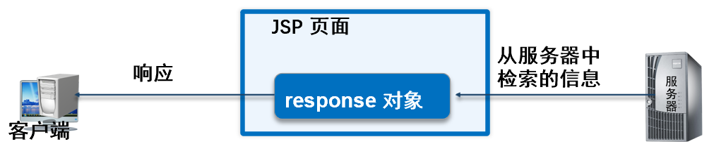
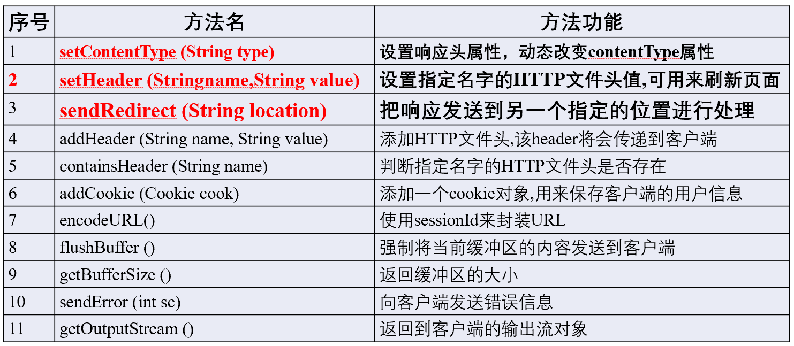
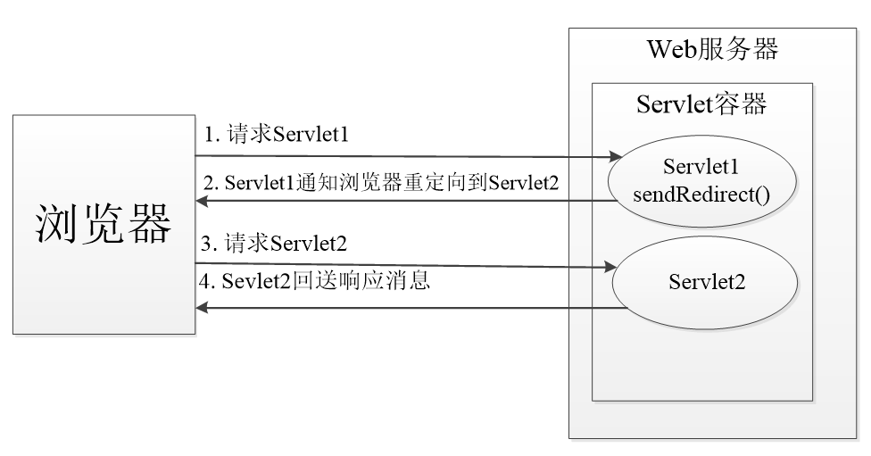
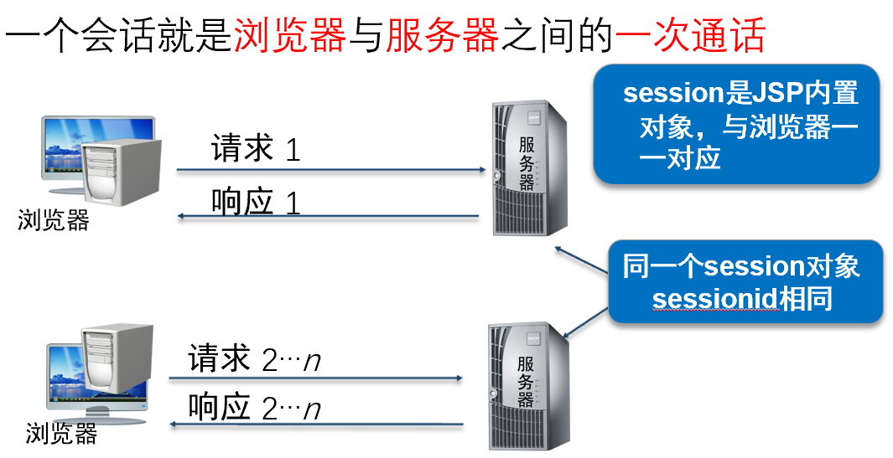
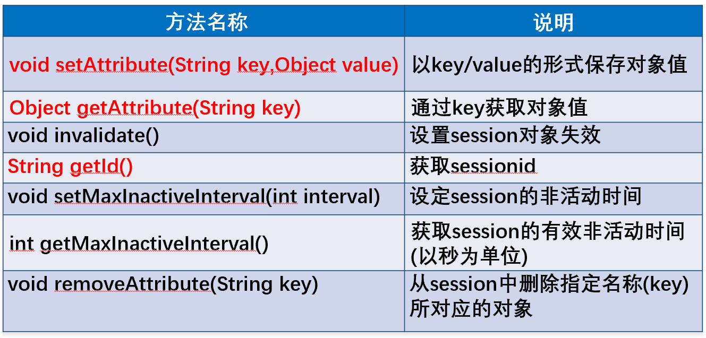
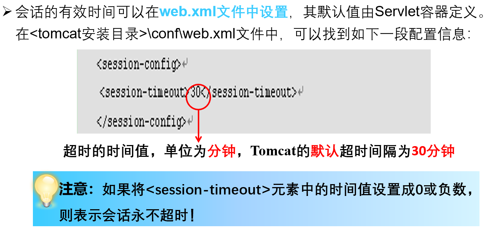
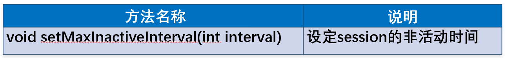
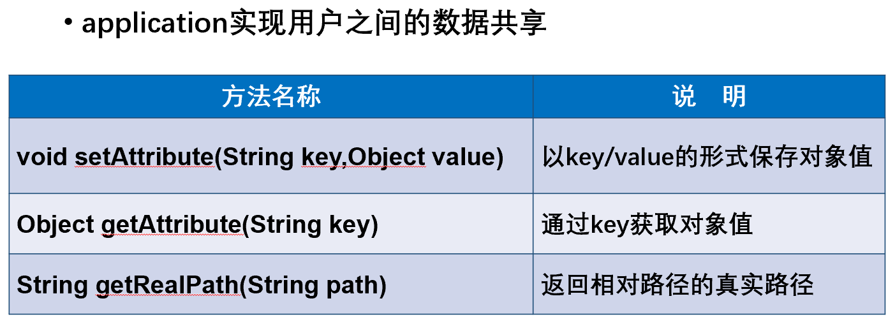
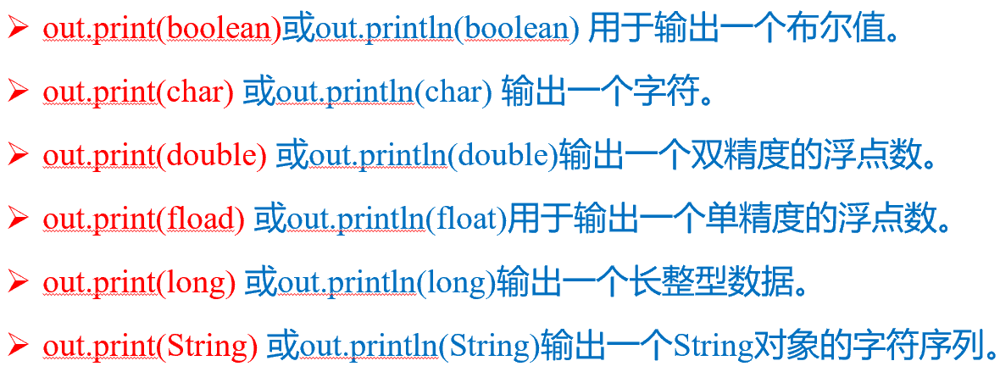
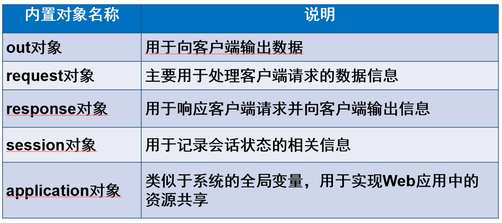

# JSP隐式对象

## Response对象

Response是和应答相关的HttpServletResponse接口类的一个对象，它**封装了服务器对客户端的响应**，然后被发送到客户端以响应客户请求。HttpServletResponse对象具有页面作用域。



**常用方法**



### 设置响应头属性

**setContentType(String type)**：可以动态改变contentType的属性值，参数type可取text/html、application/x-msexcel、application/msword。

### 应用Response对象刷新页面

**setHeader(String name,String value)**：可以用来定时刷新界面**(地址会改变)**

```jsp
<%
	response.setHeader("Refresh","3,pa2.jsp");//这里是3秒后跳转到pa2.jsp如果是("Refresh,"3")则默认跳转到自身
%>
```

### 应用Response对象实现重定向

在某些情况下，当响应客户时，需要将客户重新引导至另一个页面，可以使用response对象的sendRedirect(URL)方法实现客户的重定向。

所谓请求重定向，指的是Web服务器接收到客户端的请求后，可能由于某些条件限制，**不能访问当前请求URL所指向的Web资源**，而是**指定了一个新的资源路径**，让客户端重新发送请求。



## HttpSession对象

会话：会话可简单理解为：用户开一个浏览器，点击多个超链接，访问服务器多个web资源，然后**关闭浏览器**，整个过程称之为一个会话。每个用户与服务器进行交互的过程中，各自会有一些数据，**程序要想办法保存每个用户的数据**。



每个session对象都与浏览器一一对应 ，**重新开启一个浏览器**，**相当于重新创建一个session对象**（版本不同可能有所差别）

常用方法：



### Session超时管理

Web服务器采用了**超时管理来判断客户端**是否存在！在一定时间内，如果某个客户端一直没有请求访问，那么，Web服务器会认为客户端已经结束请求，将对应的Session对象变成垃圾对象，并**进行清除**。反之，Web服务器会创建一个新的Session对象，并分配一个新的ID属性。





## Application对象

常用方法：



**session与application的区别**

一个用户对应着一个session，并且随着用户的离开session中的信息也会消失。而application则不同，**它从服务器启动后就一直存在**，类似于系统的“全局变量”，而且有且只有一个实例。

## Out对象

out对象是一个输出流，用来向用户端输出数据



**方法println和print的区别：**

- println会向缓存区写入一个换行，而print不写入换行。但是浏览器的显示区域**目前不识别println写入的换行**，如果希望浏览器显示换行，应当向浏览器写入<"br">实现换行。
- **`System.out.print`输出结果会显示在控制台，`out.println`输出结果显示在页面**
- `resp.getWrite().println()`直接讲内容输出在一个新的页面（**后续的代码还会继续执行**）（**需要指定浏览器编码方式**`res.setContentType("text/html;charset=utf-8");`）

## 小结


