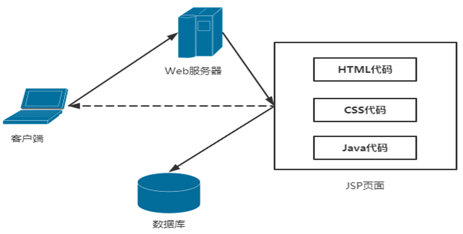
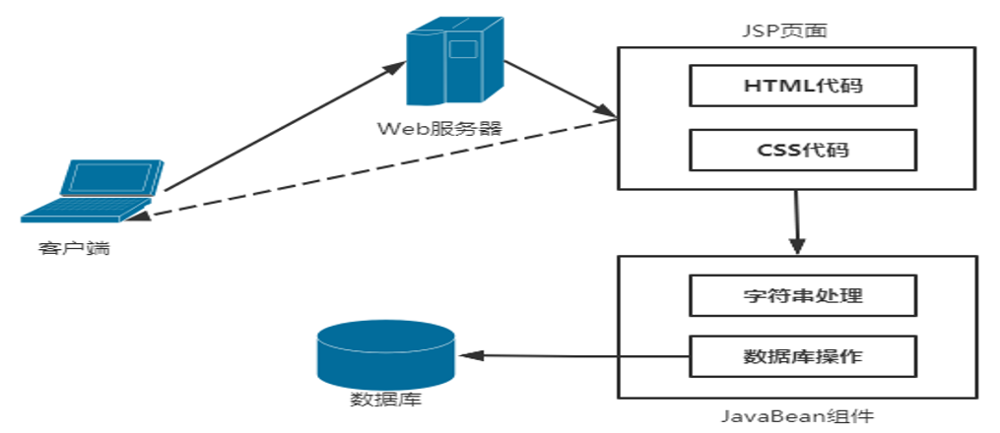
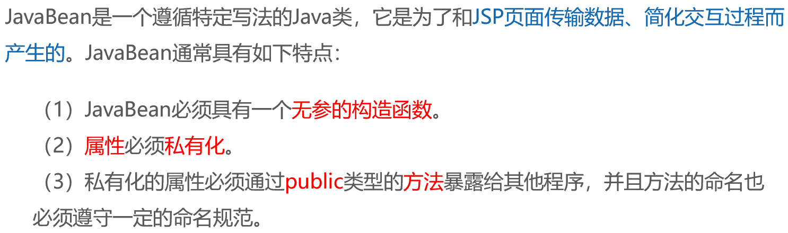
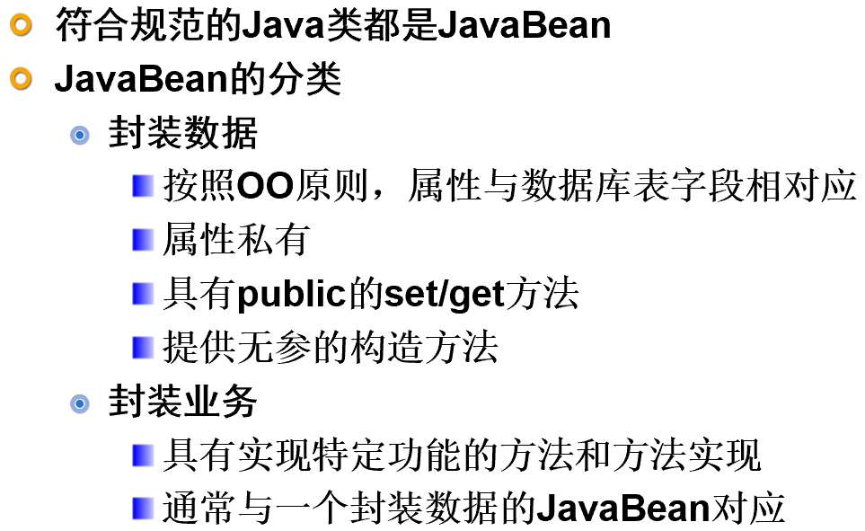
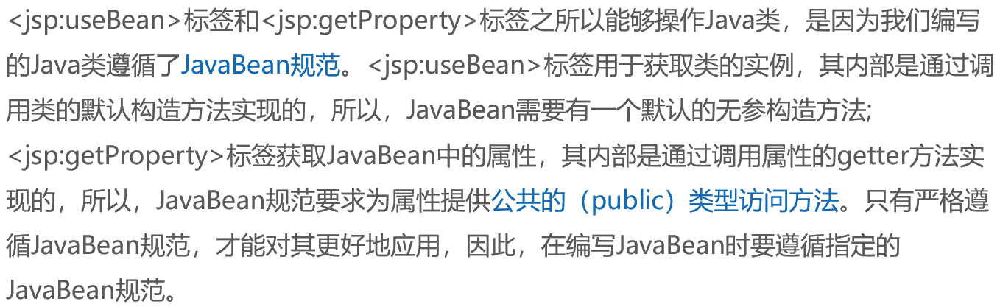
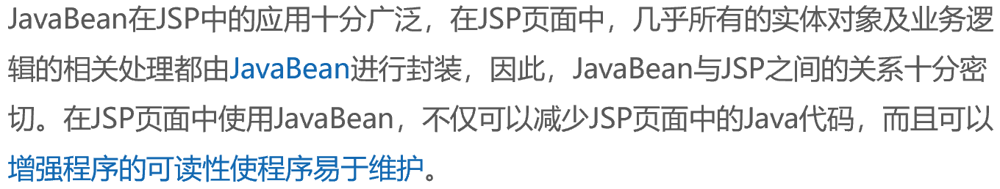
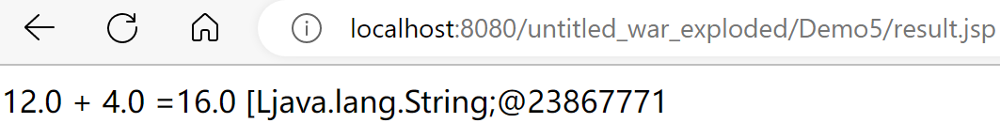

# JavaBean技术

在Java Web的实际开发中，为了使得JSP页面中的业务逻辑变得更加清晰，程序中的**实体对象**和**业务逻辑**可以单独封装到Java类中，提高程序的可读性和易维护性，需要用到JavaBean技术等相关知识。

## JavaBean的概念

在JSP网页开发的初级阶段，需要将Java代码嵌入到网页中，对JSP页面中的一些业务逻辑进行处理，如字符串、数据库操作等。



早期的JSP开发流程看似简单，但这种开发方式将大量的Java代码嵌入到JSP页面中，必定会给修改和维护带来一定的困难，因为在JSP页面中包含**HTML代码、CSS代码、Java代码**等，同时再加入**业务逻辑处理代码**，既不利于页面编程人员的设计，也不利于Java程序员对程序的开发，而且将Java代码嵌入到页面中，**不能体现面向对象的开发模式**，达不到代码的重用。

如果使HTML代码与Java代码相分离，将**Java代码单独封装成为一个处理某种业务逻辑的类**，然后在JSP页面中调用此类，可以**降低HTML代码与Java代码之间的耦合度**，简化JSP页面。提高Java程序代码的重用性及灵活性。这种与HTML代码相分离，而使用Java代码封装的类，就是一个JavaBean组件。在Java Web开发中，可以使用JavaBean组件完成业务逻辑的处理。



## JavaBean特点



**JavaBean的优势**

- 解决代码重复编写，减少代码冗余
- 功能区分明确，避免业务逻辑处理与页面显示处理集中在一起造成混乱
- 提高了代码的维护性

## JavaBean的种类



**封装数据的JavaBean**

Student.java

```java
package Demo6;

public class Student {
    private String name;	   	// 姓名
    public Student  () {    }	//得有无参构造方法
    public void setName(String name) {
        this. name = name;
    }
    public String getName() {
        return name;
    }
}
```

```jsp
<%@ page import="Demo6.Student" %>
<%
    //使用JavaBean
    Student student = new Student();
    student.setName("lucy");
    String  name = student.getName();
    out.print("姓名是："+name);//-->名字是lucy
%>
```

在JavaBean对象中，为了防止外部直接对JavaBean属性的调用，通常将JavaBean中的**属性设置为私有的（private）**，但需要为其**提供公共的（public）访问方法**，也就是getter方法。

## <jsp:useBean >标签和<jsp:getProperty >标签操作Java类

```jsp
<jsp:useBean id="bean的名字" class="创建beans的类"  scope="bean有效范围"/>
或
<jsp:useBean id= "bean的名字" class="创建beans的类"  scope= "bean有效范围">
</jsp:useBean>
<!--例如：<jsp:useBean id="student" class="com.hnisc.Student"></jsp:useBean>-->
```

```java
public class Student {
    private String name = "张三";
    private int age = 20;
    private String sex = "男";
    public String getName() {
        return name;
    }
    public int getAge() {
        return age;
    }
    public String getSex() {
        return sex;
    }
}
```

```jsp
<body>
<jsp:useBean id="student" class="Demo6.Student"/><!--使用useBean不需要导包的，这里创建了一个类student，会调用默认的构造方法，如果没有会报错--></jsp:useBean>
<div>
    <ul>
        <li>姓名：<jsp:getProperty name="student" property="name"/></li><!--姓名：张三-->
        <li>年龄：<jsp:getProperty name="student" property="age"/></li><!--年龄：20-->
        <li>性别：<jsp:getProperty name="student" property="sex"/></li><!--性别：男-->
    </ul>
</div>
```



## 使用JavaBean属性赋值

如果JavaBean提供了setter方法，在JSP页面中就可以通过<jsp:setProperty >标签对其属性进行赋值

```jsp
<jsp:useBean id="student" class="Demo6.Student"/>
<jsp:setProperty name="student" property="name" value="小明"/>
<jsp:setProperty name="student" property="age" value="18"/>
<jsp:setProperty name="student" property="sex" value="男"/>
```



```jsp
<jsp:setProperty name="student" property="*"/><!--命名相同时(input的name和类的属性名称一致时)，会将submit提交的数据对类的属性进行设置-->
```

Computer.java

```java
package Demo5;
public class Computer{
    public Computer(){
    }
    private double numberOne;
    private double numberTwo;
    private String operator="+";
    private double result;
    private String[] mas;
    public double getResult(){
        if ("+".equals(operator))
            result=numberOne+numberTwo;
        else if ("-".equals(operator))
            result=numberOne-numberTwo;
        else if ("*".equals(operator))
            result=numberOne*numberTwo;
        else if ("/".equals(operator))
            result=numberOne/numberTwo;
        return result;
    }

    public void setResult(double result) {
        this.result = result;
    }

    public double getNumberOne() {
        return numberOne;
    }

    public void setNumberOne(double numberOne) {
        this.numberOne = numberOne;
    }

    public double getNumberTwo() {
        return numberTwo;
    }

    public void setNumberTwo(double numberTwo) {
        this.numberTwo = numberTwo;
    }

    public String getOperator() {
        return operator;
    }

    public void setOperator(String operator) {
        this.operator = operator;
    }

    public String[] getMas() {
        return mas;
    }

    public void setMas(String[] mas) {
        this.mas = mas;
    }
}
```

computer.jsp

```jsp
<body>
    <form action="result.jsp" method="post" name="form">
        <input type="text" name="numberOne" size="5"><!--表单中提交的属性和Java中的属性名字保持一致就将setProperty的Property设置为"*"-->
        <select name="operator">
            <option value="+">+</option>
            <option value="-">-</option>
            <option value="*">*</option>
            <option value="/">/</option>
        </select><input type="text" name="numberTwo" size="5"><br>
        <input type="checkbox" name="mass" value="网络">网络
        <input type="checkbox" name="mass" value="朋友推荐">朋友推荐
        <input type="checkbox" name="mass" value="电视">电视
        <p><input type="submit" value="提交" name="submit"></p>
    </form>
</body>
<!--如果名字不同，则需要使用到param属性将JSP表单的属性(param)为Java的属性(property)赋值，赋值后可以通过getProperty方法输出(property)
例如：<jsp:setProperty name="computer" property="mas" param="mass"/>其中mas为Java的属性名，mass为JSP表单提交的属性名-->
```

result.jsp

```jsp
<body>
    <%request.setCharacterEncoding("UTF-8");%>
    <jsp:useBean id="computer" class="Demo5.Computer"/>
    <jsp:setProperty property="*" name="computer"/>
    <jsp:setProperty name="computer" property="mas" param="mass"/>
    <jsp:getProperty name="computer" property="numberOne" />
    <jsp:getProperty name="computer" property="operator"/>
    <jsp:getProperty name="computer" property="numberTwo"/>
    =<jsp:getProperty name="computer" property="result"/>
    <jsp:getProperty name="computer" property="mas"/><!--可以成功将值传递过去，但是这里因为get方法只能获取到数组地址-->
</body>
```


