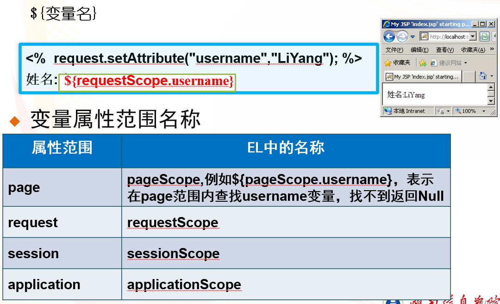

# EL表达式和JSTL

## EL表达式简介

EL即为Expression Language(表达式语言)，可以用于**替代JSP页面中的复杂代码**。EL得到某个数据时可以**自动转化类型**，而且使用简单

```jsp
${EL exprission}<!--使用变量名获取值/获取对象的属性值/获取集合。值得注意的是，当找不到对应属性时或者属性值为空时，不会报错后者输出null，直接为空-->
```

## 获取get方法和post方法提交过来的值

**`param`和`paramValues`获取input表单中提交过来的数据)**

## 使用变量名获取值



## 获取对象的属性值


## Java语句和EL表达式的通讯

- 通过`<c:set scope="page" value="<%=name%>" var="name"/>`设置，再通过`${pageScope.name}`获取
- 通过`setAttribute()`方法

test.jsp

```jsp
<%
    request.setAttribute("80","page属性范围");//一般推荐纯英文设置为关键字
    pageContext.setAttribute("info", "page属性范围");
    request.setAttribute("info", "request属性范围");
    session.setAttribute("info", "session属性范围");//与后面的<c:set var="info" value="session属性范围" scope="session"/>设置效果一致
    application.setAttribute("info", "application属性范围");
%>
<h2>不同属性范围的值</h2>
<hr />
使用数值做关键字：${requestScope["80"]}<!--当要存取的属性名称中包含一些特殊字符，如.或–等并非字母或数字的符号，只能使用这种方法-->
<br>不指定范围：${info}<!--默认为“最近”的-->
<br> page 属性内容：${pageScope.info}<!--等同于pageScope["info"]-->
<br> request 属性内容：${requestScope.info}
<br>session 属性内容：${sessionScope.info}
<br>application 属性内容：${applicationScope.info}
</body>
<!--EL输出一个常量的话，字符串要加双引号，不然的话EL会默认把你认为的常量当做一个变量来处理-->
```


## 获取集合

List


Map


## 操作符

**关系操作符**


**逻辑操作符**


**Empty操作符**


## EL隐式对象


test.jsp

```jsp
<body>
    <form action="test1.jsp" method="post">
        输入名字：<input type="text" name="name"/><br>
        性别为：<select name="sex">
            <option value="男">男</option>
            <option value="女">女</option>
        </select>
        <input type="checkbox" name="mass" value="唱">唱
        <input type="checkbox" name="mass" value="跳">跳
        <input type="checkbox" name="mass" value="rap">rap
        <input type="submit" name="submit" value="提交">
    </form>
</body>
```

test1.jsp

```jsp
<body>
    <%
        request.setCharacterEncoding("UTF-8");
    %>
    获取到的名字：${param.name}<br>
    获取到的性别：${param.sex}<br>
    获取到的爱好：${paramValues.mass[0]}${paramValues.mass[1]}${paramValues.mass[2]}
</body>
```


# JSTL

## 通用标签

使用EL表达式可以简化JSP页面代码，EL表达式可以访问JavaBean的属性，但是并不能实现在**JSP中进行逻辑判断**，因而要使用**JSTL标签**。


**JSTL标准库内的标签**


### <c:out >语法


```jsp
<%@ taglib prefix="c" uri="http://java.sun.com/jsp/jstl/core" %>
<body>
    <c:out value="Hello JSP 2.0 !! " /> <br/>
    <c:out value="${ 3 + 5 }" /> <br/><!--直接进行运算并输出-->
    <c:out value="${ param.data }" default="No Data" /> <br/><!--value的值为空，显示default中的内容-->
    <c:out value="<B>有特殊字符</B>" /> <br/>
    <c:out value="<B>有特殊字符</B>" escapeXml="false" /><!--为false时对value中的特殊字符进行转换-->
</body>
```


### <c:set >语法


设置变量后需使用**${}输出**或者**Java语句的getAttribute方法**输出(在**重定向跳转时仅限于同文件**)

### <c:remove >语法


### 小结


## 条件标签

### <c:if >语法

实现Java中的if功能


- <c:if > 标签必须要有test属性，当test中的表达式结果为true时，则会执行本体内容；如果为false，则不会执行。

- <c:if >的本体内容除了能放纯文字，还可以放任何JSP程序代码(Scriptlet)、JSP 标签或者HTML码

```jsp
<!--布尔类型-->
<c:if test="${!requestScope.result}"><!--EL表达式会自动匹配类型，这里对布尔类型的result进行取反操作-->
        操作失败（存在数据输入为空的情况）
        <a href="/untitled_war_exploded/findServlet">返回用户列表</a>
    </c:if>
<!--字符串类型-->
<c:if test="${requestScope.username eq 'admin'||'Admin'}"><!--这里eq就是判断两者是否相等的，还可以使用逻辑运算符，注意这里字符串是单引号，而且不会输出-->
        欢迎你${requestScope.username}
    </c:if>
<!--int类型-->
<c:if test="${requestScope.index % 2 == 0}">
        index为偶数
</c:if>
```

### <c:choose >语法

实现Java语言中if-else if-else语句的功能


### <c:when >语法


### <c:otherwise >语法


## 迭代标签

### <c:forEach >语法


```jsp
<table border="1">
        <tr>
            <td>ID</td>
            <td>用户名</td>
            <td>密码</td>
            <td>邮箱</td>
            <td>出生日期</td>
            <td>操作</td>
        </tr>
        <c:forEach var="user" items="${requestScope.userList}"><!--循环输出链表，注意只能是链表，不能是对象-->
        <tr>
            <td>${user.id}</td><!--这里调用的是JavaBean的set和get方法，变量命名是小写开头没问题，如果是大写反而会反转成小写，调用Set和Get方法时会出问题，一定注意-->
            <td>${user.name}</td>
            <td>${user.password}</td>
            <td>${user.email}</td>
            <td>${user.birthday}</td>
        </tr>
        </c:forEach>
    </table>
```

**指定迭代次数**


test.jsp

```jsp
<form action="test1.jsp" method="post">
        输入名字：<input type="text" name="name"/><br>
        性别为：<select name="sex">
            <option value="男">男</option>
            <option value="女">女</option>
        </select>
        <input type="checkbox" name="mass" value="唱">唱
        <input type="checkbox" name="mass" value="跳">跳
        <input type="checkbox" name="mass" value="rap">rap
        <input type="submit" name="submit" value="提交">
    </form>
```

test1.jsp

```jsp
<%
        request.setCharacterEncoding("UTF-8");
        int a = 10;
    %>
    获取到的名字：${param.name}<br><!--param适用于获取表单信息-->
    获取到的性别：${param.sex}<br>
    <c:set var="n" value="0" scope="page"/>
    获取到的爱好：<c:forEach begin="1" end="3" step="1">
        ${paramValues.mass[n]}
        <c:out value="<!--${n=n+1}-->" escapeXml="false"/><!--通过对特殊字符的转换注释对n的输出-->
    </c:forEach>
```

