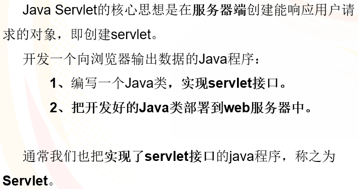
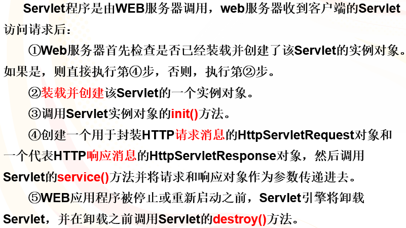
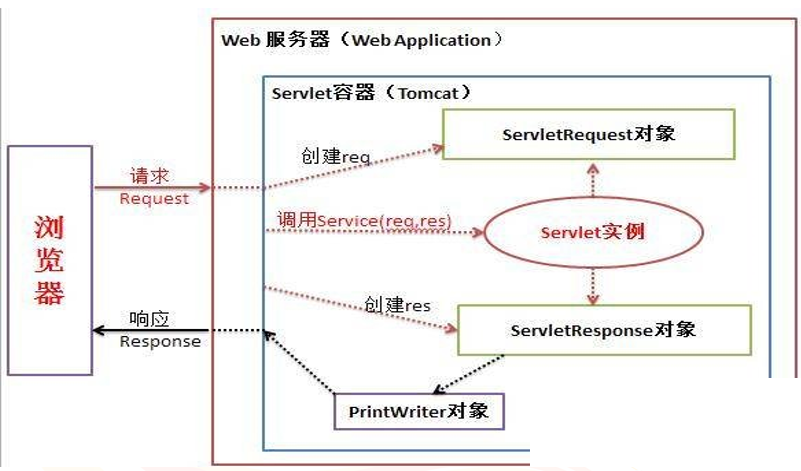
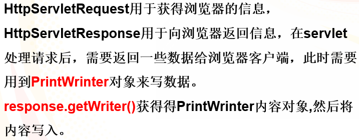
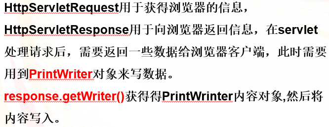
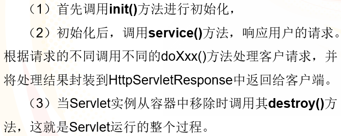
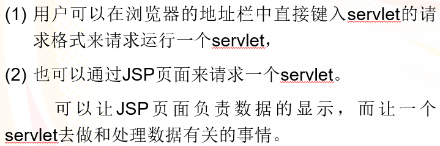
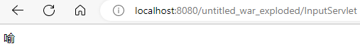
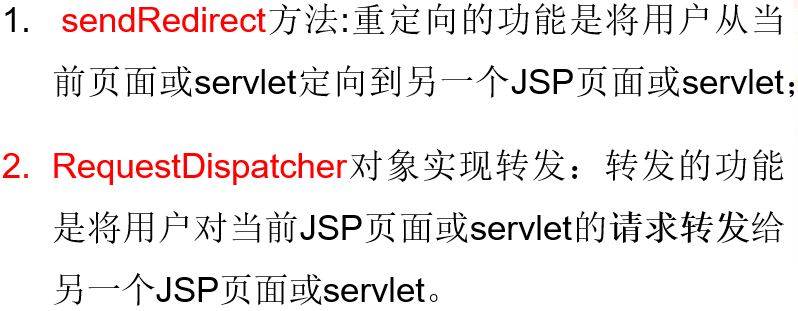
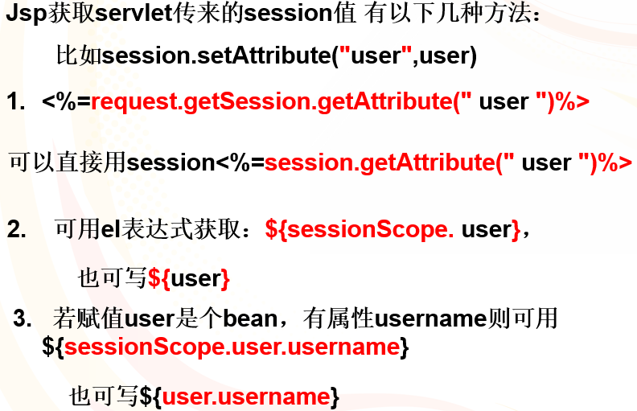

# Servlet开发

## Servlet简介



## Servlet运行过程





## Servlet类的创建

开发servlet就可以有三种方法：

1. **直接实现interface**：servlet
2. 自**GenericServlet继承**
3. 自**HttpServlet继承**，重写service方法，也可以重写doGet()和doPost()方法



### 编写部署文件web.xml

```xml
<servlet>
        <servlet-name>InputServlet</servlet-name><!--注册名称-->
        <servlet-class>servlet.InputServlet</servlet-class><!--完整的类名，真实src下文件位置-->
    </servlet>
    <servlet-mapping>
        <servlet-name>InputServlet</servlet-name><!--注册名称-->
        <url-pattern>/InputServlet</url-pattern><!--Servlet的对外访问路径，默认挂载地址为虚拟映射地址加这里的url，所以这里为http://localhost:8080/untitled_war_exploded/InputServlet-->
    </servlet-mapping>
```

### 注解配置@WebServlet

```jsp
@WebServlet(name = "InputServlet",urlPatterns = "/InputServlet")    //与web.xml的写法效果一致，而且会根据文件目录自动生成<servlet-class>信息，更加自动化，不过优先级比web.xml要低
```

### HttpServlet



```java
	res.setContentType("text/html;charset=utf-8");// 请求浏览器转换为中文编码
	PrintWriter pw=response.getWriter();//PrintWriter对象用于servlet输出(从根本上输出代码控制页面)
	pw.println("<script>alert('更新成功');location.href='path';</script>");//跳出提示内容后点击确定就会跳转到对应页面，为重定向方式
```

**JSPWriter与PrintWriter的关系**

- JspWriter可以在JSP页面中**直接用out对象输出**，可以用pageContext.getOut();得到JspWriter对象。PrintWrietr在JSP页面中必须用response.getWriter();方法得到其对象。**二者作用域不同**。
- **PrintWriter中的数据会输出在JspWriter前面**。(如果将JspWriter实例化后调用flush()方法就可以达到及时刷新缓冲区的目的)

## Servlet生命周期



## 通过JSP页面访问servlet



**每次修改Java代码，需要重启才能生效**

input.jsp

```jsp
<body>
<form action="/untitled_war_exploded/InputServlet" method="post"><!--jsp文件没有放在Web的直接目录下，而是Web的子目录下，所以这里需要加入虚拟映射地址来写绝对路径，当然还可以使用相对路径../InputServlet-->
    请输入你想显示的内容：
    <input type="text" name="input" />
    <br>
    <input type="submit" value="提交" />
    <input type="reset" value="重置" />
</form>
</body>
```

InputServlet.java

```java
package servlet;

import javax.servlet.annotation.WebServlet;
import javax.servlet.http.HttpServlet;
import java.io.*;
import javax.servlet.*;
import javax.servlet.http.*;
@WebServlet(name = "InputServlet",urlPatterns = "/InputServlet")    //与web.xml的写法效果一致
public class InputServlet extends HttpServlet{
    protected void service(HttpServletRequest req, HttpServletResponse res)//重写了service方法
            throws ServletException, IOException {
        req.setCharacterEncoding("utf-8"); // 响应内容转换为中文编码
        res.setContentType("text/html;charset=utf-8");// 请求浏览器转换为中文编码
        String input=req.getParameter("input");// 取出表单提交的内容
        PrintWriter pw=res.getWriter();// 得到PrintWriter对象
        pw.println("<html><head><title>");
        pw.println("显示输入内容");
        pw.println("</title><body>");
        pw.println(input);
        pw.println("</body></html>");
    }
}
//这里使用PrintWriter方法servlet是会直接返回给浏览器代码的，为了显示的规范，是需要告诉浏览器一定配置信息和HTML代码
```



## 通过超链接访问servlet

```jsp
<a href="/untitled_war_exploded/InputServlet">点击</a>
```

## doGet和doPost方法

如果**不写service()方法**。可以在Servlet类中**重写doPost或doGet方法**来响应用户的请求，这样可以增加响应的灵活性，并**降低服务器的负担**。

如果不论用户请求类型是post还是get，服务器的处理过程完全相同，那么可以**只在doPost方法中编写处理过程**，而在**doGet方法中再调用doPost方法**即可，反之同理

## 重定向和转发



重定向方法仅仅是将用户从当前页面或servlet定向到另一个JSP页面或servlet，但**不能将用户对当前页面或servlet的请求（HttpServletRequest对象）转发给所定向的资源**。也就是说，重定向的目标页面或servlet无法使用request获取用户提交的数据。

## 使用session

HttpServletRequest对象request调用getSession方法获取用户的session对象：

```jsp
HttpSession session=request.getSession(true);
```

## 关于读取servlet传来的session值



test.jsp

```jsp
<body bgcolor="pink">
<form action="/untitled_war_exploded/LoginServlet" method="post" name="form1"><br/>
    用户名：<input type="text" name="username" size="12"/><br/><br/>
    密&nbsp;码：
    <input type="password" name="password" size="12"/><br/><br/>
    <input type="submit"  value="登录"/>
    <input type="reset"   value="重置"/>
</form>
</body>
```

LoginServlet.java

```java
package servlet;

import javax.servlet.ServletException;
import javax.servlet.annotation.WebServlet;
import javax.servlet.http.HttpServlet;
import javax.servlet.http.HttpServletRequest;
import javax.servlet.http.HttpServletResponse;
import java.io.IOException;
@WebServlet(name = "LoginServlet",urlPatterns = "/LoginServlet")
public class LoginServlet extends HttpServlet {
    public void doGet(HttpServletRequest request, HttpServletResponse response) throws ServletException, IOException, IOException, ServletException {
        //获得用户名与密码
        String username = request.getParameter("username");
        String password = request.getParameter("password");
        //判断用户名与密码是否正确
        if("admin".equals(username)&&"123".equals(password)){
            //重定向：response.sendRedirect("/servlet/result.jsp");在welcome.jsp页面获不到值
            /*转发:1.直接转发在welcome.jsp页面用<%=request.getParameter("username")%>可以获得用户名
			2.用request.setAttribute()方法保存，在跳转后的页面可以用EL表达式${requestScope.username}获得*/
            request.setAttribute("username", username);
            request.getRequestDispatcher("/servlet/result.jsp").forward(request,
                    response);//转发
        }else{
            response.sendRedirect("/untitled_war_exploded/servlet/result.jsp");//重定向
        }
    }
    public void doPost(HttpServletRequest request, HttpServletResponse response) throws ServletException, IOException {
        doGet(request, response);
    }
}
```

result.jsp

```jsp
<body>
    <c:if test="${requestScope.username eq 'admin'}"><!--这里eq就是判断两者是否相等的，注意这里字符串是单引号，而且不会输出-->
        欢迎你${requestScope.username}
    </c:if>
    <c:if test="${empty requestScope.username}"><!--这里empty用来判断是否为空-->
        用户名或密码错误
    </c:if>
</body>
```

