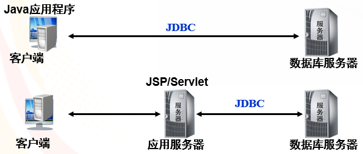
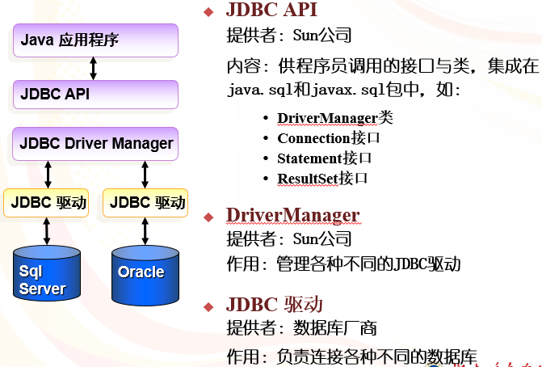
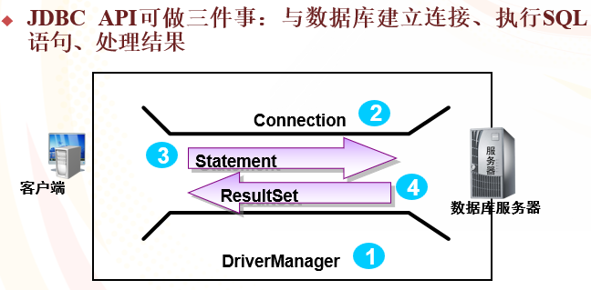
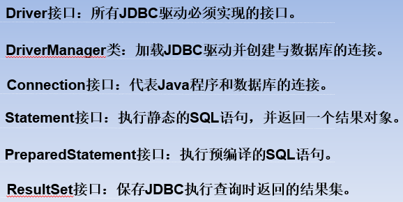
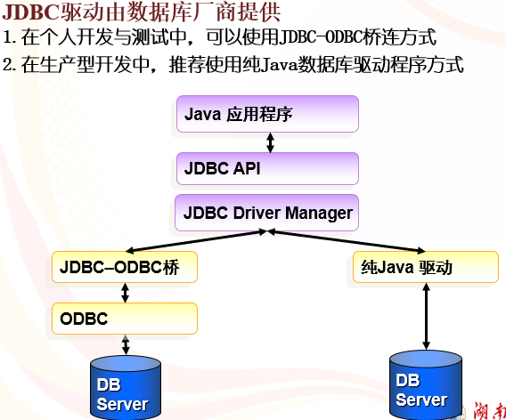
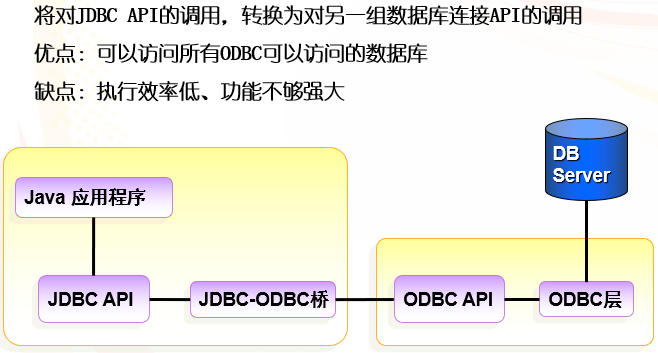
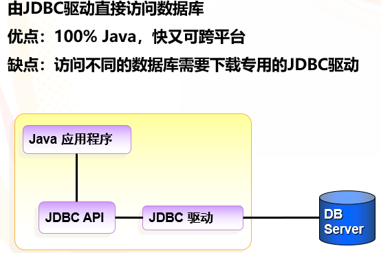
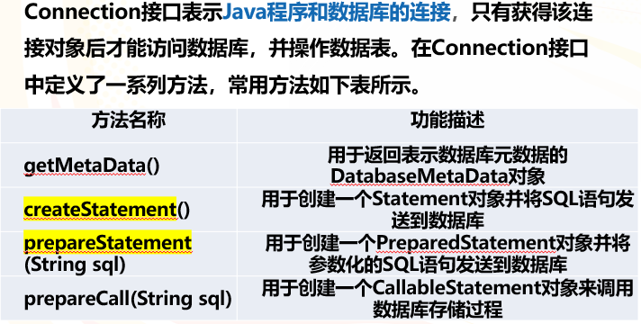
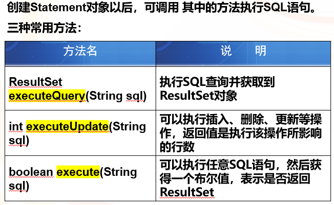
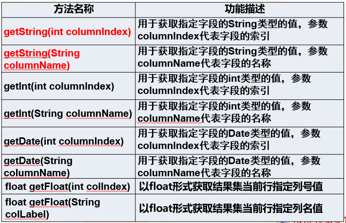

# JDBC基本概念

## JDBC作用原理

JDBC(java database connectivity)是Java数据库连接技术的简称，提供**连接各种常用数据库的能力**。



## JDBC工作原理



## JDBC常用API





## JDBC连接方式

1. 加载并注册数据库驱动。
2. 通过DriverManager获取数据库连接。
3. 通过Connection对象获取Statement对象。
4. 使用Statement执行SQL语句。
5. 操作ResultSet结果集。
6. 关闭连接，释放资源。



## JDBC-ODBC桥方式



## 纯Java驱动



### 不同数据库的驱动方式

Microsoft SQLServer

```jsp
driver="com.microsoft.sqlserver.jdbc.SQLServerDriver";
url="jdbc:sqlserver://localhost:1433;DatabaseName=eshop";<!--eshop指代数据库名称-->
```

Oracle

```jsp
driver="oracle.jdbc.driver.OracleDriver";
url="jdbc:oracle:thin:@dbip:port:databasename";<!--port表示端口号，databasename为数据库名称-->
```

Mysql5.5及之前

```jsp
driver="com.mysql.jdbc.Driver";
url="jdbc:mysql://localhost:3306/eshop";
```

Mysql5.6及之后

```jsp
driver="com.mysql.cj.jdbc.Driver";
url="jdbc:mysql://localhost:3306/eshop?serverTimezone=GMT%2B8&characterEncoding=UTF-8";
或
url="jdbc:mysql://localhost:3306/eshop?serverTimezone=Shanghai&useUnicode=true&characterEncoding=utf8&useSSL=false";<!--serverTimezone为地区时间，&为连接符-->
```

### Driver接口

Driver接口是所有JDBC驱动程序必须实现的接口，该接口专门提供给数据库厂商使用。需要注意的是，在编写JDBC程序时，必须要把**所使用的数据库驱动程序或类库加载到项目的classpath**中（这里指MySQL驱动JAR包）

### DriverManager类


### Connetion接口



### Statement对象



### ResultSet接口

- ResultSet用于处理查询结果，ResultSet对象包含了**Statement**和**PreparedStatement**的**executeQuery()方法**中SELECT查询的结果集。即符合指定SQL语句中条件的所有行。结果**集一般是一个表**。
- 在ResultSet接口内部有一个**指向表格数据行的游标**（指针），ResultSet对象初始化时，游标在表格的第一行之前，**调用next()方法可将游标移动到下一行**。如果**下一行没有数据，则返回false**。在应用程序中经常调用next()方法作为while循环的条件来迭代ResultSet结果集。 



## 释放资源

对数据库的访问结束之后，及时地关闭相应对象，从而释放所占的资源

- rs.close()  //关闭ResultSet对象
- stmt.close()  //关闭Statement对象
- con.close() //关闭Connection对象
