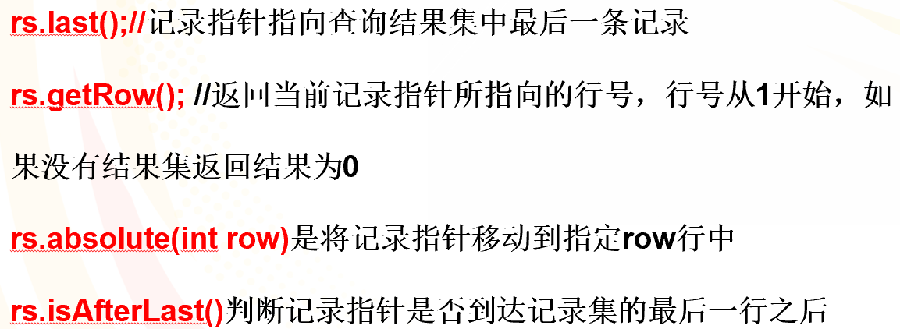
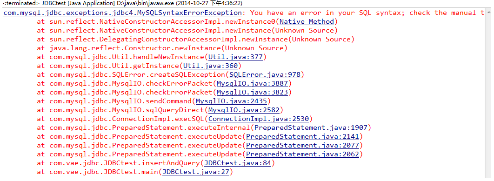
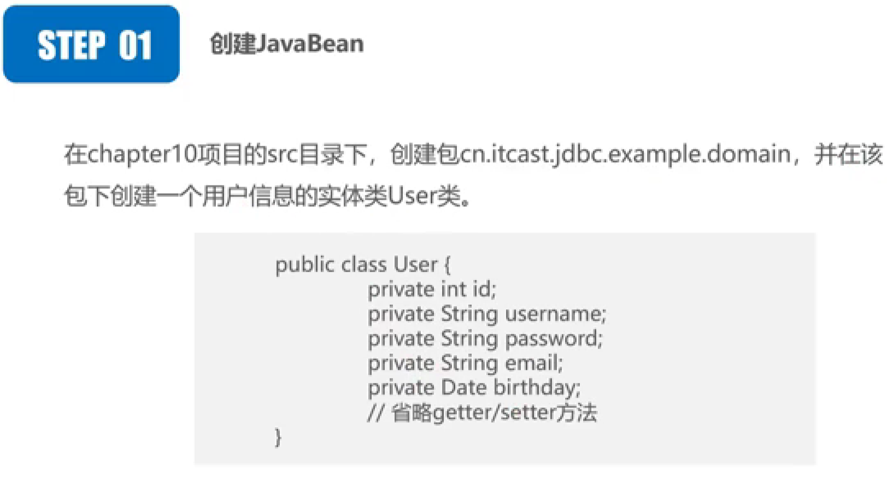
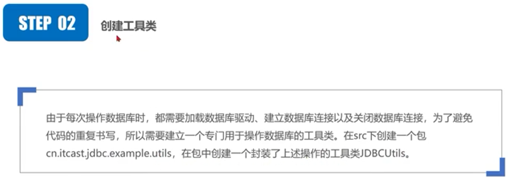
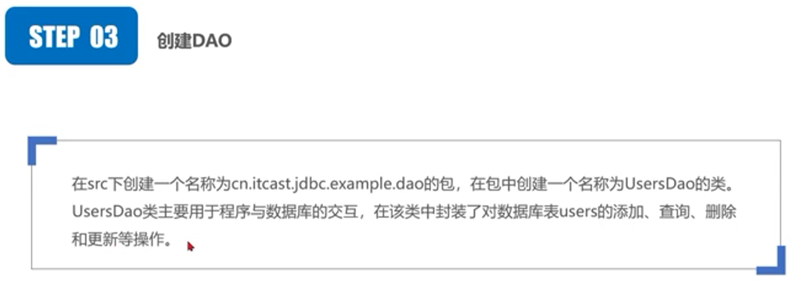
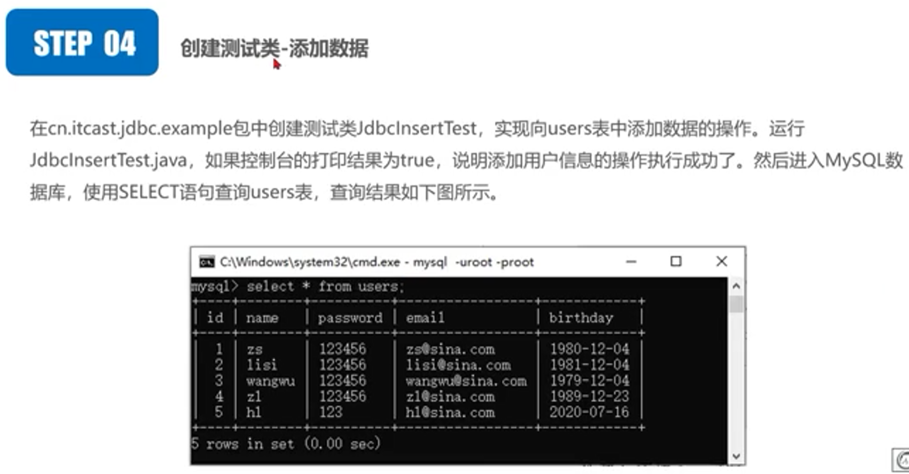

# 数据库操作

## 数据库操作对象

PreparedStatement类可以将SQL语句传给数据库做预编译处理，即在执行的SQL语句中包含一个或多个IN参数，可以**通过设置IN参数值多次执行SQL语句**，不必重新给出SQL语句，这样可以大大提高执行SQL语句的速度。所谓IN参数就是指那些在SQL语句创立时尚未指定值的参数，在SQL语句中**IN参数的值用?号**代替。

## PreparedStatement

- PreparedStatement接口继承Statement接口
- PreparedStatement比普通的Statement对象使用起来更加灵活，更有效率

```java
PreparedStatement prst=conn.prepareStatement("select * from stu where age>=? and sex=?"))
//格式prst.setXXX(position,value) XXX指设置数据的各种类型，
prst.setInt(1,age)	//设置第一个参数值为age(变量)，整型
prst.setString(2,sex)	//设置第二个参数值为sex(变量)，字符型
```

### Connection的PreparedStatement和Statement使用对比

- 使用的`Connection`方法不同
  - PreparedStatement使用的Connection方法为`prepareStatement()`，且**需要输入sql进行预编译**
  - Statement使用的Connection方法为`createStatement()`，且不能提前输入sql语句
- 对结果集的输入不同
  - PreparedStatement的对象在前面预编译后可以直接调用结果集方法
  - Statement的对象需要将sql输入才能调用结果集方法

- 安全性不同
  - PreparedStatement相对而言安全性更高，可以预防sql注入
  - Statement可能会受到sql注入

**PreparedStatement对于”拼接“语句的使用**

```java
			String sql = "select * from users where name = ?";
            PreparedStatement stmt = connection.prepareStatement(sql);//这个也会被后面那个覆盖，以后面的为准
            stmt.setString(1,"孙");//这里设置第一个没有用，还是以后面为准，不能说这里设置第一个，后面设置第二个

            String sql1 = sql+" and password = ?";//加上前面sql语句的一个"?"就是两个，所以得设置两次值(只看"?"的数量)
            String pwd = "werqewte";
            stmt = connection.prepareStatement(sql1);
            stmt.setString(1,"孙");
            stmt.setString(2,pwd);
```

## ResultSet方法



## Statement接口

### execute方法

executeQuery、executeUpdate 和 execute。使用哪一个方法由 SQL 语句所产生的内容决定（方法内**是否放入sql语句由使用的Statement方法决定**）

**executeQuery**

> 用于产生**单个结果集（ResultSet）**的语句，例如 SELECT 语句。 被使用最多的执行 SQL 语句的方法。这个方法被用来执行 SELECT 语句，**返回查询结果的表**它几乎是使用最多的 SQL 语句。但也**只能执行查询语句**，执行后返回代表查询结果的ResultSet对象。

**executeUpdate**

> 用于**执行 INSERT、UPDATE 或 DELETE 语句以及 SQL DDL（数据定义语言）语句**，例如 CREATE TABLE 和 DROP TABLE。INSERT、UPDATE 或 DELETE 语句的效果是修改表中零行或多行中的一列或多列。executeUpdate 的返回值是一个整数（int），指示受影响的行数（即更新计数）。**对于 CREATE TABLE 或 DROP TABLE 等不操作行的语句，executeUpdate 的返回值总为零**。

**execute**

> 可用于执行任何SQL语句，**返回一个boolean值**，表明**执行该SQL语句是否返回了ResultSet**。如果执行后第一个结果是ResultSet，则返回true，否则返回false。但它执行SQL语句时比较麻烦，通常我们没有必要使用execute方法来执行SQL语句，而是使用executeQuery或executeUpdate更适合，但如果**在不清楚SQL语句的类型时则只能使用execute方法来执行该SQL语句**了。

关于`statement.execute(sql)`返回的结果：

- 为true时，处理的是查询操作(executeQuery)
- 为false时，处理的是更新操作(executeUpdate)

```java
 			Class.forName(driver);//注册数据库驱动
            conn = DriverManager.getConnection(url,username,password);//通过DriverManager建立数据库连接
            String sql = "select * from users ";
//            String sql = "insert into users (name ,password,email) value ('yxx','1234567','1457906@qq.com')";
            stmt = conn.createStatement();
            Boolean result = stmt.execute(sql);//在执行sql语句的同时会更新getResultSet方法和getUpdateCount方法
			if(result){
                rs = stmt.getResultSet();//getResultSet方法获取结果集(为null则代表没有结果)
                while (rs.next());//执行next操作后获取第一行
            }
			else{
                System.out.println("该SQL语句影响的记录有" + stmt.getUpdateCount() + "条");//getUpdateCount方法获取返回的行数(为-1则表示结果是结果集或没有结果)
            }
```

### getGeneratedKeys方法

可以通过此方法获取到实行**添加操作**后的自增主键的值

```java
			//需要在预编译时声明：1为可以获取(Statement.RETURN_GENERATED_KEYS)，2为不能获取
            ps = conn.prepareStatement(sql,Statement.RETURN_GENERATED_KEYS);
            ps.setString(1,user.getName());
            ps.setString(2,user.getPassword());
            ps.setString(3,user.getEmail());
            ps.setDate(4,user.getBirthday());
            ps.executeUpdate();
            //输出获取到的自增id
            rs = ps.getGeneratedKeys();
            while (rs.next()){
                System.out.println("获取到的自增id为："+rs.getInt(1));
            }
```

## 完整的连接和关闭数据库的过程

```java
    //连接数据库的四个字符串
	String driver = "com.mysql.jdbc.Driver";
    String url = "jdbc:mysql://localhost:3306/student?useUnicode=yes&characterEncoding=utf8";
    String user = "root";
    String pwd = "root";

	//声明执行数据库操作的三个对象
    Connection conn = null;
    PreparedStatement pstmt = null;
    ResultSet rs = null;

    try{
        String sql = "select * from t_admin where id = ?";
        //注册驱动
        Class.forName(driver);
        //获取连接
        conn = DriverManager.getConnection(url,user,pwd);
        //预编译sql语句
        pstmt = conn.prepareStatement(sql);
        //设置第一个sql语句中"?"的值
        pstmt.setInt(1,id);
        //执行sql语句
        rs = pstmt.executeQuery();
        Admin admin = null;
        while(rs.next()){
            admin = new Admin();
            admin.setId(rs.getInt("id")); //根据结果的列名获取值
            admin.setName(rs.getString(2));
            admin.setPassword(rs.getString(3));
        }
    }catch (SQLException e){
        e.printStackTrace;
    }finally{
         rs.close();
         pstmt.close();
         conn.close();
    }
```

## 事物处理

如果JDBC连接处于自动提交模式，默认情况下，则每个SQL语句在完成后都会提交到数据库。要启用手动事务支持，而不是使用JDBC驱动程序默认使用的自动提交模式，请调用`Connection`对象的`setAutoCommit()`方法。 如果将布尔的`false`传递给`setAutoCommit()`，则关闭自动提交。 也可以传递一个布尔值`true`来重新打开它。

例如，如果有一个名为`conn`的`Connection`对象，以下代码为关闭自动提交

```java
conn.setAutoCommit(false);
```

完整的方法

```java
setAutoCommit(boolean autoCommit)

conn.setAutoCommit(false);//关闭自动提交模式,开启事务

conn.commit() //开始事务处理

conn.rollback()；//撤销事务操作
```

**事务要么同时执行，要么同时回滚**

```java
    	Connection conn = JDBCConnection.getConnection();
        String sql = "INSERT INTO users(NAME,PASSWORD,email,birthday) VALUES('zs','123456','zs@sina.com','1980-12-04')";
        String sql1 = "INSERT INTO users(NAME,PASSWORD,email) VALUES('雨晨','123456','zs@sina.com','1980-12-04')";//这里少写了一个birthday
        try {
            conn.setAutoCommit(false);//设置为主动提交事务
            
            PreparedStatement ps = conn.prepareStatement(sql);
            ps.executeUpdate();///因为没有'?'这里可以直接执行，返回值是一个整数，返回受影响的行数，可以不必接收

            Statement st = conn.createStatement();
            st.executeUpdate(sql1);
            
            conn.commit();//如果没有回滚则提交事务
        } catch (SQLException e) {
            try {
                conn.rollback();//只要conn的sql语句出现错误，则将事务回滚
            } catch (SQLException ex) {
                ex.printStackTrace();
            }
            e.printStackTrace();
        }finally {
            try {
                conn.commit();//无论结果如何，最后都要提交事务上去，否则容易影响后续的代码运行
            } catch (SQLException e) {
                e.printStackTrace();
            }
        }
//运行结果：sql语句和sql1语句都没有执行成功
```

核心代码是第07行、13行、16行。这三行代码就完成了事务处理的操作。两个sql语句中，只要有一个语句出现错误，程序将无法运行，说明事务提交失败，且报错如下：（有些会直接提示语句的错误）



但是值得注意的是，**回滚仅限于执行了主动提交事务的`connection`对象**

```java
		Connection conn = JDBCConnection.getConnection();
        Connection connection = JDBCConnection.getConnection();//这里又创建了一个Connection的对象
        String sql = "INSERT INTO users(NAME,PASSWORD,email,birthday) VALUES('zs','123456','zs@sina.com','1980-12-04')";
        String sql1 = "INSERT INTO users(NAME,PASSWORD,email) VALUES('雨晨','123456','zs@sina.com','1980-12-04')";//这里少写了一个birthday
        try {
            conn.setAutoCommit(false);//conn这里设置为主动提交事务

            PreparedStatement ps = conn.prepareStatement(sql);
            ps.executeUpdate();

            Statement st = connection.createStatement();//这里的connection没有设置主动提交事务
            st.executeUpdate(sql1);

        } catch (SQLException e) {
            e.printStackTrace();
        }finally {
            try {
                conn.commit();//无论结果如何，最后都要提交事务上去，否则容易影响后续的代码运行
            } catch (SQLException e) {
                e.printStackTrace();
            }
        }
//运行结果：sql语句执行成功，sql1语句执行失败（两个不同的Connection对象）
```

### 设置保存点(SavePoint)

```java
		Savepoint savepoint = null;
        Connection conn = JDBCConnection.getConnection();
        String sql = "INSERT INTO users(NAME,PASSWORD,email,birthday) VALUES('zs','123456','zs@sina.com','1980-12-04')";
        String sql1 = "INSERT INTO users(NAME,PASSWORD,email) VALUES('雨晨','123456','zs@sina.com','1980-12-04')";//这里少写了一个birthday
        try {
            conn.setAutoCommit(false);//设置为主动提交事务

            PreparedStatement ps = conn.prepareStatement(sql);
            ps.executeUpdate();///因为没有'?'这里可以直接执行，返回值是一个整数，返回受影响的行数，可以不必接收

            savepoint = conn.setSavepoint("savepoint");//注意方法里面输入的是String类型，名称与Savepoint的对象名称保持一致

            Statement st = conn.createStatement();
            st.executeUpdate(sql1);

        } catch (SQLException e) {
            try {
                conn.rollback(savepoint);//如果sql执行异常，则回滚到保存点1的结果。与上面类似，同样也只能回滚conn对象的相关操作
            } catch (SQLException ex) {
                ex.printStackTrace();
            }
            e.printStackTrace();
        }finally {
            try {
                conn.commit();//无论结果如何，最后都要提交事务上去，否则容易影响后续的代码运行
            } catch (SQLException e) {
                e.printStackTrace();
            }
        }
//运行结果：sql和sql1虽然是同一个conn，但是由于在sql运行后保存了，最终sql运行成功
```

## 分页

在地址栏中标明当前地址，如`http://.......?page=1`表示现在是第一页。**strPage用来接收从客户端传过来的参数**，如果为空则表明首次浏览，将当前页（intPage）设置为1，否则**转换为整型，赋值给intPage**。

```java
String strPage=request.getParameter("page");
if(strPage==null){
	intPage=1;
}else{
	intPage=Integer.parseInt(strPage);
}
```

### 计算总页数

计算总页数=**记录总数/每页显示的记录数+1**

`(m%n==0)?(m/n):(m/n+1)`

第一种：

```java
	rs.last() //记录指针指向查询结果集中最后一条记录
    rowCount=rs.getRow();//获取当前行数(即记录总数)
    pageCount=(rowCount%pageSize==0)?(rowCount/pageSize):(rowCount/pageSize+1);//计算总页数
```

第二种：

```sql
	select count(*) from users;#通过sql语句返回列表的行数
```

```java
	rs = stmt.executeQuery(sql);
    while (rs.next()){//一定要先用rs.next()后再赋值
         rowCount = rs.getInt(1);
    }
```

### sql分页语句

客户端通过传递`page`(**页码**)、`pageCount`(**总页数**)、`pageSize`(**每页显示的条数**)这几个参数去分页查询数据库表中的数据

```sql
	#mysql特有的
	select * from table limit (page-1)*pageSize,pageSize; #注意：(page-1)*pageSize代表开始的位置(0开始)，后面的pageSize是代表显示的个数。显示第三个开始以及后面的一个是-->2,2。直接3就是代表-->0,3，显示第一个以及后面两个
```

```sql
	#sql server特有的
	select top pageSize * from table where id not in (select top (page-1)*pageSize from table);#从(page-1)*pageSize行开始(不包括自己)往后pageSize行
	
	Select * from table order by id offset (page-1)*pageSize rows fetch next pageSize rows only;#这里会对先id从小到大排序后，舍弃(page-1)*pageSize行，输出后面的pageSize行
```

### 具体实现

可以通过session作用域来传参数和对象，就不必每次分页都创造一个Pager对象了，这里用的是request作用域

Pager.java

```java
import java.util.List;

public class Pager<k> {
    private int pageSize;//一页显示的记录数
    private int currentPage;//当前页面
    private int rowCount;//记录总行数
    private List<k> dateList;
    private int pageCount;//总页数

    public Pager(int pageSize, int currentPage, int rowCount) {
        this.pageSize = pageSize;
        this.currentPage = currentPage;
        this.rowCount = rowCount;
        this.pageCount = (this.rowCount % this.pageSize == 0) ?
                (this.rowCount / this.pageSize):
                (this.rowCount / this.pageSize+1);//计算页数
    }
    //省略get和set方法
```

pagingServlet.java

```java
        req.setCharacterEncoding("UTF-8");
        int pageSize;
        int currentPage;
        Pager<User> pager = null;
        if(StringUtil.isNotEmptyOrNull(String.valueOf(req.getParameter("pageSize")))){
            pageSize = Integer.parseInt(String.valueOf(req.getParameter("pageSize")));
        }else {
            pageSize = 2;//默认页面显示为2
        }
        if(StringUtil.isNotEmptyOrNull(String.valueOf(req.getParameter("currentPage")))){
            currentPage = Integer.parseInt(String.valueOf(req.getParameter("currentPage")));
        }else {
            currentPage = 1;//默认为第一页
        }
        pager = new Pager<User>(pageSize,currentPage,Dao.getRowCount());
        Dao.pageUser(pager);//查询返回好了链表存储完毕
        req.setAttribute("pager",pager);
        req.getRequestDispatcher("/JDBC/paging.jsp").forward(req,resp);
```

paging.jsp

```jsp
<head>
    <title>Title</title>
    <style>
        .currentPage{
            text-decoration: none;
            color: #999;
        }
    </style>
</head>
<body>
<table border="1">
    <tr>
        <td>ID</td>
        <td>用户名</td>
        <td>密码</td>
        <td>邮箱</td>
        <td>出生日期</td>
        <td>操作</td>
    </tr>
    <c:forEach var="user" items="${requestScope.pager.dateList}"><!--循环输出链表-->
    <tr>
        <td>${user.id}</td>
        <td>${user.name}</td>
        <td>${user.password}</td>
        <td>${user.email}</td>
        <td>${user.birthday}</td>
        <td><a href="javascript:del(${user.id})">删除</a></td><!--JS语法无法传递多个值-->
            <%--            <td><a href="javascript:upd(${user.id})">修改</a></td>--%>
        <td><a href="/untitled_war_exploded/JDBC/update.jsp?id=${user.id}&name=${user.name}&password=${user.password}&email=${user.email}&birthday=${user.birthday}">修改</a></td><!--每个a都是一个块作用域-->
    </tr>
    </c:forEach>
</table>
    <a href="/untitled_war_exploded/JDBC/add.jsp">添加</a>
    <a href="/untitled_war_exploded/JDBC/index.jsp">返回首页</a>
    <a href="javascript:previous(${requestScope.pager.currentPage})">上一页</a>
    <a href="javascript:last(${requestScope.pager.currentPage})">下一页</a>
    <a href="javascript:lastPage(${requestScope.pager.pageCount})">尾页</a><br>
    一共${requestScope.pager.pageCount}页，每页显示${requestScope.pager.pageSize}个，请输入想跳转的页面或者页面显示数量
    <form action="pagingServlet">
        <input type="text" value="${requestScope.pager.currentPage}" name = "currentPage">
        <input type="text" value="${requestScope.pager.pageSize}" name = "pageSize">
        <input type="submit" value="设置">
    </form>
    页数：
    <c:forEach begin="1" end="${requestScope.pager.pageCount}" var="item">
        <c:choose>
            <c:when test="${item == requestScope.pager.currentPage}">
                <span class="currentPage">${item}</span><!--不可点击-->
            </c:when>
            <c:otherwise>
                <a href=javascript:now(${item},${requestScope.pager.pageCount},${requestScope.pager.pageSize})>${item}</a><!--传多个参数不加引号，不能传复杂参数，链表和对象都不行-->
            </c:otherwise>
        </c:choose>
    </c:forEach>

<script>
    function del(id){
        //弹出确认对话框，点击确认按钮返回值为true,点击取消按钮返回值为false
        if(window.confirm("你真的要删除本行数据吗？")){
            //地址栏跳转到delUserServlet，并传递id值
            location.href="deleteServlet?id="+id;//注意重定向后的地址栏，是采用get方式提交给新表单的
        }
    }
    function previous(currentPage) {
        if(currentPage === 1){//EL表达式根据内容自动匹配了数据类型，这里都为int
            alert("已经是第一行了")
        }else {
            location.href="pagingServlet?currentPage="+(currentPage-1);
        }
    }
    function last(currentPage) {
        if(currentPage === ${requestScope.pager.pageCount}){
            alert("已经是最后一行了")
        }else {
            location.href="pagingServlet?currentPage="+(currentPage+1);
        }
    }
    function lastPage(pageCount) {
        location.href="pagingServlet?currentPage="+pageCount;
    }
    function now(currentPage,pageCount,pageSize) {
        location.href="pagingServlet?currentPage="+currentPage+"&pageCount="+pageCount+"&pageSize="+pageSize;
    }
</script>
</body>
```

UserDao.java

```java
pageUser(Pager<User> pager)
		List<User> list = new ArrayList<>();
        conn = JDBCConnection.getConnection();
        String sql = "select * from users limit ? , ?";
        try {
            ps = conn.prepareStatement(sql);
            ps.setInt(1,((pager.getCurrentPage()-1)*pager.getPageSize()));
            ps.setInt(2,pager.getPageSize());
            rs = ps.executeQuery();
            while (rs.next()){
                User user1 = new User();
                user1.setId(rs.getInt(1));
                user1.setName(rs.getString(2));
                user1.setPassword(rs.getString(3));
                user1.setEmail(rs.getString(4));
                user1.setBirthday(rs.getDate(5));
                list.add(user1);
            }
            pager.setDateList(list);
            
getRowCount()
    	int rowCount = 0;
        String sql = "select count(*) from users";
        conn = JDBCConnection.getConnection();
        try {
            stmt = conn.createStatement();
            rs = stmt.executeQuery(sql);
            if (rs.next()){//一定要先用rs.next()后再赋值
                rowCount = rs.getInt(1);
            }
```

***

## 关于日期格式的转换

- 存入

  - 对于提交表单来说，是支持date类型的数据提交的

  - `request.getParameter`方法会**转化为String发送给servlet类**

  - servlet类通过`req.setCharacterEncoding("UTF-8")`**设置数据编码方式**

  - servlet类需要先**将String类转化为sql的date**再存入User(sql类型date)

  - 最后通过调用DAO类方法中的`ps.setDate`将数据存入数据库

- 取出
  - 直接取出链表，调用链其中User的`getBirthday`方法使用`print`输出即可(**支持date类型**)
  - 又或者采用`<c:forEach var="user" items="${requestScope.userList}">`的方法遍历输出

**转换工具类方法**

```java
public static Date strToDate(String sDate)  {
//        String format="yyyy-mm-dd";//String转util Date
//        SimpleDateFormat sdf = new SimpleDateFormat(format);
//        Date date=null;
//        try {
//            date= sdf.parse(sDate);
//        } catch (ParseException e) {
//            e.printStackTrace();
//        }
        String str = sDate;
        SimpleDateFormat format = new SimpleDateFormat("yyyy-MM-dd");//String转sql Date
        java.util.Date d = null;
        try {
            d = format.parse(str);
        } catch (Exception e) {
            e.printStackTrace();
        }
        java.sql.Date date = new java.sql.Date(d.getTime());//通过getTime方法转换
        return date;
    }
```

***

## 数据库的增删改查


## 第一步：创建JavaBean（封装用户信息）



## 第二步：创建工具类（封装数据库工具类）



## 第三步：创建DAO（封装数据库操作）



## 第四步：创建测试类


