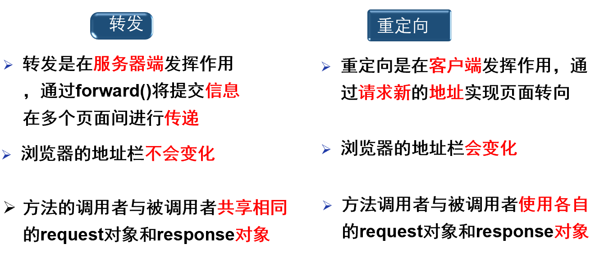

# 转发与重定向的区别

## 转发和重定向汇总



注意：**session对象保持一致**

|                         语法                          | 地址 | req设置值(setA) |              特点               |      接收方式       |
| :---------------------------------------------------: | :--: | :-------------: | :-----------------------------: | :-----------------: |
| < a href="path?param=value&param1=value1">超链接< /a> | 变化 |      不可       | HTML方式不能带变量**(get方式)** |      param方法      |
|        <jsp:forward page="path?param=value"/>         | 不变 |      不可       |      JSP方式转发且地址不变      |      param方法      |
|                      表单submit                       | 变化 |      不可       |    HTML方式且地址会发生变化     |      param方法      |
|    request的.getRequestDispatcher()的forward()方法    | 不变 |      可以       |     Java方式作用于服务器端      | param方法和getA方法 |
|             response的sendRedirect()方法              | 变化 |      不可       |      Java方式作用于客户端       |   getSession方法    |
|      response的setHeader("Refresh","3,test.jsp")      | 变化 |      不可       |            定时刷新             |   getSession方法    |
|  < script>location.href="path?param"+param< /script>  | 变化 |      不可       |   JS方式用于传递**及时参数**    |      param方法      |

> 可以使用param方法的代表在跳转后的页面可以使用**EL的param**和**Java的request的Parameter方法**获取到**输入来的值**，gatA方法代表在跳转后的页面可以使用**Java的request.getAttribute()**方法获取到前面页面设置的值,至于getSession方法就是**从session作用域获取设置的值**。除了**request的forward方法带req和resp转发**，其余都不可以通过setAttribute()方法获取设置的值。

- JS的方式跳转的**初始地址就是"转发"的最外层，不受自身文件位置的影响**

注意：

1. **”被动“方式不能同时出现在一个jsp中，可以”主动“和”被动“同时出现，此时”主动“因未提交所以会失效。除了<jsp:forward page="relativeURL"/>的”被动“方式外，表单代码甚至不会执行**
2. 地址变化就代表会产生一个**新的req，resp对象**传递给跳转的页面，旧的会被抛弃

## 关于转发和重定向填地址区别

## 跳转对象在同一目录

```jsp
<%		
	<form action="test1.jsp">
    	<input type="submit" value="提交"/>
	</form>
		<jsp:forward page="test1.jsp"/>
        request.getRequestDispatcher("test1.jsp").forward(request,response);
		response.sendRedirect("test1.jsp");
		//同一目录，"转发"和"重定向"都是直接写文件名称即可
    %>
```

## 跳转对象不在同一目录

```jsp
<%		
	<form action="/untitled_war_exploded/Demo8/test1.jsp">
    	<input type="submit" value="提交"/>
	</form>
		<jsp:forward page="/Demo8/test1.jsp"/>
        request.getRequestDispatcher("/Demo8/test1.jsp").forward(request,response);//这里相对路径为../Demo/test.jsp
		response.sendRedirect("/untitled_war_exploded/Demo8/test1.jsp");
		//使用前面使用"/"代表从“根目录”开始找，对于“转发”来说，根目录在“web”下，而对于“重定向”来说，根目录在“http://localhost:8080”
    %>
```

## 相对路径和绝对路径

```xml
相对路径：写法简单，使用灵活

◆以“./”开头，代表当前目录和文件目录在同一个目录里，“./”可以省略不写！

◆以"../"开头：向上走一级，代表目标文件在当前文件所在的上一级目录；

◆以"../../"开头：向上走两级，代表父级的父级目录，也就是上上级目录，再说明白点，就是上一级目录的上一级目录

◆以"/”开头，代表根目录

绝对路径：除非引用文件从来不移动，否则不推荐使用

◆Windows使用的是"\":例如C:\Users\喻欣轩\Desktop\博客\JSP

◆Linux、macOS等类Unix系统使用的是"/"
```

