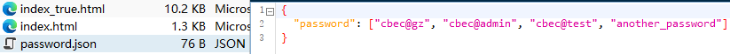
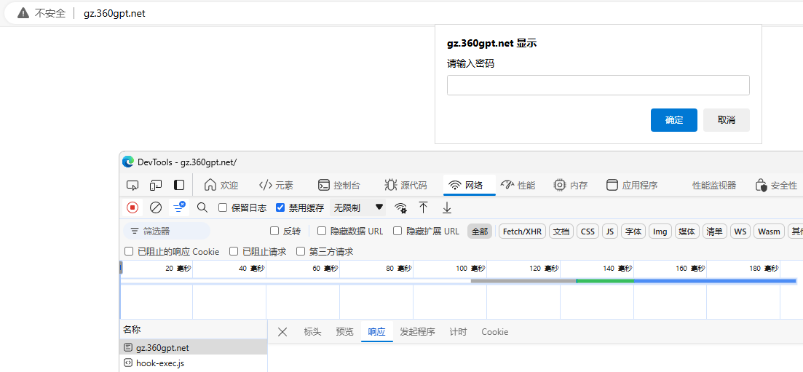

# JS前端加载密码校验

## 实现思路

> 通过在首次加载时让用户输入密码，通过去请求Nginx的`password.json`文件来校验密码，通过了再使用`iframe`标签去加载真实的页面
>
> - 如果`<iframe>`有局限性，也可以直接在`index.html`里面的`<head>`头中添加
> - 通过防止用户在网页加载完毕前查看网页源代码的方式也可以将密码直接写死在html页面

```html
<!doctype html>
<html>
<head>
    <meta charset="utf-8">
    <script>
        async function getPassword() {
            let response = await fetch("/password.json")
            let jsonData = await response.json()
            return jsonData['password']
        }

        (async () => {
            let isPass = false
            try {
                let userInput = prompt('请输入密码')
                let correctStringList = await getPassword()
                if (correctStringList.find((current) => current == userInput)) {
                    isPass = true
                }
            } catch (error) {
                console.log("请求错误", error)
            }
            // 判断
            if (isPass) {
                // 设置html和body的高度为100%
                document.documentElement.style.height = '100%';
                document.body.style.height = '100%';
                document.body.style.margin = '0'; // 移除默认的margin

                document.body.style.overflow = 'hidden'
                // 创建一个新的iframe元素
                let iframe = document.createElement('iframe');
                // 设置iframe的属性
                iframe.src = 'index_true.html';
                iframe.style.width = '100%';
                iframe.style.height = '100%';
                iframe.style.border = 'none'; // 移除边框，如果需要的话
                // 将iframe添加到body中
                document.body.appendChild(iframe);
            } else {
                window.location.href = 'https://www.baidu.com/';
            }
        })();
    </script>
</head>

<body>
</body>
</html>
```

> 
>
> 如果`async`和`await`关键字在`prompt`之前，用户是可以在调试工具中看到所有的源代码的，但是如果`prompt`在前面，调试器由于页面被阻塞，无法加载出信息
>
> 