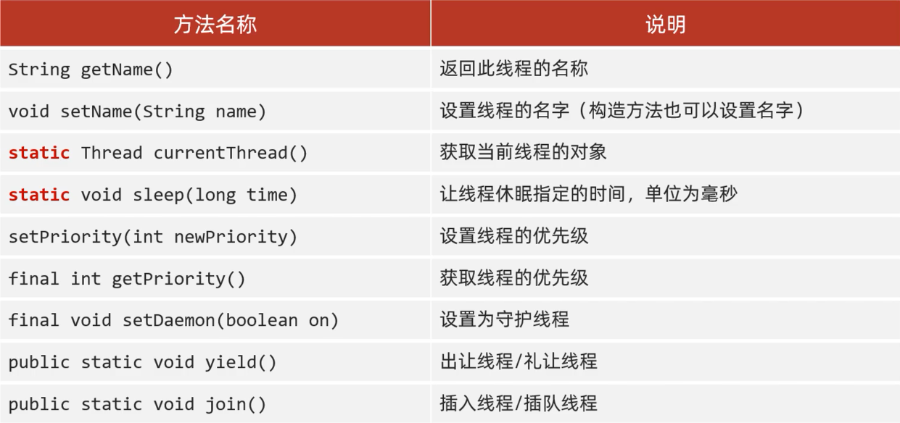
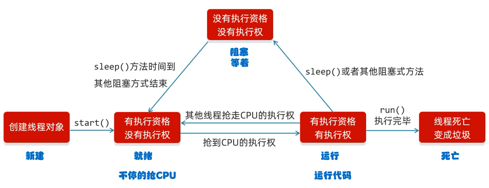
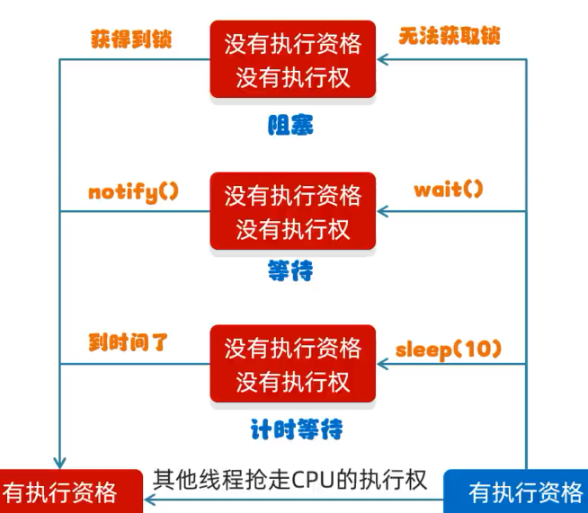
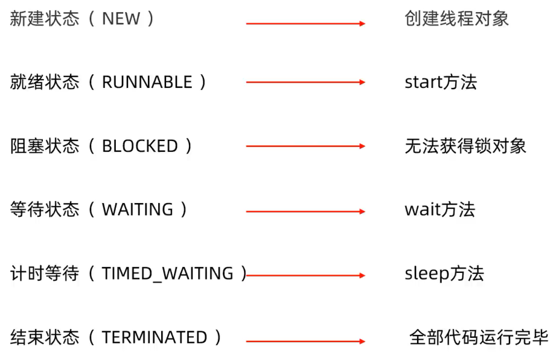

# JUC概述

> java.util.concurrent工具包的简称

## Thread方法



## 线程生命周期



其中阻塞还能细分为：



Java虚拟机中没有定义"运行"状态，因为当线程抢夺到cpu执行权后，虚拟机就将当前线程交给操作系统进行管理了，所以Java只有如下6个线程状态：



## 进程和线程

进程

> 进程时计算机中的程序关于某数据集合上的运行活动，是系统进行资源分配和调度的基本单位，是操作系统结构的基础。**资源分配的最小单位**

线程

> 线程是操作系统能够运行调度的最小单位。它被包含在进程之中，是进程中的实际运作单位，一个进程中可以并发多个小城，每条线程并行执行不同的任务。**程序执行的最小单位**

## 线程的状态

Thread.State

```java
    public enum State {
        /**
         * Thread state for a thread which has not yet started.
         */
        NEW,

        /**
         * Thread state for a runnable thread.  A thread in the runnable
         * state is executing in the Java virtual machine but it may
         * be waiting for other resources from the operating system
         * such as processor.
         */
        RUNNABLE,

        /**
         * Thread state for a thread blocked waiting for a monitor lock.
         * A thread in the blocked state is waiting for a monitor lock
         * to enter a synchronized block/method or
         * reenter a synchronized block/method after calling
         * {@link Object#wait() Object.wait}.
         */
        BLOCKED,

        /**
         * Thread state for a waiting thread.
         * A thread is in the waiting state due to calling one of the
         * following methods:
         * <ul>
         *   <li>{@link Object#wait() Object.wait} with no timeout</li>
         *   <li>{@link #join() Thread.join} with no timeout</li>
         *   <li>{@link LockSupport#park() LockSupport.park}</li>
         * </ul>
         *
         * <p>A thread in the waiting state is waiting for another thread to
         * perform a particular action.
         *
         * For example, a thread that has called <tt>Object.wait()</tt>
         * on an object is waiting for another thread to call
         * <tt>Object.notify()</tt> or <tt>Object.notifyAll()</tt> on
         * that object. A thread that has called <tt>Thread.join()</tt>
         * is waiting for a specified thread to terminate.
         */
        WAITING,

        /**
         * Thread state for a waiting thread with a specified waiting time.
         * A thread is in the timed waiting state due to calling one of
         * the following methods with a specified positive waiting time:
         * <ul>
         *   <li>{@link #sleep Thread.sleep}</li>
         *   <li>{@link Object#wait(long) Object.wait} with timeout</li>
         *   <li>{@link #join(long) Thread.join} with timeout</li>
         *   <li>{@link LockSupport#parkNanos LockSupport.parkNanos}</li>
         *   <li>{@link LockSupport#parkUntil LockSupport.parkUntil}</li>
         * </ul>
         */
        TIMED_WAITING,

        /**
         * Thread state for a terminated thread.
         * The thread has completed execution.
         */
        TERMINATED;
    }
```

> NEW新建、RUNNABLE准备就绪、BLOCKED阻塞、WAITING等待、TIME_WAITING等待超时、TERMINATED终结

## wait和sleep

- sleep是Thread的静态方法，wait是Object的方法，任何对象实例都能调用
- sleep是不会释放锁，它也不需要占用锁。wait会释放锁，但调用它的前提是当前线程占有锁（即代码要在synchronized中）
- 它们都可以被interrupted方法中断

## 并发和并行

串行模式：所有任务按照先后顺序进行，一次只能获得一个任务，并执行这个任务

并行模式：可以同时取得多个任务，并同时去执行所取得的这些任务。并行的效率从代码层次上强依赖于多进程/多线程代码，从硬件角度上则依赖于多核CPU

并发：多个程序可以同时运行的现象，更细化的是多进程可以同时运行或者多指令可以同时运行

## 管程

> 管程（Monitor）是一种同步机制，用于实现线程之间的协作和互斥。用于保证同一时间，只有一个线程访问被保护数据或者代码。JVM同步基于进入和退出，是使用管程对象实现的。

## 用户线程和守护线程

用户线程：用户线程是指由用户创建的线程，它们的生命周期不受其他线程的影响，只有在执行完任务后或者调用了`stop()`方法后才会结束

守护线程：守护线程是指在程序运行时后台提供服务的线程，它的生命周期与程序的生命周期相同，当所有的用户线程结束时，守护线程会自动结束。守护线程通常用于执行一些后台任务，比如垃圾回收、统计程序运行时间等

```java
    public static void main(String[] args) {
        Thread a = new Thread(() -> {
            // isDaemon()为false代表是用户线程
            System.out.println(Thread.currentThread().getName()+ "::" +
                    Thread.currentThread().isDaemon());
            while (true){

            }
        },"A");

        // 创建的进程默认为用户进程，会一直等待用户进程的结束
//        a.start();
//        System.out.println(Thread.currentThread().getName() + " is over");

        // 设置为守护进程，守护进程会随着主线程结束而结束
        a.setDaemon(true);
        a.start();
        System.out.println(Thread.currentThread().getName() + " is over");
    }
```

> ```
> main is over
> A::true
> ```