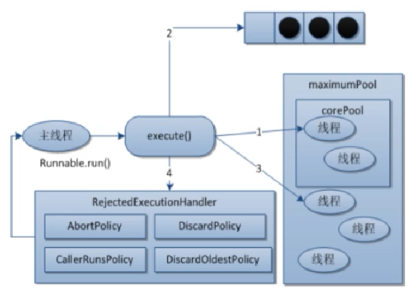

# 线程池参数和自定义

## 线程池参数

ThreadPoolExecutor：

- `int corePoolSize`：常驻线程数量

- `int maximumPoolSize`：最大线程数量

- `long keepAliveTime`：多余的空闲线程在被终止之前等待新任务的最长时间

- `TimeUnit unit`：keepAliveTime参数的时间单位

- `BlockingQueue<Runnable> workQueue`：指定阻塞队列，用于存储待执行任务

- `ThreadFactory threadFactory`：线程工厂

  - `Executors.defaultThreadFactory()`：默认使用，它会创建一个新的线程来执行任务，所有新创建的线程都有同样的优先级并且都不是守护线程

  - `Executors.privilegedThreadFactory()`：具有与当前安全上下文和类加载器相同的新线程的工厂

  - `implements ThreadFactory`：实现接口，自定义线程工厂

    - ```java
      // 自定义线程工厂
      class myThreadFactory implements ThreadFactory {
      
          private Integer num = 0;
      
          @Override
          public Thread newThread(Runnable r) {
              // 可以设置线程的名称、优先级、是否为守护线程等
              return new Thread(r, "myThread" + num++);
          }
      }
      
      // 构建线程工厂，设置线程的名称，这里的%d是一个占位符，表示线程编号
      new ThreadFactoryBuilder().setNameFormat("scheduled_task_thread_%d").build()
      ```

- `RejectedExecutionHandler handler`：拒绝策略，用于处理那些不能由线程池执行的任务

  - `AbortPolicy`：默认情况下的使用，它会抛出一个运行时异常`RejectedExecutionException`
  - `CallerRunsPolicy`："调用者运行"一种调节机制，该策略既不会抛弃任务，也不会抛出异常，而是将某些任务回退到调用者，从而降低新任务的流量
  - `DiscardPolicy`：抛弃队列中等待最久的任务，然后把当前任务加入队列中尝试再次提交当前任务
  - `DiscardOldestPolicy`：默默地丢弃无法处理的任务，不给予任务处理也不抛出异常，造成任务丢失


## 工作流程



- 当有线程执行请求时，使用corePoolSize中常驻的线程去执行
- 任务数进一步增加，任务进入阻塞队列
- 任务数进一步增加，**创建低于maximumPoolSize数量的线程去执行**
- 任务数进一步增加，超过maximumPoolSize数量，**执行拒绝策略**
- 任务饱和后，**常驻线程和额外线程有任务执行完后，此时阻塞队列任务才会进入线程池**

## 自定义线程池

> 阿里巴巴开发手册：线程池不允许使用 Executors 去创建，而是通过 ThreadPoolExecutor 的方式创建。这样的处理方式让写的人更加明确线程池的运行规则，规避资源耗尽的风险
>
> Executors 返回的线程池对象的弊端如下：
>
> - FixedThreadPool 和 SingleThreadPool：允许的请求队列长度为 Integer.MAX_VALUE，可能会堆积大量的请求，从而导致 OOM(**Java虚拟机（JVM）在堆内存中没有足够的空间来分配对象**)
> - CachedThreadPool 和 ScheduledThreadPool：允许的创建线程数量为 Integer.MAX_VALUE，可能会创建大量的线程，从而导致 OOM

自定义线程池大小：

- CPU密集型运算：最大并行数+1
- I/O密集型运算：最大并行数 * 期望CPU利用率 * 总时间(CPU计算时间 + 等待时间) / CPU计算时间
  - 可以通过分析thread dump来获取到线程的状态，进而估算出W/C(等待时间与计算时间的比率)的值

> `Runtime.getRuntime().availableProcessors()`：向Java虚拟机返回可用处理器的数目，为最大并行数，等于机器上的逻辑处理器（也就是核心）数量，包括超线程产生的逻辑处理器

MySelfThreadDemo.java

```java
import java.util.Random;
import java.util.concurrent.*;

// 自定义线程工厂
class myThreadFactory implements ThreadFactory {

    private Integer num = 0;

    @Override
    public Thread newThread(Runnable r) {
        // 可以设置线程的名称、优先级、是否为守护线程等
        return new Thread(r, "myThread" + num++);
    }
}

public class MySelfThreadDemo {
    public static void main(String[] args) {
        ExecutorService myPoolExecutor = new ThreadPoolExecutor(
                10,
                20,
                // 多余的空闲线程在被终止之前等待新任务的最长时间
                2L,
                TimeUnit.SECONDS,
                // 阻塞队列
                new ArrayBlockingQueue<>(3),
                // 新线程具有相同的线程组，优先级和守护状态
//                Executors.defaultThreadFactory(),
                // 具有与当前安全上下文和类加载器相同的新线程的工厂
//                Executors.privilegedThreadFactory(),
                // 使用自定义的线程工厂
                new myThreadFactory(),
                // 拒绝策略
                new ThreadPoolExecutor.AbortPolicy()
        );

        // 依次执行线程池中的任务，对比效果
        try {
            execute(myPoolExecutor);
            TimeUnit.SECONDS.sleep(5);
            System.out.println("-------------");
            submit(myPoolExecutor);
        } catch (InterruptedException e) {
            e.printStackTrace();
        } finally {
            // 这里只有一个线程池，等所有任务完成后才能关闭
            myPoolExecutor.shutdown();
        }

    }

    // 执行Runnable类型任务
    public static void execute(ExecutorService executorService) {
        try {
            for (int i = 1; i <= 10; i++) {
                // 调用线程池中的线程执行操作
                executorService.execute(() -> {
                    System.out.println(Thread.currentThread().getName() + "办理业务");
                });
            }
        } catch (Exception e) {
            e.printStackTrace();
        }
    }

    // 执行Callable类型的任务
    public static void submit(ExecutorService executorService) {
        try {
            for (int i = 1; i <= 10; i++) {
                // 调用线程池中的线程执行操作
                Future<Integer> submit = executorService.submit(() -> {
                    System.out.print(Thread.currentThread().getName() + "办理金额为");
                    return new Random().nextInt(100);
                });
                // 将线程返回的结果进行打印
                System.out.println(submit.get());
            }
        } catch (Exception e) {
            e.printStackTrace();
        }
    }
}
```

> ```
> myThread0办理业务
> myThread4办理业务
> myThread5办理业务
> myThread3办理业务
> myThread2办理业务
> myThread1办理业务
> myThread7办理业务
> myThread6办理业务
> myThread8办理业务
> myThread9办理业务
> -------------
> myThread0办理金额为92
> myThread2办理金额为67
> myThread1办理金额为8
> myThread7办理金额为76
> myThread6办理金额为61
> myThread8办理金额为58
> myThread4办理金额为11
> myThread5办理金额为52
> myThread9办理金额为20
> myThread3办理金额为1
> ```
