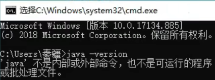

# JDK的安装与卸载

## 安装

###    安装程序

- 百度搜索JDK8，选择带“oracle”的网站

- 往下滑选择“windows”的“X64”版本进行下载**（大小200MB左右，后缀为exe）**

1. 同意协议，登录账号下载即可

 **（记住安装的路径`C:\Program Files\Java\jdk1.8.0_202`）**

> 最后一个免费版202，201为修复bug的稳定版
>
> 下载地址：[Java Archive | Oracle](https://www.oracle.com/java/technologies/downloads/archive/)
>
> 下载最后一个免费且稳定版：
>
> 
>
> 

###    安装环境变量

- 此电脑选择属性-->高级系统设置-->环境变量

- 配置**系统变量**-->新建**（变量名：JAVA_HOME,变量值：文件目录）**

- 配置**Path变量(用户变量)**-->新建两个变量`%JAVA_HOME%\bin`和`%JAVA_HOME%\jre\bin`

**（可以在命令提示符中输入`java -version`查看java版本号）**

## 卸载

- 系统环境变量中找到Java。找到变量对应的**文件目录**之后删除，例如这里就是C盘下面的Program Files下的Java

- **系统变量**中删除`JAVA_HOME`环境变量

- 在**环境变量**Path中删除java相关变量后点击确定

 **（可以在命令提示符中输入`java -version`检查是否删除干净）**

