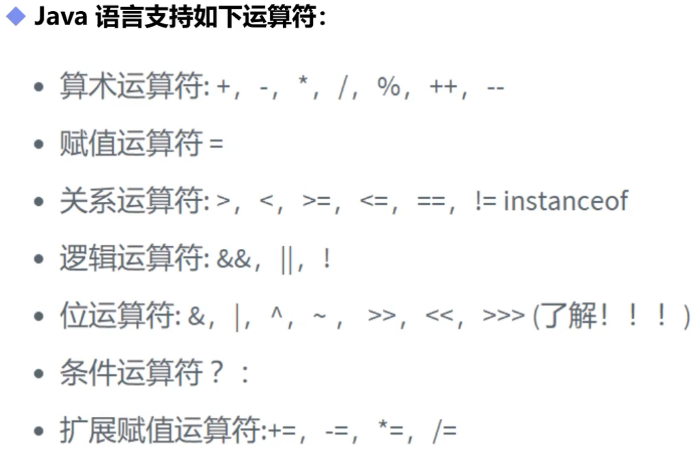
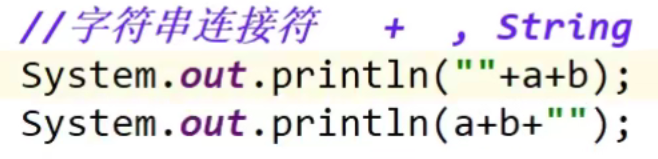
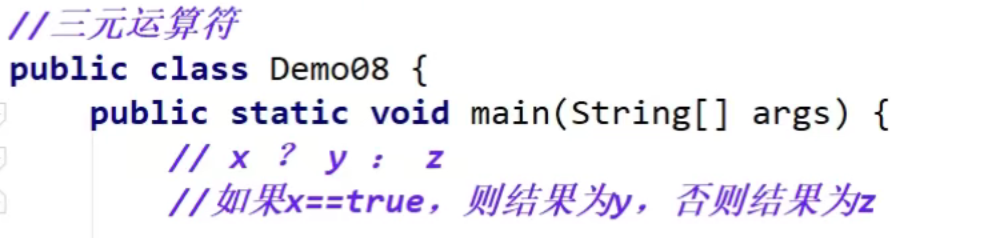

# 运算符

## 一，支持的运算符

## 二，位运算符

1. &与运算两个位都是 1 时，结果才为 1，否则为 0。

2. | 或运算两个位都是 0 时，结果才为 0，否则为 1。

3. ^异或运算两个位相同则为 0，不同则为 1。

4. ~ 取反运算，0 则变为 1，1 则变为 0。

5. <<左移运算（乘以2的n次方）

6. \>>右移运算（除以2的n次方）

## 三，字符串连接词

当+作为字符连接串之后，后面元素之间的＋号都是做字符连接符

**（前者输出结果为“”内的字符串和a的值以及b的值，后着输出结果为（a＋b）的值以及“”内的字符串）**

## 四，三元运算符

