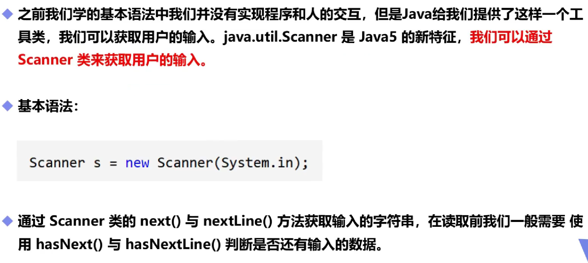
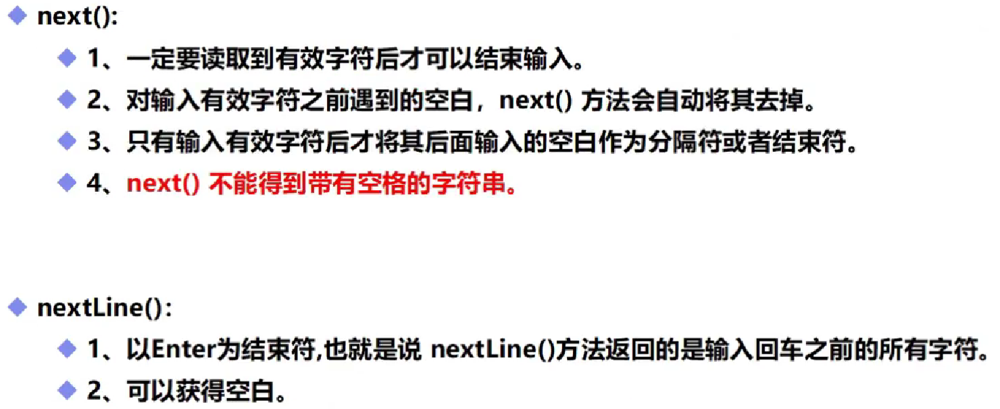
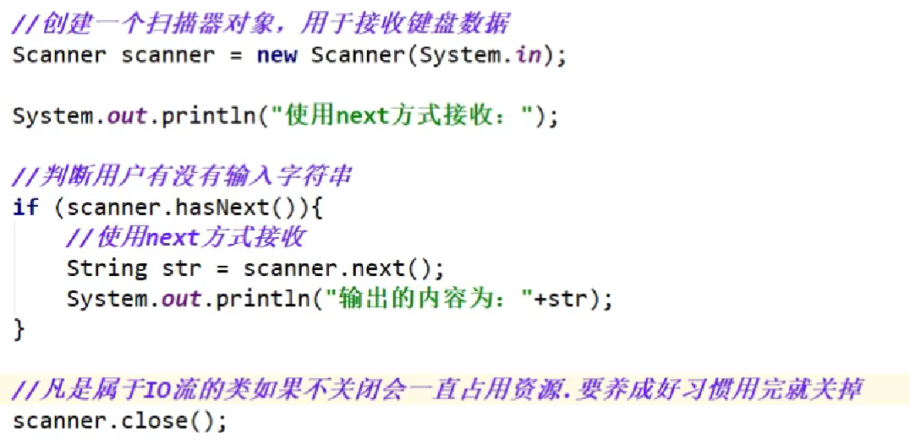

# Scanner对象

## 一，基本规则



## 二，不同输入



## 三，使用举例



```java
Scanner scanner=new Scanner(System.in); //变量名称scanner可以修改，使用方式为：名称.next()
String str=scanner.next();//next后面没有说明的话，默认将获取内容转化为String的类型。nextLine()代表会获取到一行的内容，而next()只获取到空格前字符。
scanner.close();//释放内存。
```

## 四，进阶用法

```java
public static void main(String[] args) {
        Scanner scanner=new Scanner(System.in);
        System.out.println("please input number(int)");
        if (scanner.hasNextInt()){//scanner.hasNextInt()判断输入的内容是否为int，并返回布尔值。if依据布尔值来确定是否需要执行，与C语言有差距。
            int a=scanner.nextInt();//scanner.nextInt()将输入的内容以int型返回给变量a
            System.out.println("the number is:"+a);
        }else {
            System.out.println("error");
        }
        scanner.close();
    }
//整个程序判断输入的值是否为int类型，如果是，则输出输入的值，否则输出error
(scanner会将输入的数据存入缓冲区，且每个函数相对独立。next()和hasnext()函数作用为转化和判断。)
```

**(一定记得导入包——`import java.util.Scanner;`)**
