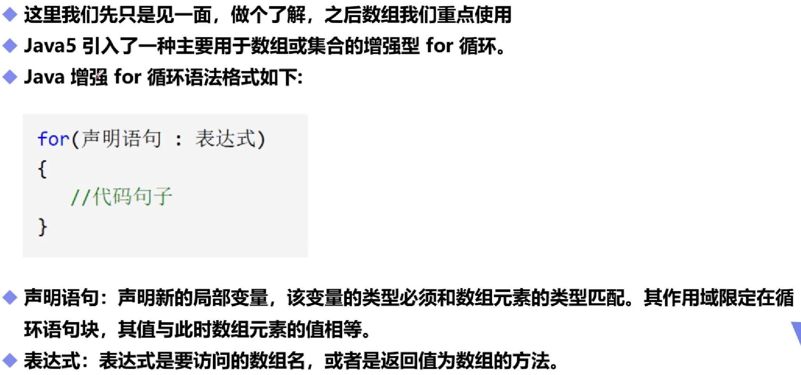
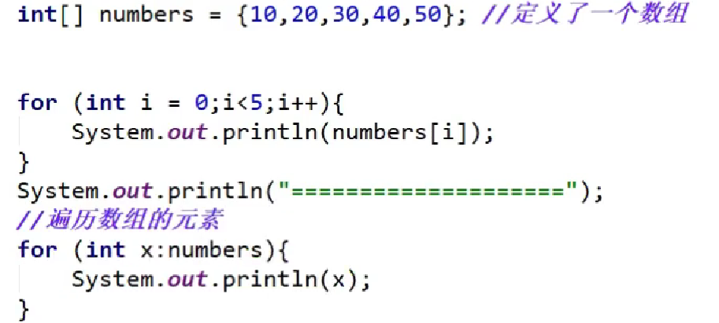

# 增强for循环

## 一，基本概念



## 二，使用举例



**（两个循环输出结果一致，都是将数组内的元素全部输出）**

## 三，输出多维数组

```java
public static void main(String[] args) {
        int[][] array1=new int[2][2];
        for (int[] ints : array1) {
            for (int i : ints) {
                System.out.println(i);
            }
        }
        int[][][] array2=new int[2][2][2];
        for (int[][] ints : array2) {
            for (int[] anInt : ints) {
                for (int i : anInt) {
                    System.out.println(i);
                }
            }
        }
    }
(需要嵌套for循环输出，依据数组维数来决定嵌套层数)
```

## Stream API

```java
        List<StringBuffer> list = new ArrayList<>(
                Arrays.asList(
                        new StringBuffer("你好"),
                        new StringBuffer("好你")
                )
        );
        list = list.stream().map((item) -> {
            item.append("世界");
            return item;
        }).collect(Collectors.toList());
        System.out.println(list);
```

> Stream API底层实现了多线程和并行处理，可以利用多核处理器进行并行处理，提高程序的性能
>
> 输出结果为：[你好世界, 好你世界]
