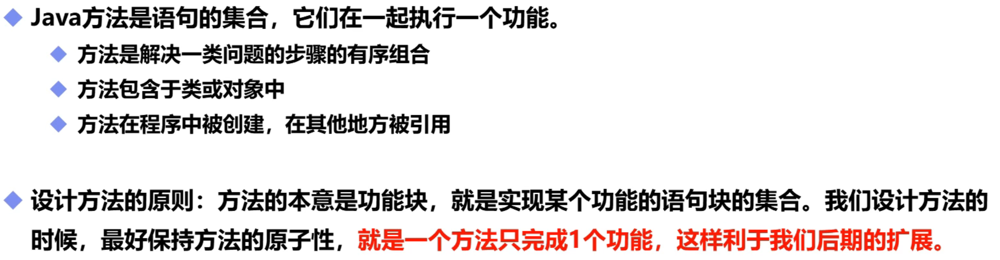
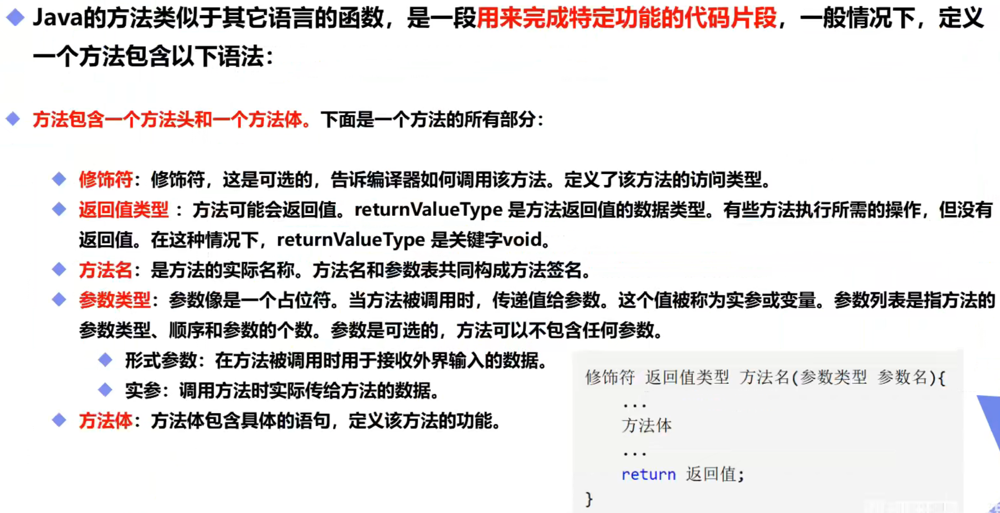
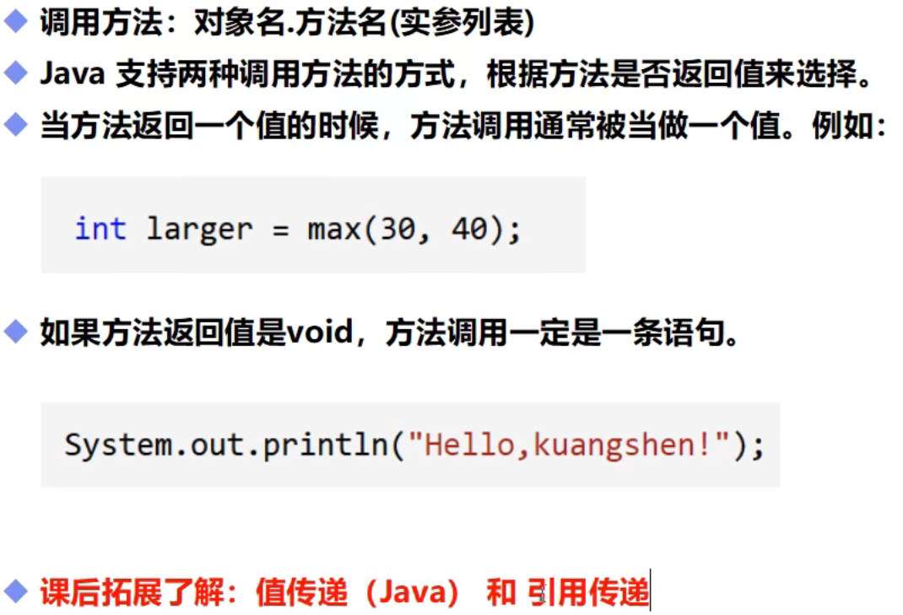
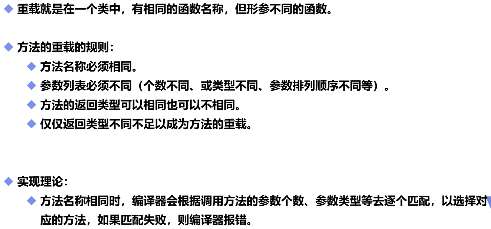

# 方法和传递

## 一，基本概念



## 二，方法使用

```java
public static void main(String[] args) {
        System.out.println(add(1,5));
    }

    public static int add(int a,int b){//int可换为void，void无法返回值，其它规则和C语言一致
        return a+b;
    }
```

## 三，方法定义



## 四，方法调用



**（拓展：Java只有值传递，地址被封装起来了，编程中没有了取址符，只有值传递。C语言有三种参数传递方式，值传递（int a）地址传递（int *a=&b）引用传递（int &a=b））**

```c
a=b;	//a复制了b的值
*a=&b;	//只是将b地址上的内容赋给了指针a，a有自己独立的地址，a和b地址不相同但内容相同
&a=b;	//变量a复制了变量b的地址，此时a和b地址相同，所以内容也相同
(口诀：看什么就管什么，但要的相反)
```

## 五，方法重载



```java
public static void main(String[] args) {
        System.out.println(add(1,5));
    }
    public static int add(int a,int b){
        return a+b;
    }
    public static int add(double a,double b){//注意方法名称必须相同，参数列表必须不同
        return ((int)(a+b));//在方法中return后面不能有任何语句，否则会报错
    }
```

