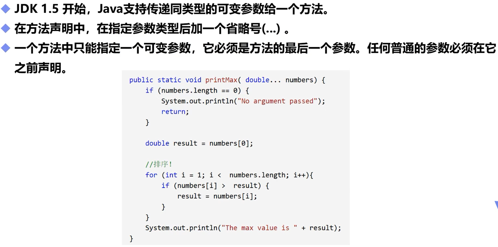

# 可变参数

## 一，定义



## 二，举例

```java
public static void main(String[] args) {
    add(1,2,3);//直接输入数值
    add(new int[]{1,2,3});//数组形式输入数值
    }
    public static void add(int ...number){//定义可变参数number
        int result=0;
        for (int i = 0; i < number.length; i++) {//number.length为可变参数长度
            result=result+number[i];	//将所有输入的数加起来
        }
        System.out.println(result);
    }
//可变参数和数组与许多相似的性质
```

```java
6
6
```

