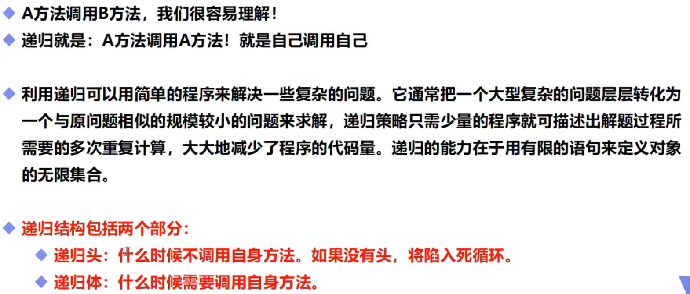

# 递归

## 一，基本概念



## 二，使用举例

```java
public static void main(String[] args) {
        System.out.println(max(6));
    }
    public static double max(double a){
        if (a==1){//终止条件
            return 1;
        }else{
            return a*max(a-1);//递归调用，求a的阶乘
        }
    }
(递归调用属于栈结构的应用)
```

