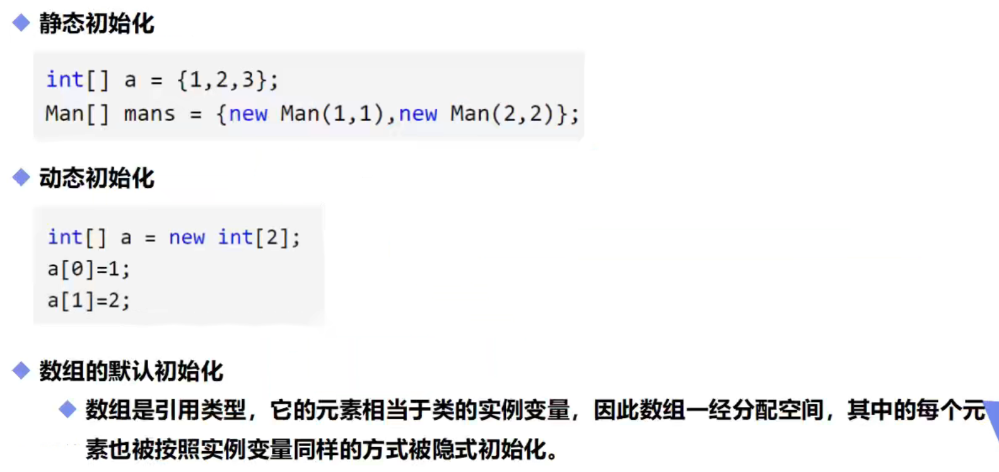

# 数组

## 一，数组声明创建


## 二，使用举例

创建数组的三种方式：

- `int[] num`：仅声明数组num，并未初始化
  - `num=new int[]{1,2,3,4,5}`：开拓空间进行初始化并为里面的变量赋初值
  - `num=new int[5]`：开拓空间进行初始化(里面变量为默认值)

- `int[] num=new int[]{1,2,3,4,5}`：注意[]内不能再定义数组空间大小(系统会自动分配)
- `int[] num=new int[5]`：开辟数组num长度为5空间大小(里面的值都是默认值)，此时赋值需要采用num[i]的方式

```java
public static void main(String[] args) {
    int[] num={1,2,3,4,5};//定义了数组的同时赋值
        for (int i : num) {//获取数组长度之后循环输出数组
            System.out.println(i);
        }
    System.out.println(num.length);//num.length代表数组内元素个数
    int[][] num1={{1,2},{3,4,5}};
    System.out.println(num1.length);//num1.length代表数组内元素个数
    System.out.println(num1[1].length);//nun1[1].length代表二维数组中第二排数组长度
    }
```

注意事项：

- C语言数组定义时可以声明大小再赋值int a[5]={1,2,3,4,5}，Java中**除了开辟数组空间需要声明长度**，其他时候系统会定义声明长度，**人工声明长度反而会报错**
- 注意`int[] num`和`int num[]`等价，[]位置可以调整
- “{}”赋值方式只能在初始化时赋值一次，后面修改数组内值时不能再使用这种方式

## 三，数组初始化



```java
public static void main(String[] args) {
    int[] num1={1,2,3,4,5};//静态初始化：创建+赋值，在创建时就将值赋好
    int[] num2=new int[5];//动态初始化：先创建，在后续的语句中再赋值。还未赋值的元素为默认初始化
    num2[0]=1;
    }
```

## 四，数组边界


## 五，Arrays类


```java
System.out.println(Arrays.toString(num));//顺序打印数组num
```

