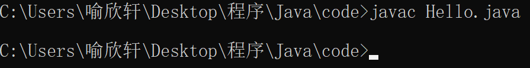
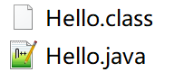
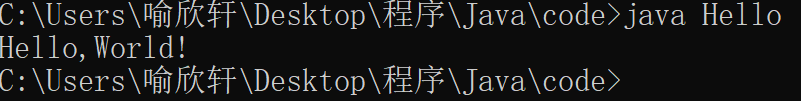

# 第一个Hello程序

## 代码如下

```java
public class Hello{
	public static void main(String[] args){
		System.out.print("Hello,World!");
	}
}
```

文档名称为：Hello.java**（需与代码“class”后的名称“Hello”保持一致）**

## 编译

使用cmd运行在对应文件目录，此时输入：javac Hello.java进行编译**（有文件类型后缀）**



如图显示即代表代码没有问题且编译成功，系统会自动生成Hello.class文件



## 运行

使用cmd运行在对应文件目录，此时输入：java Hello进行运行**（没有文件类型后缀）**



如图显示即代表运行成功且输出了代码的运行结果

