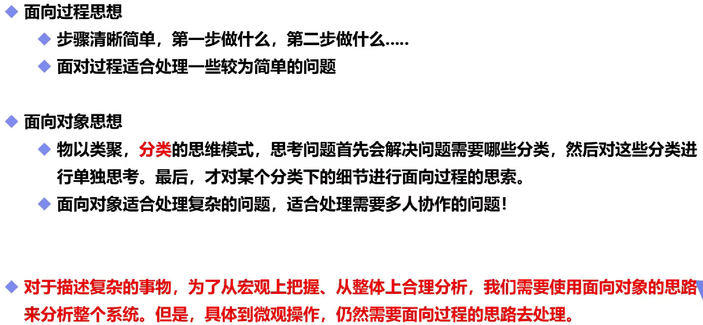
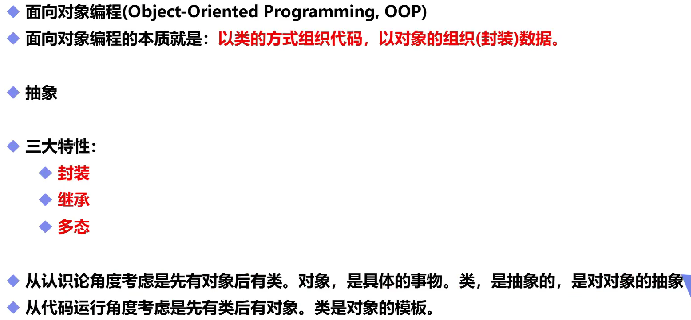
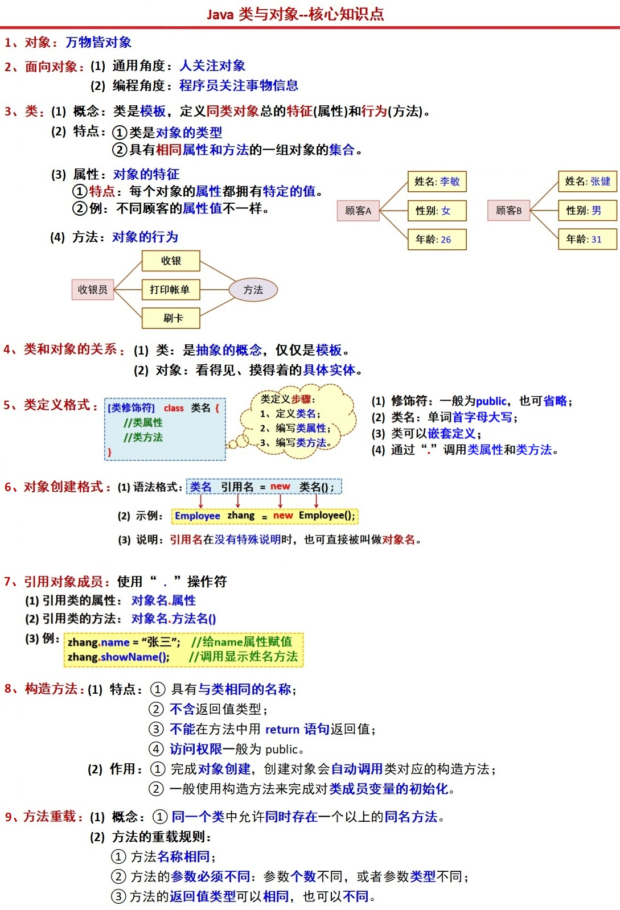

# 面向对象

## 一，两种面向



## 二，基本概念



## 三，类与对象

当一个**对象实例化后**，或者**初始化后**，会给其中的**所有属性赋初值**。对于**static修饰的变量会直接赋初值**，不需要实例化。



## 四，重载

- 方法重载有 5 个匹配原则：**精准匹配**、**基本类型自动转换成更大的基本类型匹配**、**自动装/拆箱匹配**、**按照继承路线依次向上匹配**、**可变参数匹配**。 

```java
public class Test {
    public static void main(String[] args) {
        Test test = new Test();
        test.method(12);
    }
    public void method(int num){
        System.out.println("调用int方法");
    }
    public void method(long num){
        System.out.println("调用long方法");
    }
    public void method(Integer num){
        System.out.println("调用Integer方法");
    }
    public void method(Object num){
        System.out.println("调用Object方法");
    }
    public void method(int... num){//可选参数
        System.out.println("调用int...方法");
    }
}//优先顺序自上向下
```

**注意：返回值类型不同不算方法的重载，因为JVM无法确定需要调用哪个方法**
