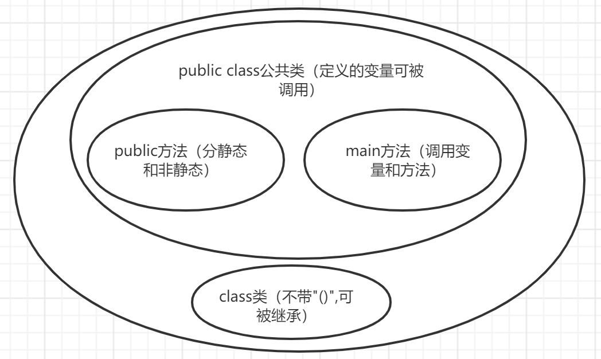

# 方法、类和引用传递

## 一，方法种类

**静态方法：static（可以直接通过类名.方法调用）**

**非静态方法：没有static（需要实例化这个类）（实例中多采用非静态方法）**

**匿名对象**

- 每次 new 都相当于开辟了一个新的对象，并开辟了一个新的物理内存空间。如果一个对象只需要使用唯一的一次，就可以使用匿名对象，匿名对象还可以作为实际参数传递。例如：**new text().n();**

- 匿名对象就是没有明确的给出名字的对象，是对象的一种简写形式。一般匿名对象只使用一次，而且匿名对象**只在堆内存中开辟空间**，而不存在栈内存的引用。

```java
public class demo07 {
    public static void main(String[] args) {
        new demo07().b();//调用自身非静态方法(这里的new进行实例化)
        demo07 name0=new demo07();//调用自身类非静态方法(创建了对象name)
        name0.b();
        demo07.a();//调用自身静态方法(注意demo07后面没有'()')
        a();//调用自身静态方法
        
        new text().n();//调用其他类非静态方法(相对简单的调用方式，但是不可以自己命名)
        text name=new text();//调用其他类非静态方法(创建了对象name)
        name.n();
        text.m();//调用其他类静态方法(因为static和类一起加载，所以不需要实例化)
    }
    public static void a(){
        System.out.println('a');
    }
    public void b(){
        System.out.println('b');
    }
}
(总结：无论是否为其他，或者是否为静态，用new方法一定不会出错，其他方法理解一下即可。不想命名可以通过new text().n()来直接调用)
(注意：public class中只能调用变量和方法，不能定义方法，且对于定义的变量也无法其他被调用)
(static{}的代码只会被执行一次，且优先级很高)
```

```java
public class text {
    public static void main(String[] args) {

    }
    public static void m(){
        System.out.println(1);
    }
    public void n(){
        System.out.println(2);
    }
}
```

```java
运行结果为
b
b
a
a
2
2
1
```

**(static方法和类一起加载，优先级很高，非static方法在类实例化之后才存在，所以static方法中的语句需要明确，互为static方法可以相互调用，但是不能在static方法中调用非static方法)**

**(实例中多采用非静态方法)**

```java
需要明确的是，调用类和调用公共类内的变量和方法的方式是一样的
    调用类(class)：
class student{
    String name="yxx";//Class内无法直接使用输出语句，只能定义变量和方法
    public int age(){
        int a=20;
        return a;
    }
}(注意：class需要写到public class之外，public class内只能写public方法)
public static void main(String[] args) {
    student student=new student();//student为student类的对象
    System.out.println(student.name);//调用类中的变量并输出
    System.out.println(student.age());//调用类中的方法并输出
}(在同一个项目中即可成功调用，class和public一样遵循变量无括号，方法带括号)

    调用公共类(public class)：参考上述代码   
```

**（总结：主函数内调用变量和方法，调用方式遵循变量无括号，方法带括号。主函数外、public class内定义public方法（分静态和非静态（实例大多采用）），public class内定义变量，public class外定义class方法（定义时无括号，且无法输出语句，可以定义变量和方法）。）(public class和class相对独立)**

**（方法：通过算法达到某个目的，类：定义变量或者方法给予使用者调用）**



## 二，构造器（构造方法）

```java
public class demo20{
}
class point{
    int a,b;
    public point(int a,int b){
        this.a=a;
        this.b=b;
    }
    public int c(point p){//p为point类的对象，需要输入的形参也变成了point类的对象
        return a*a*b*b;
    }
}
class Text1{
    public static void main(String[] args) {
        point p1=new point(1,2);//这里在定义p1为point对象的同时也为p1中的a，b赋了初值
        System.out.println(p1.c(p1));//第一个p1调用c方法，第二个p1输入了方法c需要的数据类型
    }
}
运行结果为
4
```

## 三，引用传递

```java
public class demo08 {//Java只有值传递，但是存在引用传递的应用
    public static void main(String[] args) {
        people person=new people();//将person定义为people类的一个对象(person有people的所有性质)
        System.out.println(person.name);
        
        demo08.change(person);//将person对象输入到方法change中去(change(person);也可以调用)
        System.out.println(person.name);//将person对象进行输出
    }
    public static void change(people persons){//change需要输入people类的数据类型，persons为形参
        persons.name="mine";//对person对象进行修改
    }
}
class people{ //定义了一个people类，其中有一个属性name
    String name;
}
```

```java
输出结果为
null
mine
```

- 方法：
  - **[访问权限] 方法返回值类型 方法名(形参列表){}**

- 类：
  - **[访问权限] class 类名{}**

**（带有访问权限的方法内才能进行赋值、调用对象方法，类里面只能进行定义，不能进行实现）**
