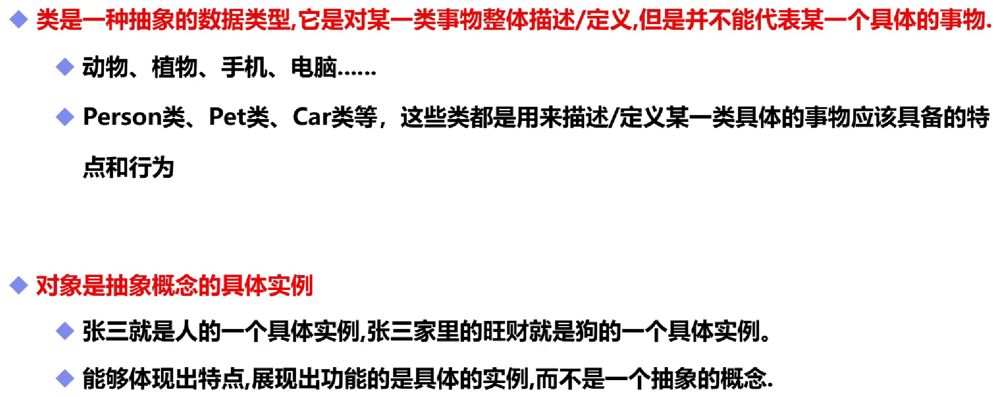
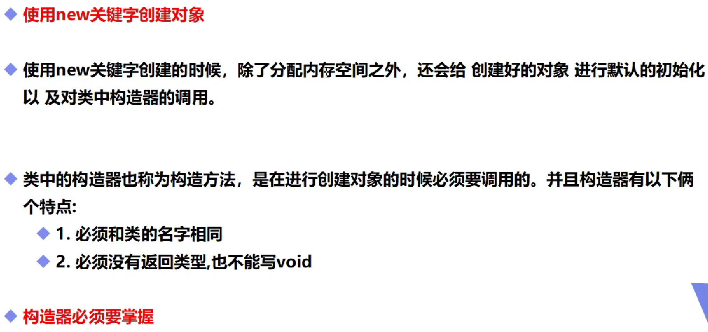

# 类、对象和实例化

## 一，基本概念



## 二，创建与初始化对象



```java
public class demo01 {//class文件中的构造器
    public demo01() {//一个类即使什么也不写，它也会存在一个方法，也就是构造方法
    }
(使用new关键字，本质是在调用构造器)
(用来初始化值)
```

## 三，类的实例化

类本身是存在**声明**和**new初始化**两个步骤的才能**实例化一个完整的对象**的。

```java
Node node;//这里声明了一个Node类型的对象node，node可以用于存储Node类型对象的值(指向堆栈的地址)
node = null;//这里进行了null初始化，node拥有Node的属性和方法，但是却没有Node类型对象的值(指向堆栈的地址)
System.out.println(node.toString());//node还无法调用或使用Node属性和方法，会出现空指针异常(NullPointerException)
node = current;//将current(current为Node的对象)的值(指向堆栈的地址)赋值给node。node和current的值相同，都会指向堆栈中的同一对象，两者都可以对指向的对象进行操作。这里是拥有地址传递的性质！
node = null;//由于堆栈中的对象只有地址，没有“实例”，所以这里只是将node置空，并不会影响current的值，更不会将堆栈中的对象删除
```

