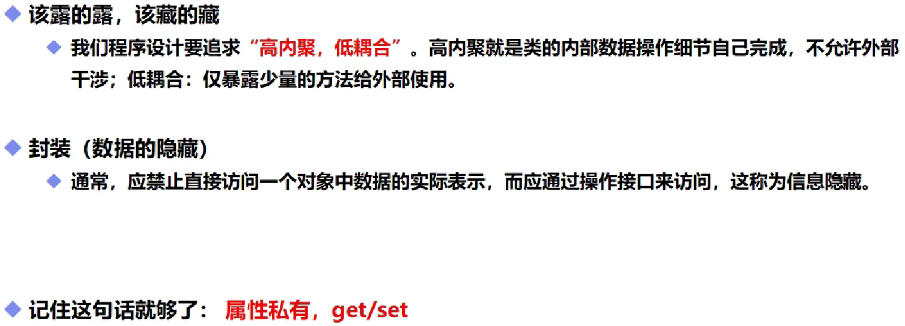
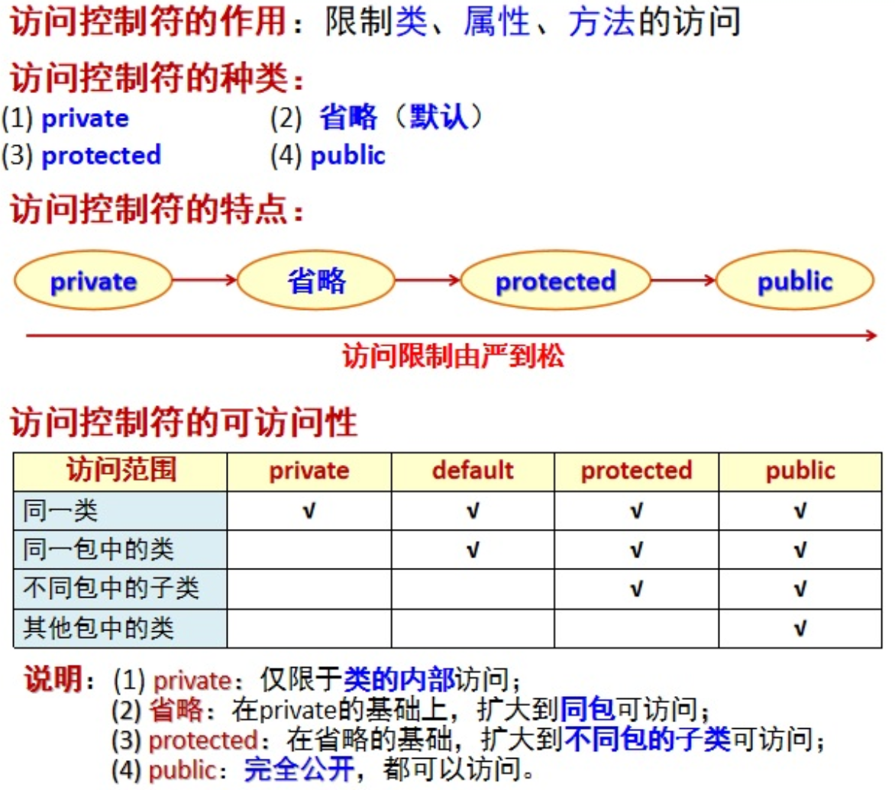
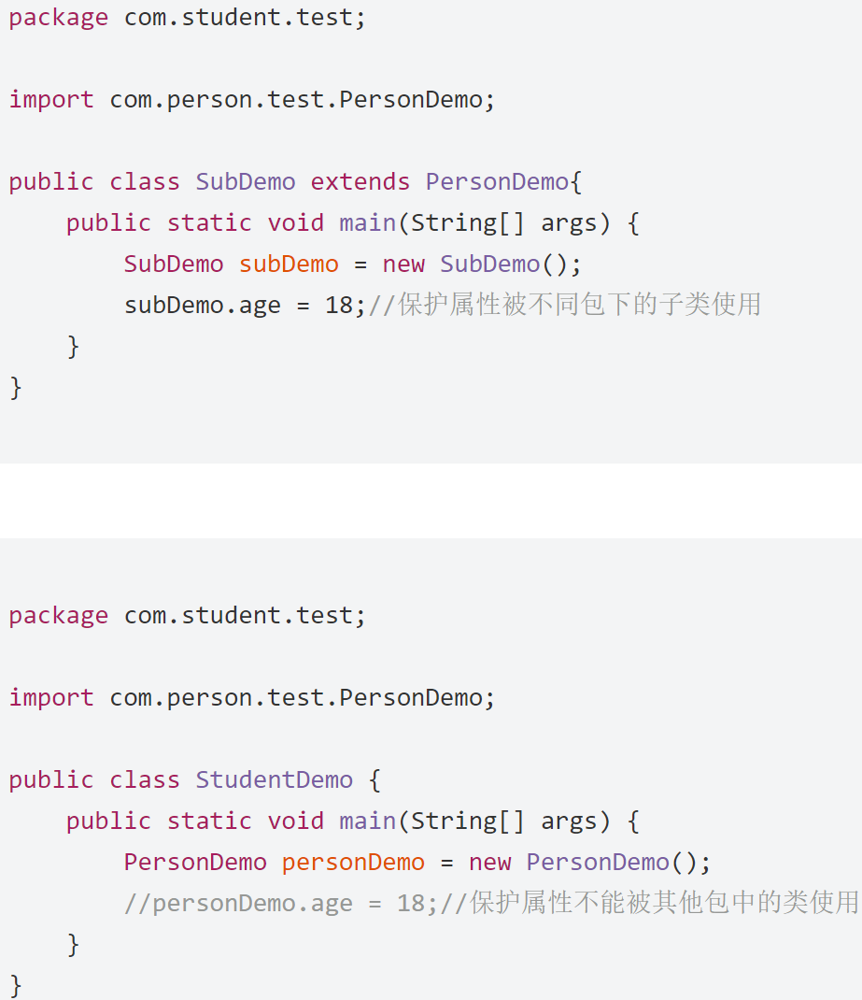

# 封装和访问控制符

## 一，基本概念



```java
public class demo09 {
    private String name;//属性私有，无法通过new调用
    private int age;
    //get：获得这个数据
    //set：给这个数据设置值
    public String getName(){
        return name;
    }
    public void setName(String name){
        this.name=name;
    }
    //alt加insert键快捷生成getName和setName方法
    public int getAge() {
        return age;
    }
    public void setAge(int age) {
        if(age>120||age<0)
            this.age=0;
        else
            this.age = age;
    }//可将内在逻辑封装起来，防止系统被破坏
}
```

```java
public class demo10 {
    public static void main(String[] args) {
        demo09 name01=new demo09();
        name01.setName("yxx");
        System.out.println(name01.getName());
        name01.setAge(150);
        System.out.println(name01.getAge());
    }
}
(运行结果为yxx 0)
```

## 二，封装的意义

1. **提高程序安全性，保护数据**
2. **隐藏代码的实现细节**
3. **统一接口**
4. **增加系统的可维护性**

## 三、访问控制符



**关于default和private的重点区分**

default是可以通过**继承调用**的，但是private是不行的



