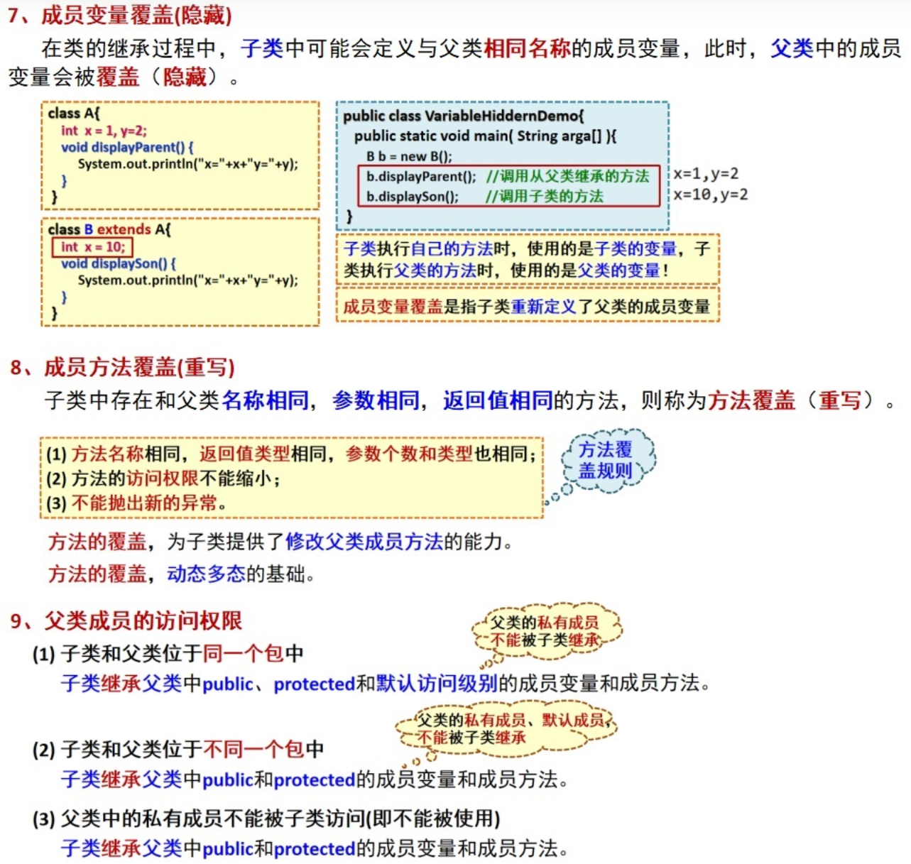
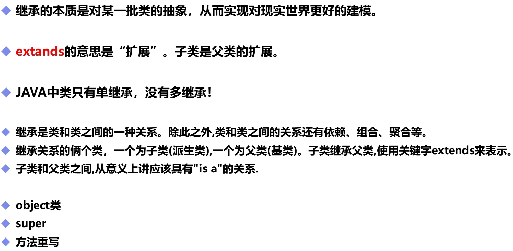

# 继承

## 一、成员变量和方法



## 二，基本概念



```java
public class demo11 extends text02{//子类demo11继承父类text02的所有方法，改成b则继承b
    public static void main(String[] args) {
        demo11 demo11=new demo11();
        demo11.a();//调用规则保持不变
    }
}
```

```java
public class text02 {
    public static void main(String[] args) {

    }
    public void a(){
        System.out.println("Hello World!");
    }
}
class b{
    String name="yxx";
}(注意无法继承class方法，只能继承public方法)
运行结果为
Hello World!
```

## 三、Object类

- Object类，它没有子类，定义了所有类公用的属性和方法
- 所有Java类都是Object类的子类
