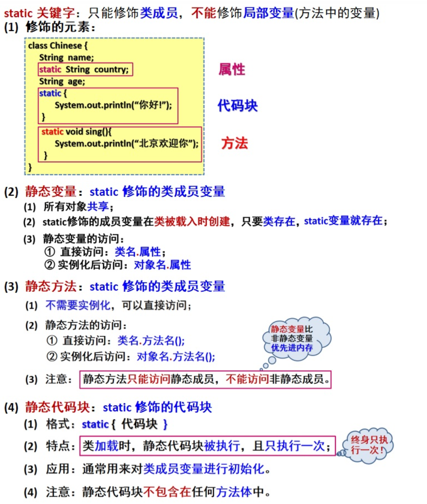

# this、super、static和引用

```java
public class demo12 extends text03{
        int person=10;
    public static void main(String[] args) {
        int num=10;
        System.out.println(new demo12().max(num));
    }
    public int max(int person){
        this.person=person+1;//this.person在这里指代的是上面定义的成员变量person，而不是此方法内的局部变量person
        System.out.println(super.name);//可以通过super调用父类text03中的所有变量和方法-->yxx
        super.name();//调用父类方法，方法打印结果-->YXX
        return this.person;//方法返回值，供调用者使用-->11
    }
}
(注意；super无法在主函数中调用)
```

```java
public class text03 {
    String name="yxx";
    public void name(){
        System.out.println("YXX");
    }
}
```

```java
运行结果为
yxx
YXX
11
```

this：调用本身调用者这个对象，**this()：本类的构造**。没有继承也可以使用。

super：代表父类对象的引用，**super()：父类的构造**。必须**在继承条件**下的**子类**中才可以使用。

**注意**

- this()和super()在构造方法中使用时，必须是第一条语句。
- this()和super()只能用于构造方法中
- this()和super()不能同时调用构造方法，会出现递归调用

**this关键字的高级用法：**实现一个语句中无限次调用对象方法

```java
public class Test1 {
    public static void main(String[] args) {
        Method method = new Method();
        method.add("你好").add("世界").add("!").delete().delete();
        System.out.println(method.stringBuilder);
    }
}
class Method {
    StringBuilder stringBuilder = new StringBuilder();
    //每次调用则将输入的自字符串添加起来，可以反复调用
    public Method add(String str){
        stringBuilder.append(str);
        return this;
    }
    //每次调用删除结尾的字符，可以反复调用
    public Method delete(){
        stringBuilder.replace(stringBuilder.length()-1,stringBuilder.length(),"");
        return this;
    }
}
//运行结果：你好世
```

## this

> `this`关键字是一个特殊的变量，它代表了当前对象的引用。在除构造方法之外的其他方法中，`this`关键字可以被看作是方法的隐式第一个参数。本质上，可以将方法的声明理解为`method(Self this, Object... args)`，其中`this`指向的是方法所在对象的自身

```java
public class TestMethod {

    public static void main(String[] args) {
        Student stu = new Student();
        stu.setName("yxx");
        System.out.println(stu.study()); // yxx在学习
    }
}

class Student {
    private String name;

    public String study(Student this){
        return this.name + "在学习";
    }

    public String getName() {
        return name;
    }

    public void setName(Student this, String name) {
        this.name = name;
    }
}
```

## super

```java
public class Test extends TestFather{
    int b;
    public Test(int a) {
        super(a);//父类如果存在构造方法，一定得在子类中实现。如果父类构造方法为空，则在子类为空的构造方法中会默认实现
    }
    public Test(int a, int b) {
        super(a);//必须是第一个语句，得优先实现父类的构造方法
        this.b = b;
    }
    public void initialization(){
        System.out.println(super.a);
    }
    public static void main(String[] args) {
        Test test = new Test(20);
        test.initialization();
    }
}//运行结果：20
```

```java
public class TestFather {
    int a;
    public TestFather(int a) {
        this.a = a;
    }
}
```

## static



## 引用

### 引用其他包

static广泛用于**方法类**中，对于专门用来实现某一个操作的类，因为需要被不是一个包下的类调用，需要使用到import。这时候需要通过**static关键字提高优先级**，否则调用类无法使用方法类中的方法和变量。

类中**只存在用static修饰的变量和方法**的类被称为**应用程序类**（不需要实例化，直接导包**使用默认对象访问**即可）

```java
package Demo;//对于类，一定要放到包里，不能直接丢在src目录下面

public class demo {
    public static int num;//加了public之后导包的“特殊对象”才能访问到
    public demo(int num){
        demo.num = num;//类本身就存在一个和自己名称相同的“特殊对象”，不过由于进入内存的优先级较高，只能调用static修饰的变量和方法。
        System.out.println("调用了构造方法");
    }
    public static void a(){
        System.out.println("你好");
    }
    
    int b;//普通定义一个b
    
    public int getB() {//对于默认对象demo来说，是无法访问到非static的
        return b;
    }

    public void setB(int b) {
        this.b = b;
    }
}
```

```java
package Demo1;
import Demo.demo;//导入包时获取到的默认对象(demo)就是那个“特殊对象”

public class Test{
    public static void main(String[] args) {
        demo demo1 = new demo(10);//这个特殊对象demo无法再实例化对象，demo传递demo1的方式为引用传递！demo1作为demo的“别名”存在，两者指向堆栈中的同一地址，这里成功调用了构造方法，会输出“调用了构造方法”
        demo1.a();//你好
        demo1.setB(20);//实例化后的对象demo1除了可以访问静态方法还能访问非静态方法，但是编译器会提示使用demo来访问更好，因为两者为引用传递
        //对于demo来说是无法通过demo.getB();访问非静态方法和属性的，但是静态的方法是和demo1相互关联的
        System.out.println(demo.num);//初始化demo1的num却可以通过demo输出-->10
    }
}
```

（**不同类导入同一个包，数据是无法做到交互的。**类似通过一个类导入一个包，修改默认对象的值，另外一个类导入同一个包，无法得到前一个类设置的值）

### 引用自身

万物皆对象，与引入其他包类似，每个包都相当于引入了自身，也就是会存在一个特殊的隐性对象——自身，同样是static关键字修饰的，**只能访问到自身static关键字修饰的方法和变量**

```java
public class Test {
    public static void main(String[] args) {
        Test.hello();//通过自身的引用调用static方法-->Hello，World!
    }
    public static void hello(){
        System.out.println("Hello，World!");
    }
}
```

值得注意的是，这个关于自身的引用和`this`指代自身是存在很大不同的，this关键字**无法在static方法中使用(主方法)**，this更像是自身默认实例化了的一个对象，可以直接**用作自身方法的返回值**来**返回自身**再进行操作
