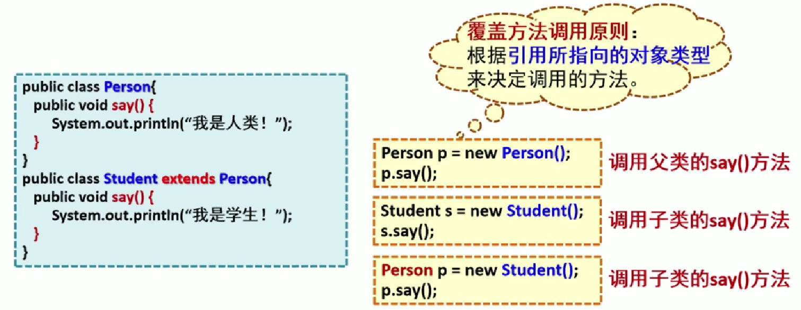
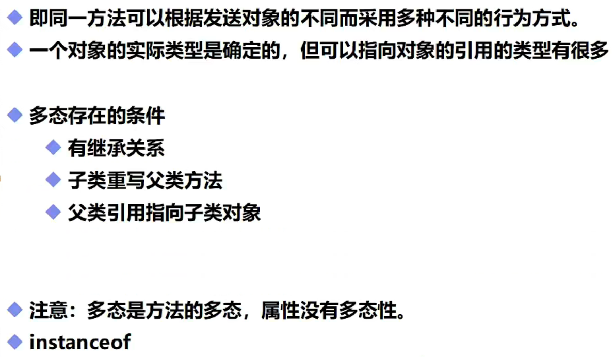
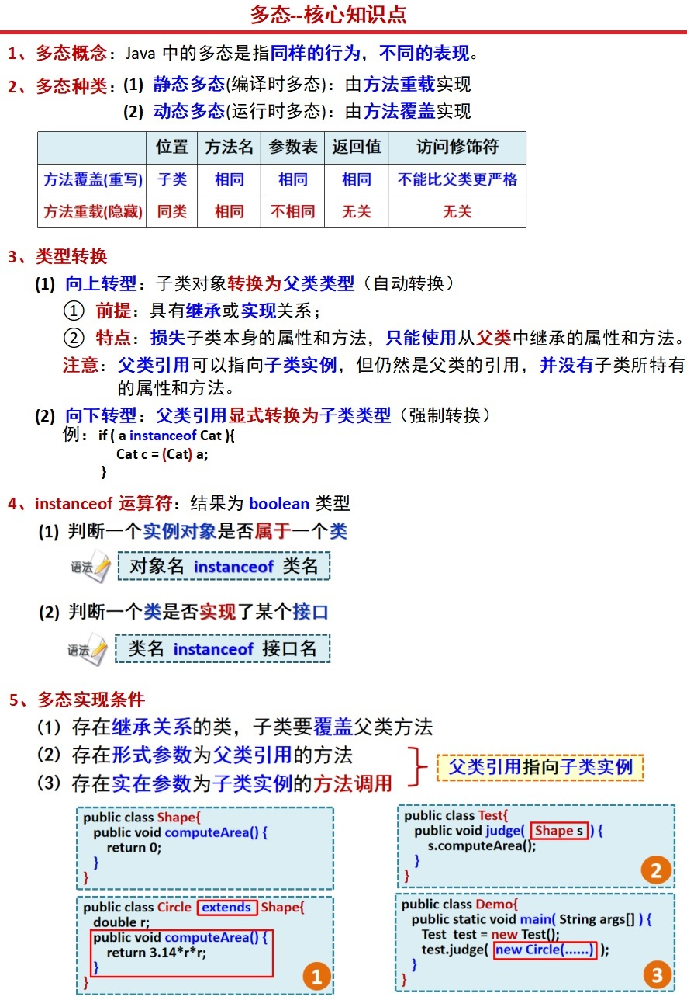

# 重写和多态

```java
Student s;//定义了一个Student类型的引用型变量s
Student s = new Student();//将s指向Student()对象(实例化)
Person p = new Student();//父类的引用指向子类对象(多态)
```



## 重写

- 向上转型：子类对象转化为父类类型(损失子类本身的属性和方法)(自动实现)-->Father f = new Son();
- 向下转型：父类引用显式转化为子类类型(强制转换)-->(Son)f

```java
//静态：方法的调用只和左边定义的数据类型有关
//非静态：算作重写
public class Test extends TestFather{//重写都是方法的重写，与属性无关
    public void run(){
        System.out.println("Test的run()");
    }
    public void son(){
        System.out.println("Test的son()");
    }
    public static void main(String[] args) {
        Test son = new Test();
        son.run();//-->Test的run()
        TestFather father = new Test();//父类的引用指向了子类
        father.run();//test1本质上是TestFather的对象，所以没有run1()方法，但是通过多态调用了Test重写了run方法-->Test的run()

        ((TestFather)son).Father();//将子类转化为了父类(由小到大没问题，但从大到小就需要转化，这里的强制转化是冗余的)-->TestFather的Father()
        ((Test)father).son();//将父类转化为了子类-->Test的son()
        father.Father();//父类可能会丢失一些自己的方法，这里还具有自己的方法-->TestFather的Father()
        //强制转化：((转化类型)引用类型).方法名();   低类型方法 方法名=(转化类型) 高类型方法名;
    }
}
```

```java
public class TestFather {
    public void run(){
        System.out.println("TestFather的run");
    }
    public void Father(){
        System.out.println("TestFather的Father()");
    }
}
```

重写：需要有继承关系，子类重写父类的方法

1. 方法名必须相同
2. 参数列表必须相同**(不能更改方法返回值的类型)**
3. 修饰符：范围可以扩大，但是不能缩小   public>Protected>Default>private
4. 抛出的异常：范围可以缩小，但不能扩大   Exception>classNotFoundException

重写：子类的方法和父类必须一致，但是方法体不同

为什么需要重写：父类的功能子类不一定需要，或者不一定满足

## 多态的基本概念



多态：**（通过子类的重写方法实例化父类对象中的方法）**

1. 存在条件：两者为继承关系，方法需要重写，**父类引用指向子类对象**（Father f1=new Son();）
2. 多态是方法的多态，属性没有多态
3. 父类和子类为同一数据类型，否则会类型转化异常（ClassCastException）

注意：以下三类无法重写

1. static方法：属于类，它不属于实例
2. final常量：定义后无法改变
3. private方法：私有方法



**继承是子类对象获取到父类的属性和方法，而多态是父类对象的方法被子类的方法重写（没有属性）**

## 多态的应用

```java
public class demo27 {
}
class Instrument{
    public void play(){
        System.out.println("弹奏乐器");
    }
    public void play2(){
        System.out.println("调用play2");
    }
}
class Wind extends Instrument{
    public void play(){
        System.out.println("弹奏Wind");
    }
    public void play2(){
        System.out.println("调用Wind的play2");
    }
}
class Brass extends Instrument{
    public void play(){
        System.out.println("弹奏Brass");
    }
    public void play2(){
        System.out.println("调用Brass的play2");
    }
}
```

```java
public class demo28 {
    public static void tune(Instrument i){//这里得用static提高优先级
        i.play();
        i.play2();
    }
    public static void main(String[] args) {
        Instrument a=new Wind();
        tune(a);//因为多态的原因，父类对象a的方法被子类重写，并不是不是对象a拥有子类的方法
        Instrument b=new Brass();
        tune(b);
        Instrument c=new Instrument();
        tune(c);//正常输出父类方法还是可以输出的
    }
}
```

```java
运行结果：
弹奏Wind
调用Wind的play2
弹奏Brass
调用Brass的play2
弹奏乐器
调用play2
```

值得注意的是，当父类中存在构造方法时，需要多加注意：

```java
public class Test{
    public static void JiSuan(ChangFangXing a){
        a.TiJi();
    }
    public static void main(String[] args) {
        JuXing a = new ChangFangXing(2,3,4);//这里使用多态调用子类重写了父类对象中的方法
        a.TiJi();
    }
}
class JuXing{
    int aLong;
    int wide;
    public JuXing(int aLong, int wide) {
        this.aLong = aLong;
        this.wide = wide;
    }
    public void TiJi(){
        System.out.println(aLong*wide);
    }
}
class ChangFangXing extends JuXing{
    int high;
    public ChangFangXing(int aLong, int wide, int high) {
        super(aLong, wide);//注意需要满足父类的构造方法
        this.high = high;
    }
    public void TiJi(){
        System.out.println(super.aLong*super.wide*high);
    }
}//运行结果：24
```
