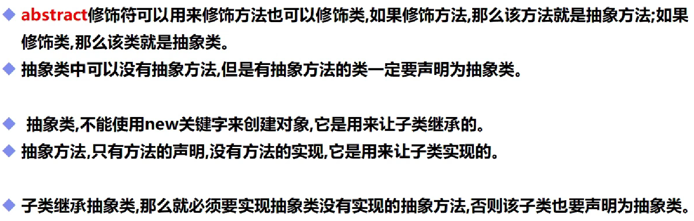
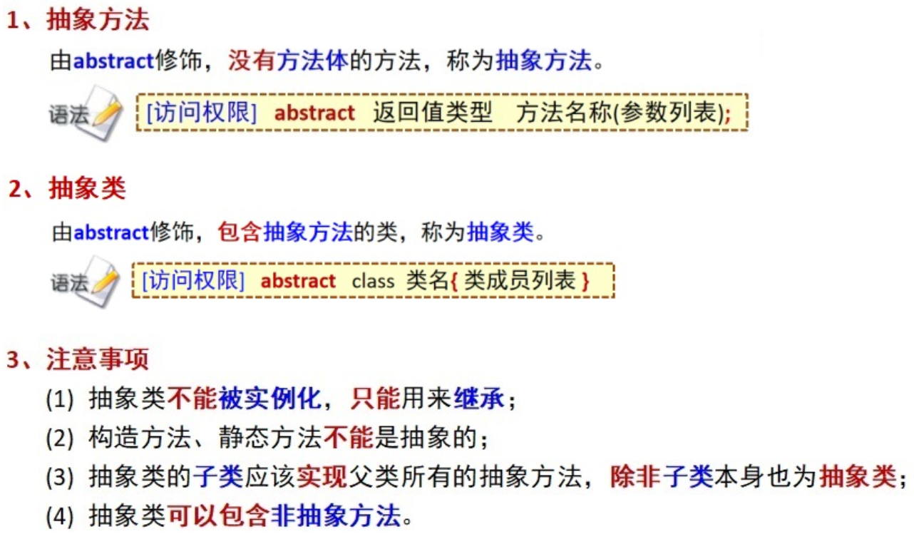

# 抽象类(abstract)

## 一，基本概念



## 二，代码实例

```java
public class demo16 extends text07{//子类继承抽象类，必须重写父类的方法，除非本身也为抽象类
    public static void main(String[] args) {
        demo16 demo16=new demo16();
        demo16.max();
    }
    public void max(){
        System.out.println("Hello");
    }
}
```

```java
public abstract class text07 {
    public abstract void max();//抽象方法，只有方法名字，没有方法的实现,必须有public abstract或者abstract
}
```

```java
运行结果
Hello
```

抽象类：

1. 不能new这个抽象类，只能靠子类去实现它
2. 抽象类中可以写普通方法
3. 抽象方法必须在抽象类中


