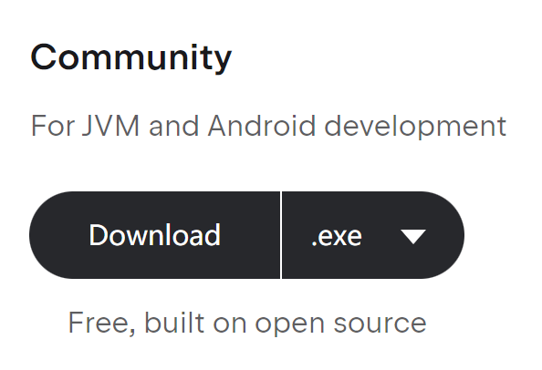
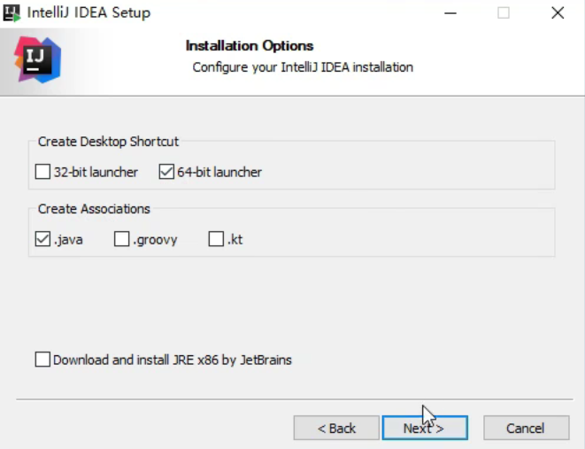
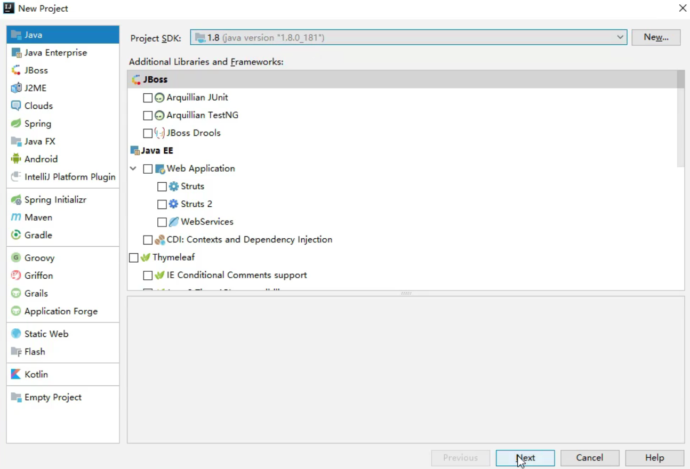
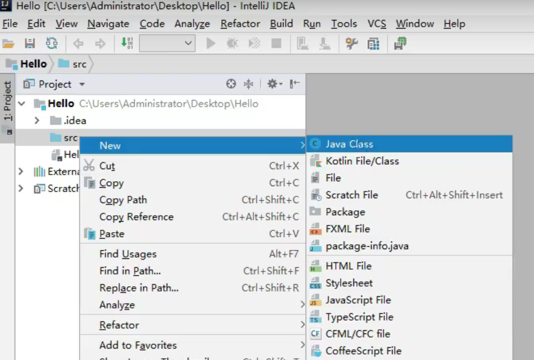
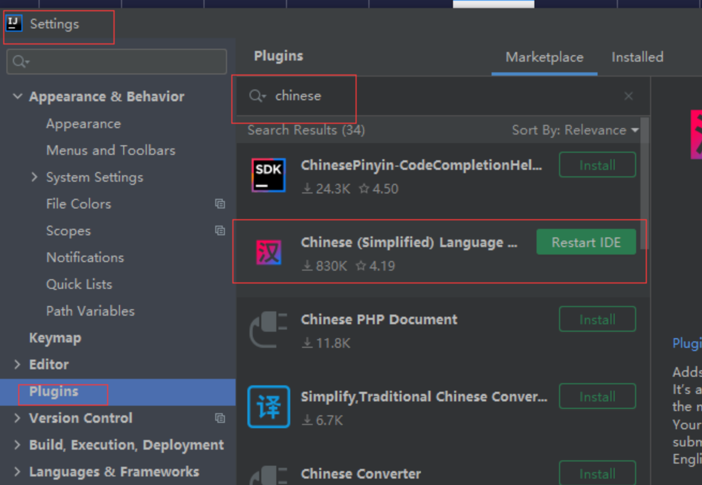

# IDEA的安装与使用

## 安装

1. 百度搜索IDEA，官网地址为[IDEA](https://www.jebrains.com/)
2. 选择IntelliJ IDEA，点击右上角的“Download”进入，选择”社区版“进行下载

3. 安装时按如图勾选**（选择C盘不会出错）**

## 使用

1. 选择创建新项目
2. 按照如图选择进入下一步(这里记得配置好JDK环境)

3. 按照如图选择进入代码编写模式

## IDEA调设为中文

1. Ctrl+Alt+S快捷键打开Settings界面
2. 进入Plugins搜索Chinese，选择下方的Chinese（simplified）Language下载
3. 最后重启软件即可

