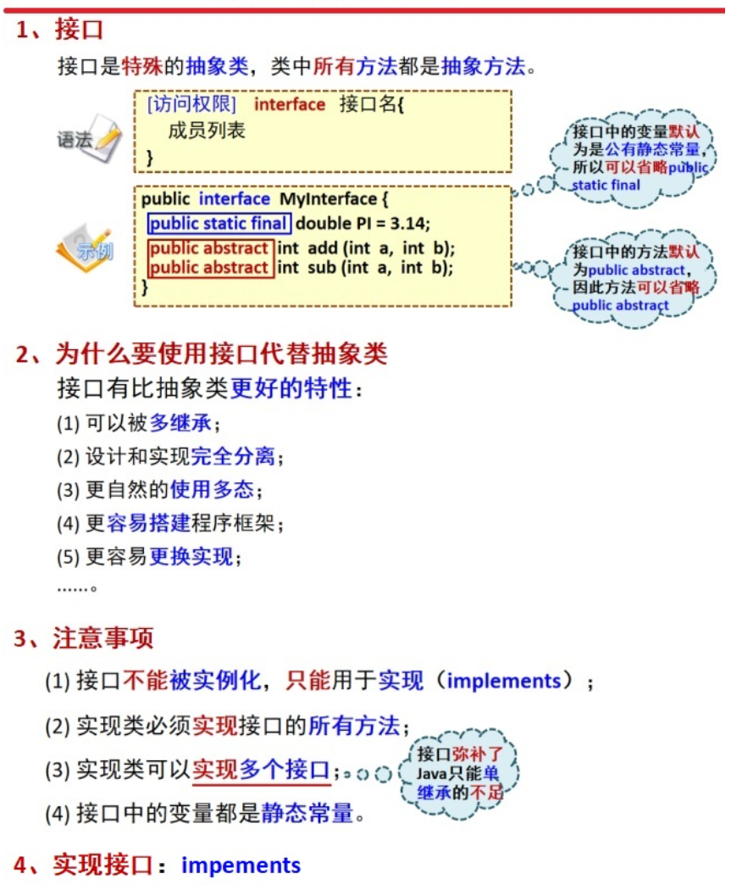
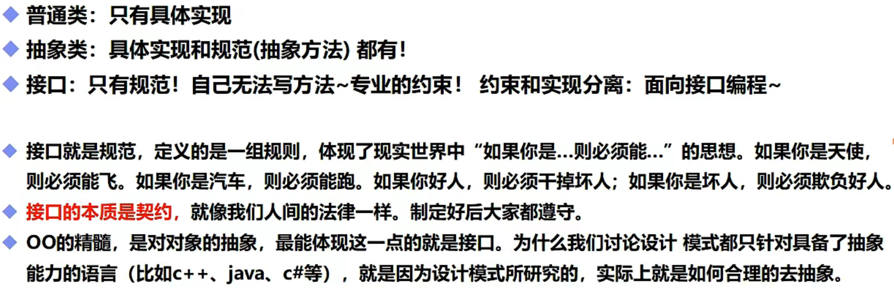

# 接口(interface)

## 一，核心知识



## 二，基本概念




**（注意：接口可以多继承，接口方法都是public abstract,所有常量都是public static final）**

```java
public class demo17 implements text08{//通过implements实现接口，需要重写里面所有方法
    public void name(){
        System.out.println("接口");
    }
}
```

```java
public interface text08 {//接口中所有定义的方法都是抽象类public abstract，且接口都需要有实现类
    void name();//可以省略public或者public abstract
}
```

**对于需要将方法定义为`static`的接口**

```java
public static List<User> findAllUser()
```

```java
public interface Dao {
    static List<User> findAllUser() {	//static关键字修饰需要写方法体，且需要返回的对应返回值
        return null;
    }
}
```

作用：

1. 接口是一种约束
2. 定义一些方法，让不同的人实现
3. 接口中没有构造方法，接口不能被实例化
4. 通过implements可以实现多个接口
5. 必须重写接口中的方法

## 三，接口的运用

### 通过多态实现对方法的安全调用

例如：

`UserDaoImpl implement UserDao`，UserDaoImpl实现接口UserDao中的方法。调用时通过多态使用UserDao中的方法（如果使用static则直接通过UserDao调用UserDaoImpl即可）

UserDao.java

```Java
public interface UserDaoImpl{
    
    static int findAllUser() {	//static关键字修饰需要写方法体
        return UserDaoImpl.findAllUser();
    }
    
    int find();
}
```

UserDaoImpl.java

```java
public class UserDaoImpl implements UserDao{
    
    public static int findAllUser(){
        return 100;
    }
    
    @Override
    public int find() {
        return 10;
    }
}
```

test.java

```java
public static void main(String[] args){
    
	System.out.println(UserDao.find());	//10
    
    UserDao ud = new UserDaoImpl();	//通过多态使用UserDaoImpl的方法覆盖UserDao的方法
    System.out.println(ud.findAllUser());	//100
}
```

### 在类内部可以定义接口供匿名内部类实现

**java类内部可以定义接口**，作用可以看作是对类功能的进一步补充，类里面包含两部分：一部分是自己的固定的，一部分是可以变化的，而这可变的部分就编程了一个接口。

```java
public static void main(String[] args) {
        operation operation = new operation() {
            @Override
            public int add(int a, int b) {
                return a+b;
            }
        };
        System.out.println(operation.add(10,20));
    }
//主方法之外
    interface operation{
        int add(int a ,int b);
    }
//运行结果：30
```

**注意：采用Lamdba表达式实现更加简洁明了**

对于外部class定义的接口实现过程(不推荐使用，了解即可)

```java
public class Test1 {
    public static void main(String[] args) {
        operation operation = (a, b) -> {   //只有一句话时大括号可以省略，return也可以一同省略变为"expression"
            return a+b;
        };
        System.out.println(operation.add(10,20));
    }
//主方法之外
    interface operation{
        int add(int a ,int b);
    }

    number num = new number(){
        operation1 operation1 = new operation1() {	//可以实现接口，但是无法调用
            @Override
            public int multiplication(int a, int b) {
                return a*b;
            }
        };
    };
}
class number {
    interface operation1{
        int multiplication(int a , int b);
    }
}
```

