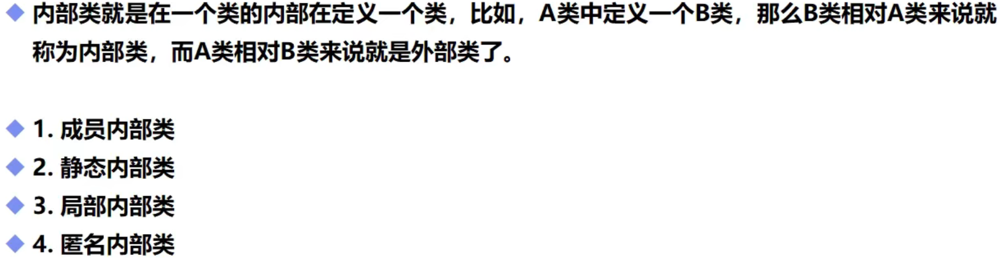

# 内部类

## 一，基本概念



## 二，代码举例

```java
public class demo18 {
    public static void main(String[] args) {
        //先创建外部类实例，然后使用该外部类实例创建内部类实例
        outer.inner inner=new outer().new inner();//一次创建完毕(因为没有对inner方法进行使用，所以这里inner没有"()")
        inner.show();
        outer outer=new outer();//分两步创建
        outer.inner inn=outer.new inner();//(这里的new是在outer后面)
        inn.show();
    }
}
```

```java
public class outer {
    private int age = 10;
    class inner{
        int age=20;
        public void show() {
            int age = 30;
            System.out.println("内部类方法里的局部变量age：" + age);
            System.out.println("内部类的成员变量age：" + this.age);
            System.out.println("外部类的成员变量age：" + outer.this.age);//可以获得外部类的私有属性
        }
    }
}
```

```java
运行结果
内部类方法里的局部变量age：30
内部类的成员变量age：20
外部类的成员变量age：10
内部类方法里的局部变量age：30
内部类的成员变量age：20
外部类的成员变量age：10
```

