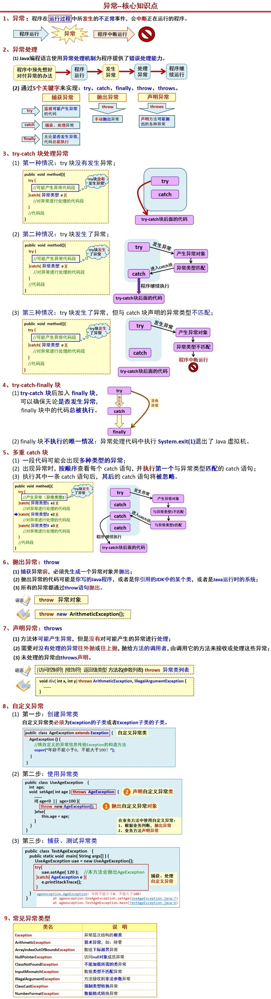
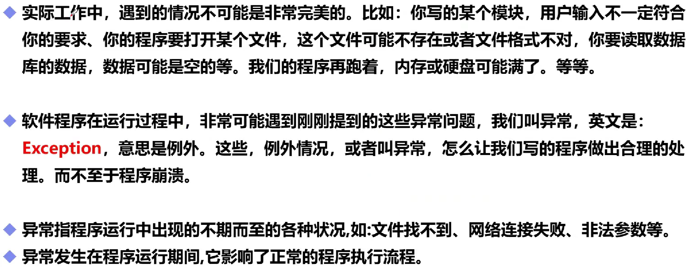
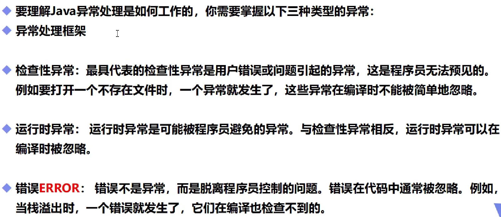
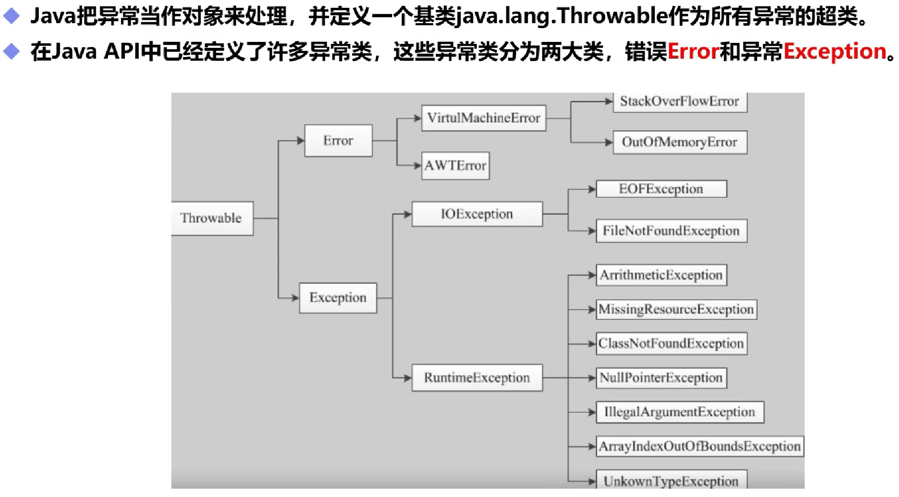
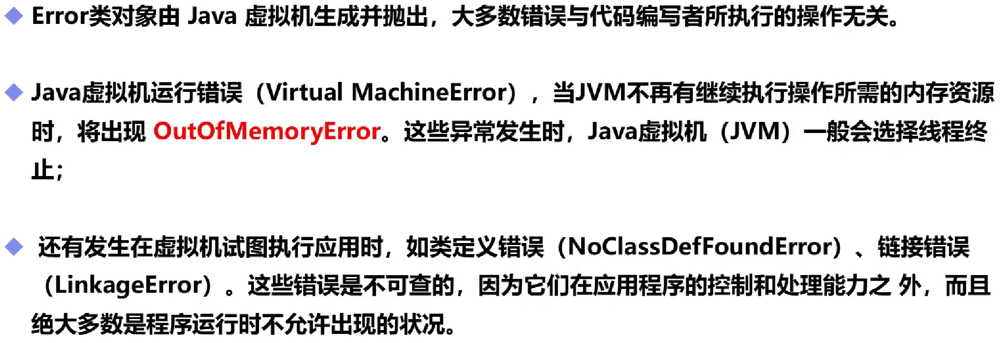
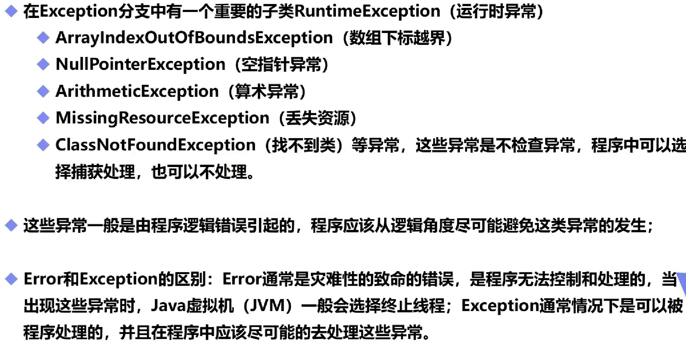
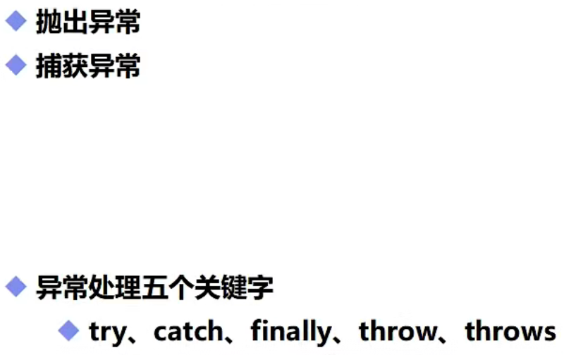
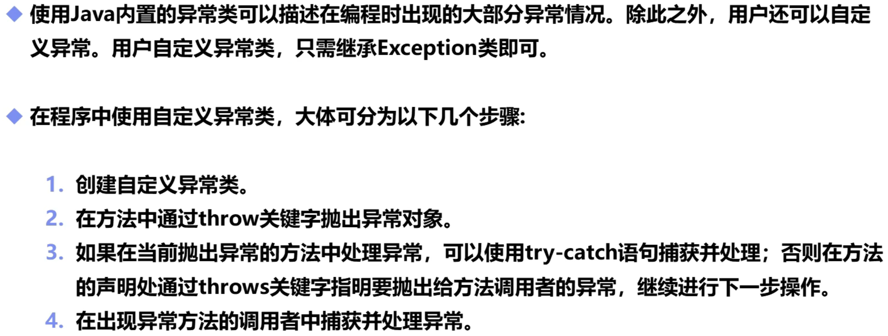
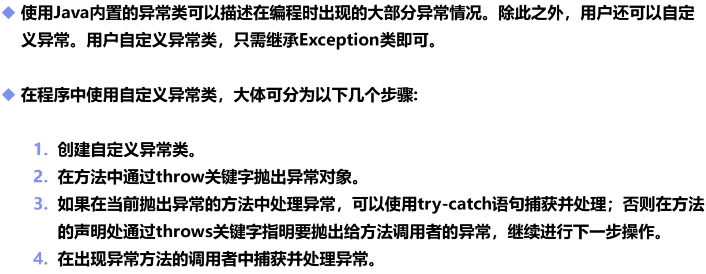
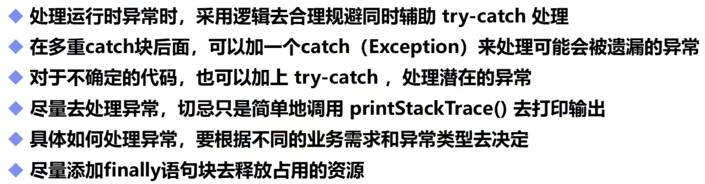

# 异常

## 核心知识点



```java
public class Test{
    public static void main(String[] args) {
        try {
            Age age = new Age(130);//使用try...catch
        } catch (TestError e) {//抓住TestError错误
            e.printStackTrace();//调用重写后的方法输出提示信息
        }
    }
}
class Age{
    int age;
    public Age(int age) throws TestError{//声明可能会出现的错误，要求调用时使用try...catch抓住TestError进行处理
        if(age < 0 || age > 120){
            throw new TestError();//抛出异常对象，触发catch操作，告诉printStackTrace方法是什么错误
        }else {
            this.age = age;
        }
    }
}//值得注意的是，catch需要抓住的异常由throws决定，throw只是起到触发catch反应，告诉printStackTrace方法是什么类型的错误的作用
```

```java
public class TestError extends Exception{
    public void printStackTrace(){
        System.out.println("设置的年龄太大或者太小");//重写printStackTrace方法
    }
}
```

## 一，基本概念



## 二，异常分类



## 三，异常体系结构



## 四，Error



## 五，Exception



## 六，异常处理机制



```java
public class demo19 {
    public static void main(String[] args) {
        int a=1;
        int b=0;
        try{
            System.out.println(a/b);
        }catch (Error o){
            System.out.println("Error");
        }catch (Exception p){
            System.out.println("Exception");//捕捉到对应异常后执行代码
        }catch (Throwable q){
            System.out.println("Throwable");//从小到大
        }finally {
            System.out.println("finally");//处理善后，会被直接运行
        }
        new demo19().text(a,b);
    }
    public void text(int a,int b){//假设这个方法中处理不了异常，就需要在方法上把这个异常抛出去
        if (b==0){
            throw new ArithmeticException();//主动抛出异常，一般在方法中使用
        }
    }
}
```

```java
Exception
finally
Exception in thread "main" java.lang.ArithmeticException
	at hello.demo19.text(demo19.java:22)
	at hello.demo19.main(demo19.java:18)
```

## 七，自定义异常







