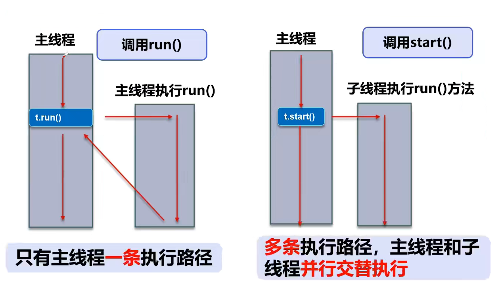

# 多线程

## 一，基本概念


## 二，Thread




```java
public class demo21 extends Thread{
    public void run(){//重写run方法，子线程
        for (int i = 0; i < 200; i++) {
            System.out.println("这是子线程");
        }
    }
    public static void main(String[] args) {//main线程，主线程
    demo21 demo=new demo21();
    demo.run();//先执行完才会继续执行
    demo.start();//先执行一部分主线程，然后执行子线程，交替执行
        for (int i = 0; i < 200; i++) {
            System.out.println("这是主线程");
        }
    }
}
```

## 三，案例


## 四，Runnable


```java
public class demo22 implements Runnable{
    public void run(){//重写run方法，子线程
        for (int i = 0; i < 200; i++) {
            System.out.println("这是子线程");
        }
    }
    public static void main(String[] args) {//main线程，主线程
        demo22 demo=new demo22();
        Thread thread=new Thread(demo);//执行线程需要丢入Runnable接口实现类
        thread.run();//先执行完才会继续执行,等同new Thread(demo).run();
        thread.start();//先执行一部分主线程，然后执行子线程，交替执行,等同new Thread(demo).start();
        for (int i = 0; i < 200; i++) {
            System.out.println("这是主线程");
        }
    }
}
```

## 五，小结


```java
public class demo23 implements Runnable{
    private int ticket=10;
    public void run(){
        while (true){
            if(ticket<=0){
                break;
            }
            System.out.println(Thread.currentThread().getName()+"拿到了第"+ticket--+"票");//中间的getName方法可以获得线程的名字
        }
    }
    public static void main(String[] args) {
        demo23 demo=new demo23();
        new Thread(demo,"小明").start();//这里在输入对象的同时也为线程命名，也可以通过System.out.println(Thread.currentThread().setName("名称");在进程内命名
        new Thread(demo,"小红").start();
        new Thread(demo,"黄牛").start();
    }
}
```

```java
运行结果为：
小红拿到了第9票
小明拿到了第8票
黄牛拿到了第10票
小明拿到了第6票
小红拿到了第7票
小明拿到了第4票
黄牛拿到了第5票
小明拿到了第2票
小红拿到了第3票
黄牛拿到了第1票
(多个线程操作同一个资源的情况下，线程不安全，数据紊乱)
```

## 六，使用synchronized确保run方法只被一个线程调用

```java
public class TextTicket implements Runnable{
    public static void main(String[] args) {
        TextTicket textTicket=new TextTicket();
        new Thread(textTicket,"第1售票点").start();
        new Thread(textTicket,"第2售票点").start();
        new Thread(textTicket,"第3售票点").start();
        new Thread(textTicket,"第4售票点").start();
    }
    private int ticket=400;
    public void run(){
        for (int i = 0; i < 100; i++) {//因为每次都是四个线程同时在排队等候，所以只需要循环100次
            try{
                synchronized (this){//一个线程访问一个对象中的synchronized(this)同步代码块的时候，其他试图访问该对象的线程将被堵塞
                    System.out.println(Thread.currentThread().getName()+"卖出了第"+ticket--+"票");
                }
                Thread.sleep(100);//此方法的使用需要抛出异常
            }catch (InterruptedException e){
                e.printStackTrace();
            }
        }
    }
}
```

```java
第1售票点卖出了第1票
第4售票点卖出了第2票
第3售票点卖出了第3票
...
第2售票点卖出了第398票
第3售票点卖出了第399票
第1售票点卖出了第400票
```

