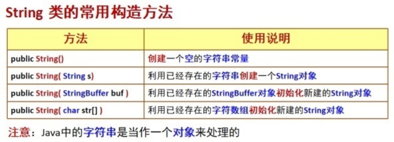
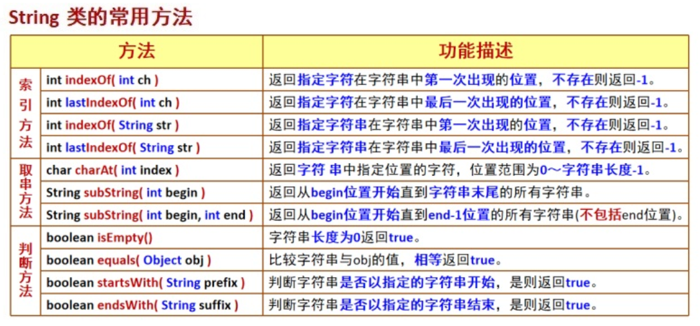

# String详解





## String的特性

1. String类是final的，不可被继承的。
2. String类本质是字符数组char[]，并且其值不可变。
3. String类对象有个特殊的创建方式，就是直接指定String s = “abc”，“abc”就代表一个字符串对象，而s就是“abc”的地址（我理解为s指向“abc”的地址），也叫做“abc”对象的引用。
4. **String对象可以通过“+”串联，串联后会形成新的字符串对象。**
5. String运行时会维护一个String Pool（String池），JavaDoc翻译很模糊“字符串缓冲区”。String池用来存放运行时产生的各种字符串，并且池中的字符串不可以重复。而一般对象不存在这个缓存区，并且创建的对象仅仅存在于方法的堆栈中。

## 字符串的创建方式

创建字符串的方式很多，归纳起来分为三种：

1. 使用new关键字创建，例如：`String s = new String("abc");`（注意这里是创建了两个对象）
2. 直接指定`s2 = "abc"`；
3. 使用串联生成新的字符串。例如`String s3 = "ab" + s2`；

## "=="和equals()的不同

- ==：对比的是两者的内存地址是否相同
- equals()：对比的是两者的值是否相同

值相同的内存地址并不一定相同

## String s="abc"和String s=new String("abc")不同点

**原理：jvm为了减少内存消耗，把这些相同的常量都放在常量池里面，并且不让他们重复，也就是常量池中只有一个“abc”字符串常量，只有一个指向为“abc”的内存地址，需要用他的时候只要调用他的引用地址指向他即可，不需要new一个新的"abc"**。

`String s0=”abc”`

`String s1="abc"`

`String s2=new String("abc")`

s0是栈内变量，也是引用变量，它的内存保存的是常量池的常量字符串对象对象”abc”的内存地址，但是常量池中的**每个值只有一份地址**。当进行`String s1 = “abc”`时，因为s0和s1的值相同，所以s0和s1两个变量指向的是同一个地址，也可以说s和s1都是一个引用，引用的地址都是一样的，因此s0==s1结果为true。而`String s2=new String("abc")`不会参与到池中来，也不会检测池中的地址，会直接创建一个新的对象，所以s1==s2结果为false。

## 具体详细的过程

1. `String str1 = “abc”;`
   `System.out.println(str1 == “abc”);`
   步骤:
   - 栈中开辟一块空间存放引用str1;
   - String池中开辟一块空间,存放String常量”abc”;
   - 引用str1指向池中String常量”abc”。
   - str1所指代的地址即常量”abc”所在地址,输出为true。

2. `String str2 = new String(“abc”);`
   `System.out.println(str2 == “abc”);`
   步骤:
   - 栈中开辟一块空间存放引用str2。
   - 堆中开辟一块空间存放一个新建的String对象”abc”。
   - 引用str2指向堆中新创建的对象”abc”。
   - str2所指代的对象地址为堆中地址，而常量”abc”地址在池中，输出为false。

3. `Sting str3 = new String(“abc”);`
   `System.out.println(str3 == str2);`
   步骤:
   - 栈中开辟一块空间存放引用str3。
   - 堆中开辟一块新空间存放另外一个(不同于str2所指)新建的String对象。
   - 引用str3指向另外新建的那个String对象。
   - str2和str3分别指向堆中不同的String对象,地址也不相同,输出为false。

## 运行实例

```java
public static void main(String[] args) {
        String s0=new String("abc"); //无论池中有没有，都会创建一个新的对象在堆栈中
        String s1=new String("abc");
        String s2="abc";
        String s3="abc"; //池中已经有"abc"，则指向s2
        String s4="ab";
        String s5="c";
        System.out.println(s0==s1); //堆栈中存放地址不同
        System.out.println(s0==s2); //堆栈和池地址不同
        System.out.println(s2==s3); //池中同一个地址指向
        System.out.println(s0.equals(s1)); //equals对比的是值，值相同即为true
        System.out.println((s4+s5).equals(s1)); //和(s4+"c")结果一样
    }
```

运行结果：

```java
false
false
true
true
true
```

## equals()和hashCode()

默认情况下

- `equals()`方法比较的是两个对象的引用是否相同，即判断它们是否是同一个对象
- `hashCode()` 方法返回对象的哈希码值

为了使哈希表能够正常工作，如果重写了`equals()`方法，那么也必须重写`hashCode()`方法，以确保相等的对象具有相同的哈希码

#### 重写`hashCode()`

- 如果两个对象通过`equals()`方法被认为是相等的，那么它们的`hashCode`值也必须相同
- 如果两个对象的`hashCode`相同，并不意味着它们一定相等；这只是提高了它们可能是相等的可能性

### Lombok

> Lombok生成的`equals()`方法会按照以下规则进行对象比较：
>
> - 自反性：如果两个对象是同一个实例（即引用相同），则返回`true`
> - 类型检查：如果传入的对象为`null`或者类型不同，则返回`false`
> - 字段逐个比较：逐一比较类中的所有非静态、非瞬态字段。如果所有字段都相等，则返回`true`
>
> Lombok默认会包含类中的所有**非静态、非瞬态字段**：
>
> - 非静态字段：静态字段属于类本身，而不是某个实例，因此不会参与`equals()`和`hashCode()`的比较
> - 非瞬态字段：瞬态字段（用`transient`修饰的字段）通常用于标记不希望被序列化的字段，因此也不会参与比较
>
> `@EqualsAndHashCode(callSuper = true)`是一个可选参数，默认情况下是`false`。它决定是否在生成的`equals()`和 `hashCode()`方法中包含父类的字段或逻辑

在类上添加`@EqualsAndHashCode`注解时，Lombok会根据类中的字段（默认是非静态字段）自动生成以下内容：

- `equals(Object obj)`方法：比较两个对象是否相等
- `hashCode()`方法：返回对象的哈希码值

`@EqualsAndHashCode(callSuper = true)`：

```java
@Override
public boolean equals(Object o) {
    if (!super.equals(o)) return false; // 调用父类的 equals()
    Child child = (Child) o;
    return Objects.equals(childField, child.childField);
}

@Override
public int hashCode() {
    return Objects.hash(super.hashCode(), childField); // 调用父类的 hashCode()
}
```

`@EqualsAndHashCode(callSuper = false)`：

```java
import java.util.Objects;

public class Person {
    private String name;
    private int age;

    @Override
    public boolean equals(Object o) {
        if (this == o) return true;
        if (o == null || getClass() != o.getClass()) return false;
        Person person = (Person) o;
        return age == person.age && Objects.equals(name, person.name);
    }

    @Override
    public int hashCode() {
        return Objects.hash(name, age);
    }
}
```

