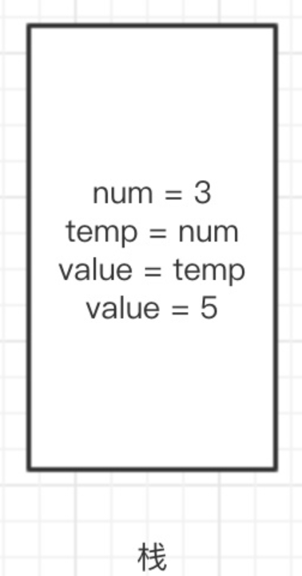
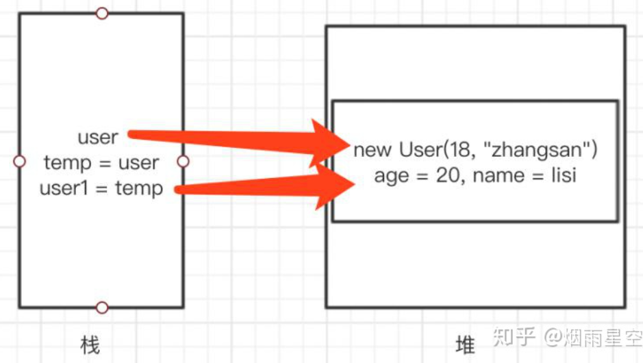
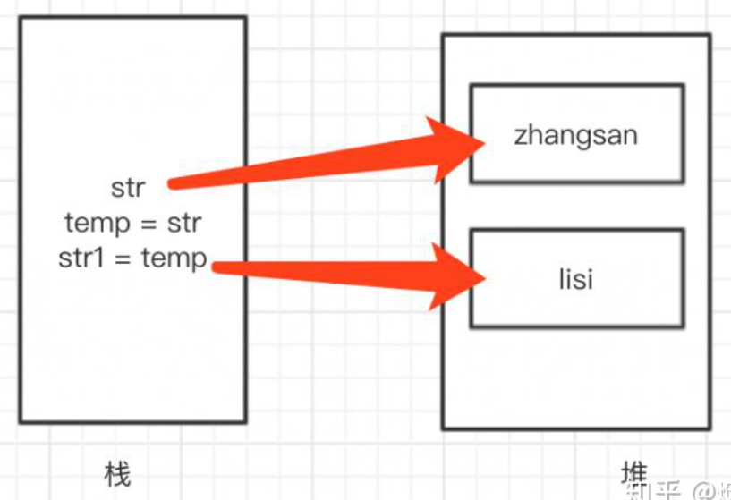

# Java的传递

Java中只存在**值传递**，但是可以通过类来实现类似**”引用传递“**的效果。

值传递：是指在调用函数时，将实际参数复制一份传递给函数，这样在函数中修改参数时，不会影响到实际参数。其实，就是在说值传递时，只会改变形参，不会改变实参。

引用传递：是指在调用函数时，将实际参数的地址传递给函数，这样在函数中对参数的修改，将影响到实际参数。

```java
A a;//a是A类型的数据“容器”，但是因为没有对a进行初始化，所以a不是一个对象，无法输出、无法调用方法、也没有值（不为null），本身自能作为容纳A类型对象的“容器”
A a=new A();//a已经初始化，a是一个对象，a中的变量具有默认值，可以正常使用，可以用print直接输出a的“地址”
A b=new A(); A a=b;//a复制了对象b的地址，属于“引用传递”
```

## 当传递值是基本数据类型时



可以发现，传递基本数据类型时，复制仅仅只是在栈中创建了副本，所以修改value的值不会影响num

## 传递类型是引用类型时

```java
public class User {
    private int age;
    private String name;
    public int getAge() {
        return age;
    }

    public void setAge(int age) {
        this.age = age;
    }

    public String getName() {
        return name;
    }

    public void setName(String name) {
        this.name = name;
    }

    public User(int age, String name) {
        this.age = age;
        this.name = name;
    }

    public User() {
    }

    @Override
    public String toString() {
        return "User{" +
                "age=" + age +
                ", name='" + name + '\'' +
                '}';
    }
}
public class TestUser {
    public static void main(String[] args) {
        User user = new User(18, "zhangsan");
        System.out.println("修改对象前:"+user);
        changeUser(user);
        System.out.println("修改对象后:"+user);
    }

    private static void changeUser(User user) {
        user.setAge(20);
        user.setName("lisi");
    }
}
```

运行结果：

```java
修改对象前:User{age=18, name='zhangsan'}
修改对象后:User{age=20, name='lisi'}
```



user是对象的引用，为实参，然后创建一个副本temp，把它传递给形参user1。但是，他们实际操作的都是堆内存中的同一个User对象。因此，对象内容的修改也会体现到实参user上。**值得注意的是，user1和user并不等同，当传递给user1一个新的对象时，并不代表user也会指向那个对象**

## 传递类型是String类型（Integer等基本类型的包装类等同）

```java
public class TestStr {
    public static void main(String[] args) {
        String str = new String("zhangsan");
        System.out.println("字符串修改前:"+str);
        changeStr(str);
        System.out.println("字符串修改后:"+str);
    }

    private static void changeStr(String str) {
        str = "lisi";
    }
}
```

运行结果：

```java
字符串修改前:zhangsan
字符串修改后:zhangsan
```




值得注意的是，当将第二题的的方法修改为：

```java
private static void changeUser(User user) {
    //添加一行代码，创建新的User对象
    user = new User();
    user.setAge(20);
    user.setName("lisi");
}
```

打印结果就会变得一模一样了，相当于在堆中重新创建了一个对象”User“来由形参user来指向，所以没有修改到外面的实参user
