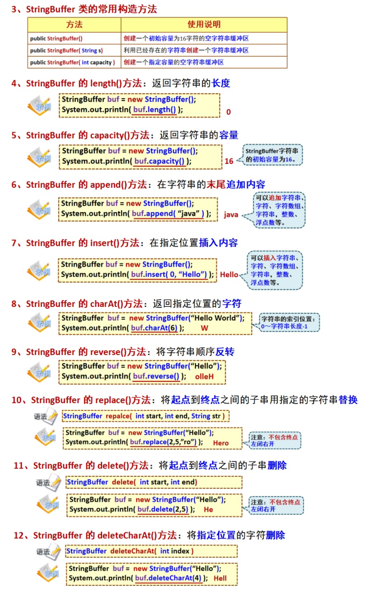

# StringBuffer和StringBuilder

## StringBuffer

1. java.lang.StringBuffer类：字符缓冲区类——是一种线程安全的可变字符序列
2. StringBuffer类与String类的区别
   1. String创建的字符串是不可变的，改变字符串变量的值，实质上是在堆中**创建一个新的字符串**，字符串变量指向新创建的字符串，原字符串在内存中依旧存在，直到Java的垃圾回收系统对其进行销毁。
   2. StringBuffer创建的字符串是可变的，字符串的内容可通过append()、insert()、setCharAt()等方法进行修改，字符串指向的对象不变

## StringBuilder

`StringBuffer`和`StringBuilder`都是用于处理可变字符串的，与`StringBuffer`对比：

- 同步性：`StringBuffer`是线程安全的，因为大部分方法都是同步的，而`StringBuilder`则不是线程安全的
- 性能：由于`StringBuffer`是线程安全的，所以在执行相同操作时，`StringBuilder`通常比`StringBuffer`更快，因为`StringBuilder`不需要进行同步

