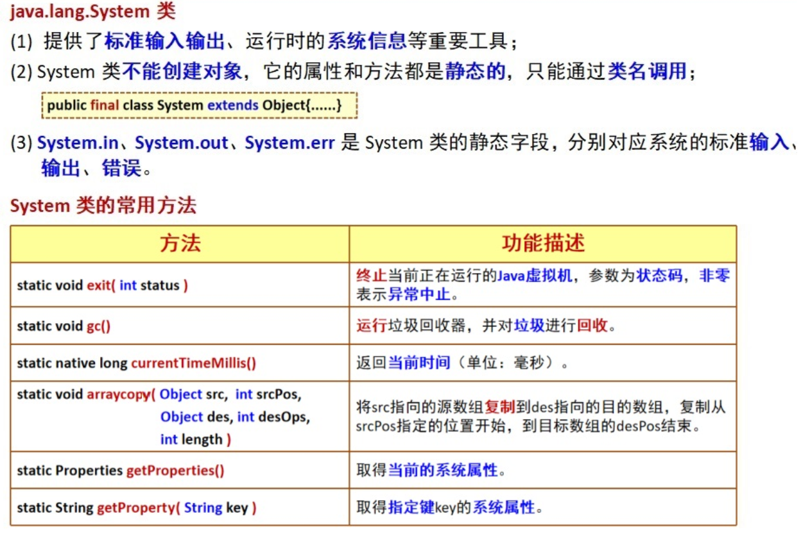
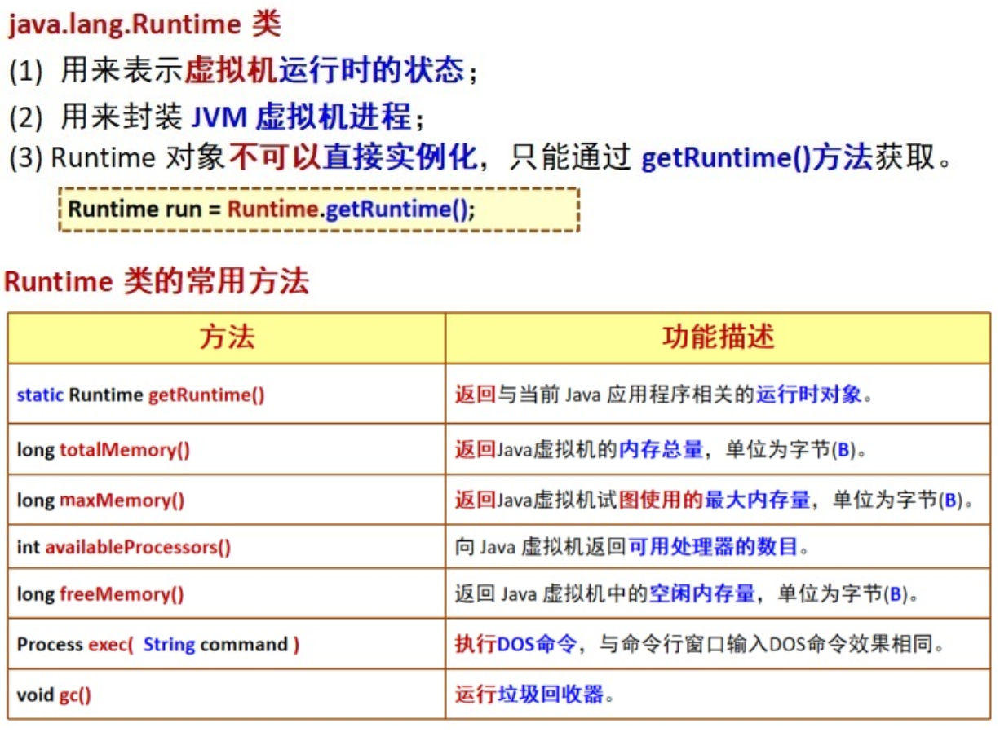

# System类和Runtime类

## System类



```java
public class Test {
    public static void main(String[] args) {
         Student student=new Student();
         student=null;
         System.gc();//回收对象
    }
}
class Student{
    public void finalize(){//finalize会在回收前自动调用，这里重写了finalize，所以会输出
        System.out.println("对象回收了");
    }
}
```

## Runtime类



```java
public class Test {
    public static void main(String[] args) {
        Runtime rt=Runtime.getRuntime();
        System.out.println("处理器个数"+rt.availableProcessors());
        System.out.println("空闲内存量"+rt.freeMemory()/1024/1024);
        System.out.println("最大可用内存量"+rt.maxMemory()/1024/1024);
    }
}
```

运行结果

```java
处理器个数8
空闲内存量225
最大可用内存量3387
```

