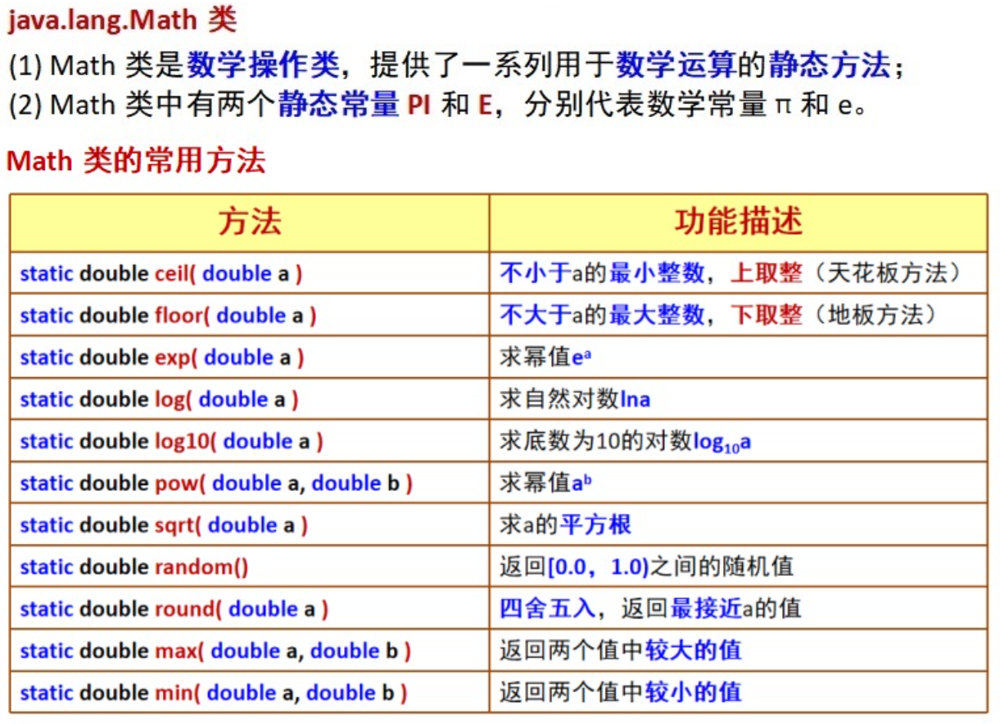
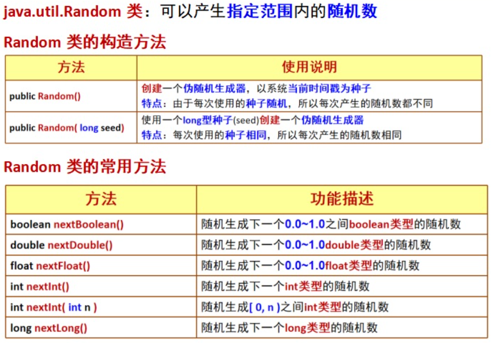

# Math类和Random类

## Math类



## Random类



```java
import java.util.Random;

public class Test {
    public static void main(String[] args) {
        Random a=new Random();//以系统时间为种子，每次运行结果随机
        System.out.println(a.nextBoolean());
        Random b=new Random(10);//以10为种子，无论运行多少次，结果都不变
        System.out.println(b.nextBoolean());
        Random c=new Random();
        System.out.println(c.nextInt(100));//生成[0,100)之间int类型的随机数(只有int可以规定范围)
    }
}
```

