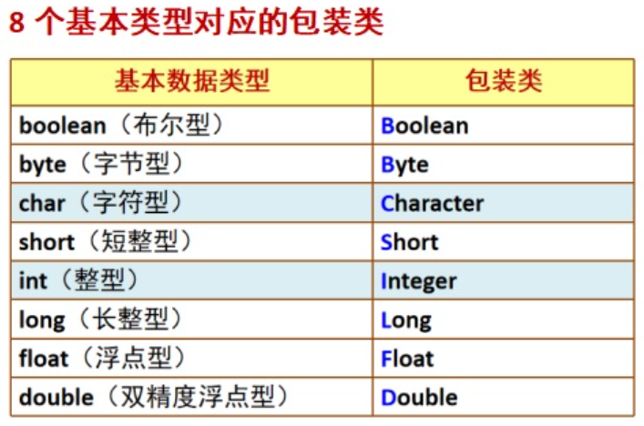
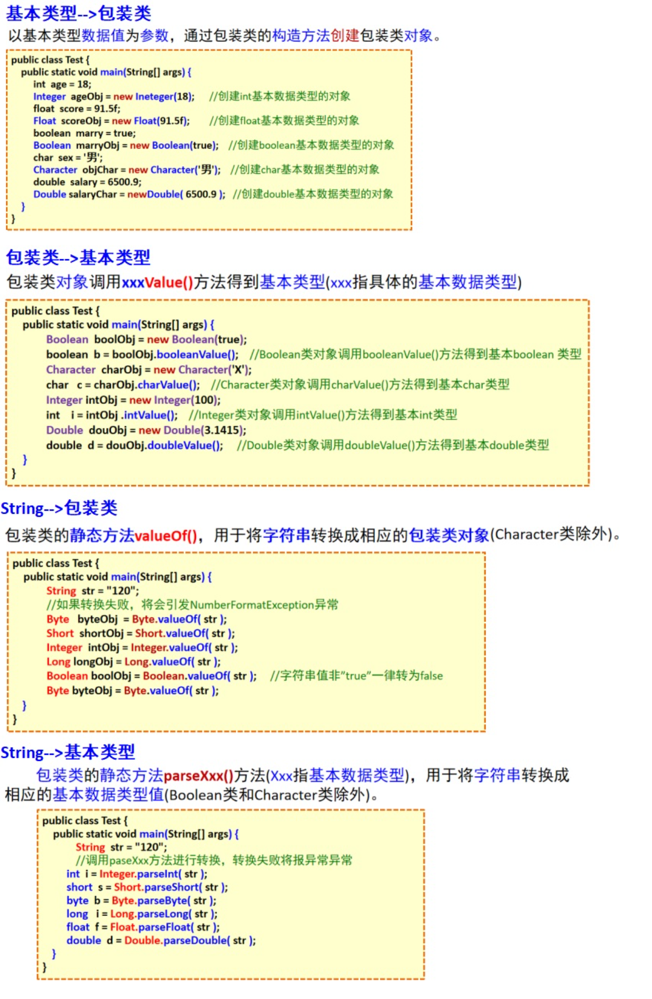

# 包装类和特殊的值

## 包装类

1. Java语言认为一切皆对象
2. **8个基本数据类型也应该具备对应的对象**
3. 通过包装类**可以将8个基本类型的值包装成对象进行使用**
4. 从JDK1.5开始，Java允许将基本类型的值直接赋值给对应的包装类对象



**注意：对象有属性和方法，数据没有属性和方法**



**注：Object转int需要先转换为String后再转换为int，例如**

```java
Object a = "123";
int b = Integer.parseInt(String.valueOf(a));//Integer.valueOf(String.valueOf(a));这样写也行，但是不够规范
```

## 关于逻辑值为null、值为"null"、值为空、值为"0"和空指针异常

每种原始类型都有默认值一样，**int默认值为0，boolean的默认值为false**，**null是任何引用类型的默认值**，不严格的说是所有object类型的默认值。

- 逻辑值为null，为`str==null`(当且仅当表单中方法`getParamenter`**获取不到对应属性的值**或者为**内容本身为空**时和**`getAttribute`**获取不到值时（因为设置端必须赋值，所以**只要找得到就不存在逻辑值为null**）)
- 值为"null“，为`str.equals("null")`
- 值为空，为`str.equals("")`
- 值为”0“，为`str.equals("0")`

- 空指针异常：通常出现在数值没有初始化就使用的情况

对于数值类型转换和判断，需要注意上述可能存在的这几种情况

（对于逻辑值的输出：print方法会自动转换为字符串，会**输出null**，而EL表达式则是**一片空白**）

## 关于String.valueOf()方法

对于`String.valueOf()`方法来说，会**对逻辑值为空的数值类型赋值为"null"**

这个方法用于将其他支持的数据类型转换为字符串数据类型

```java
//这里getParameter(Object)提交过来的值为空，导致逻辑值为null
	//逻辑值为null的为空指针(可以传递给String)-->true
	System.out.println(req.getParameter("id")==null);
	//req.getParameter("id")为空指针无法进行值比较-->空指针异常
//  System.out.println(req.getParameter("id").equals(""));
	//valueOf方法将逻辑值为空转换为了值为"null",值相等-->true
	System.out.println(String.valueOf(req.getParameter("id")).equals("null"));
```

## 字符串判断方法

为了防止异常一般对字符串增加如下判断

```java
public static boolean isNotEmptyOrNull(String str){//注意int类型初始化默认值为0，转String后值为0，可以是否为0进行判断int框有没有输入
        if(str!=null&&!"".equals(str)&&!"null".equals(str)&&!"0".equals(str))//str逻辑值不为null，值不为空，值不等于null（使用String.valueOf后会对原本逻辑值为null的变量赋值为"null"）
            return true;//不为空则为真
        else
            return false;//为空则为假
    }
```

