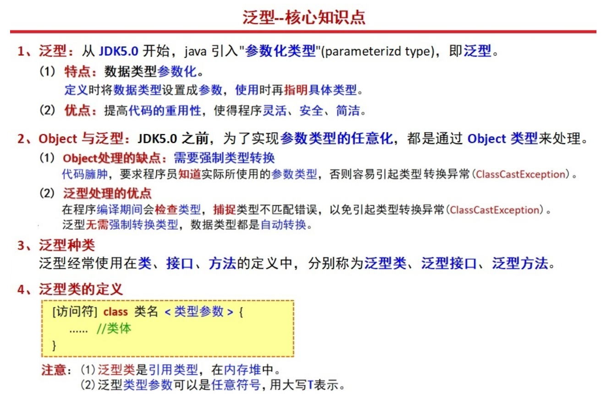
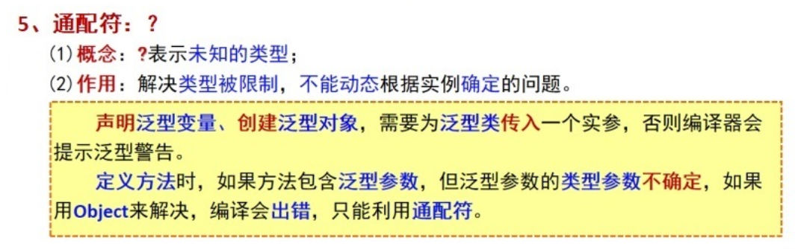
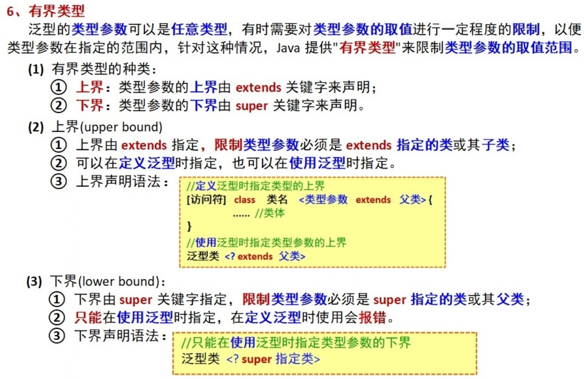
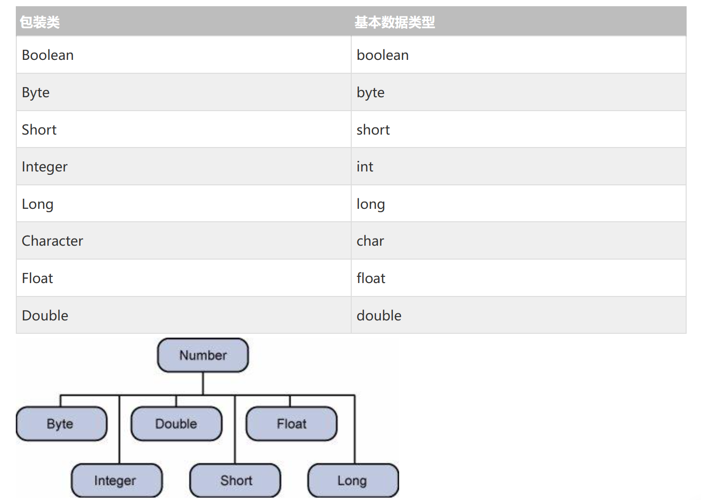
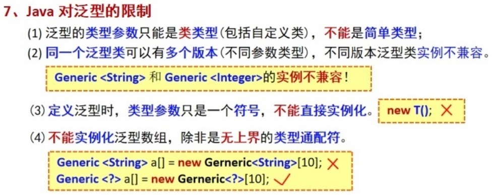

# 泛型

**用于提高类中属性能够接收的数据类型的通用性**



> 使用Object可以使接收的数据类型变得更加通用，但是在取出数据时进行数据类型转换时容易隐藏一些异常，编译不会出错，但是运行会导致错误，而**泛型在使用时由于需要声明数据类型(泛化)**，所以会在编译阶段对数据类型进行检查时就会提示编译错误

> 泛型的使用只能在**类**中**对数据类型进行定义**(`private T information`)，在使用时需要进行泛化(`Test<String> test = new Test<>("yu")`)

> 对于一些使用了泛型的类，在使用时也可以不进行泛化(`HashMap hashMap = new HashMap<>()`)，此时系统将默认**使用Object**，也就是可以接收任意数据类型，但是失去了会提示编译报错，也就和直接使用Object没有区别了

```java
public class Test <T,V>{//需要在定义类时声明泛型，这里是声明了两个
    //声明数据类型时使用泛型
    private T information;

    private V information1;

    public Test(T information, V information1) {
        this.information = information;
        this.information1 = information1;
    }

    public T getInformation() {
        return information;
    }

    public V getInformation1() {
        return information1;
    }

    public static void main(String[] args) {
        //使用时进行泛化
        Test<String,Integer> test = new Test<>("yu",18);
        System.out.println(test.information1);
    }
}
```

> 对于static方法使用泛型，需要在方法返回值前声明`public static <T> R<T> ok(T data){}`

## 通配符

**用于提高方法形参能够接收的数据类型的通用性**



> 一个类中**使用了泛型**对数据类型进行定义，如果**在实例化时还暂且不知道需要需要接收的数据是什么类型**，可以使用通配符进行代替(`private Map<?,?> map`)，如果一旦使用其接收数据，则一定需要声明数据类型，所以多用于方法内使用了泛型的形参

> 通配符可以用于提高方法内使用泛型的形参的通用性(`Map<?,?> map`)，可以让方法的形参可以**不受调用者定义泛型的数据类型所影响**，提高方法的通用性，但是有些方法的参数需要确定的数据类型才能使用(`Collections.max()`)

```java
    public static void display(Map<?,?> map){
        //将所有的键值通过Set的方式存储起来
        Set<?> key = map.keySet();
        Iterator<?> iterator = key.iterator();
        System.out.println("集合元素信息--");
        while (iterator.hasNext()){
            //获取键
            Object i = iterator.next();
            //通过键获取值
            System.out.println(map.get(i));
        }
    }
```

## 有界类型



上界(**定义和使用时都可用**)：`<T extends Number>`：规定在泛化时只能使用Number数据类型和其子类数据类型int、float，double、byte等继承Number的数据类型



下界(**只能在使用时指定**)：`Map<? super String,?>`：规定可以接收String数据类型以及String的父类数据类型(Object)

## Java对泛型的限制



