# 集合框架

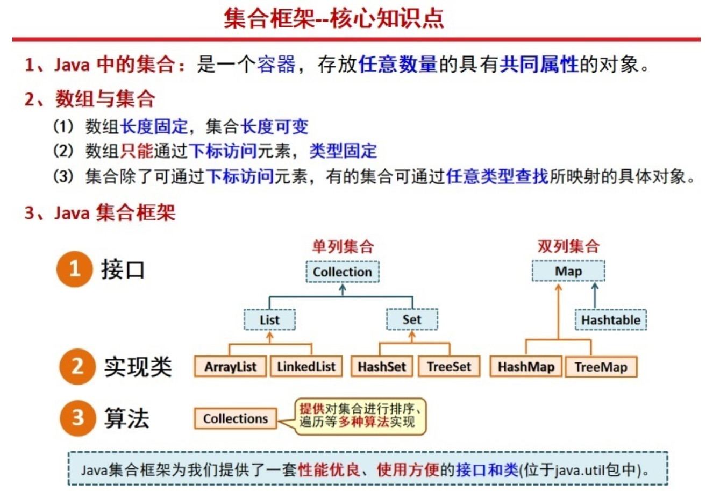

> 一般对于存放到Set集合或者Map中**键值对的元素**，需要按需要重写hashCode()(hashCode默认是比较地址值)与equals()(当地址不同时，默认比较值)方法，以保证唯一性！重写equals()方法一定重写hashcode()！

## 单列集合(Collection)

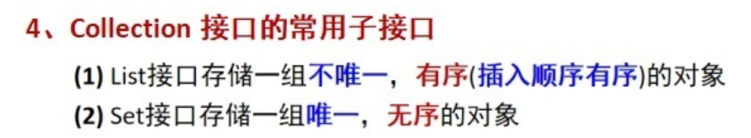

## List接口

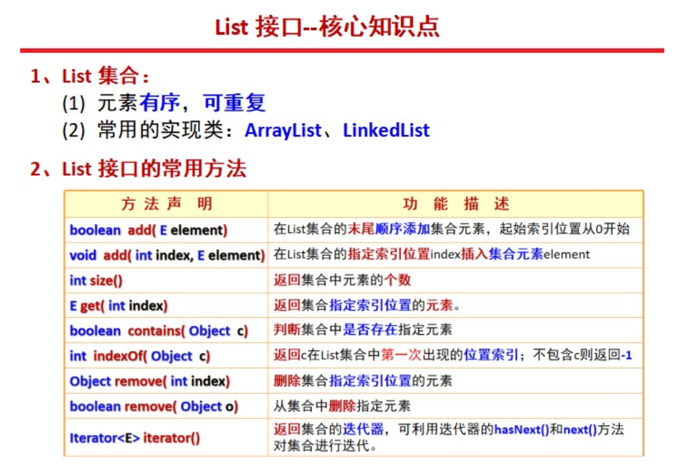

### ArrayList

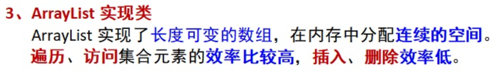

通过迭代器遍历输出：

```java
import java.util.ArrayList;
// 注意别导错包了
import java.util.Iterator;

public class Test {
    public static void main(String[] args) {
        ArrayList<String> arrayList = new ArrayList<>();
        arrayList.add("你");
        arrayList.add("好");
        arrayList.add("世");
        arrayList.add("界");
        System.out.println(arrayList);
        // 用迭代器遍历集合
        Test.outIterator(arrayList);
    }

    public static void outIterator(ArrayList<String> arrayList) {
        Iterator<String> iterator = arrayList.iterator();
        while (iterator.hasNext()) {
            System.out.println(iterator.next() + " ");
        }
    }
}
```

```
[你, 好, 世, 界]
你 
好 
世 
界 
```

### LinkedList

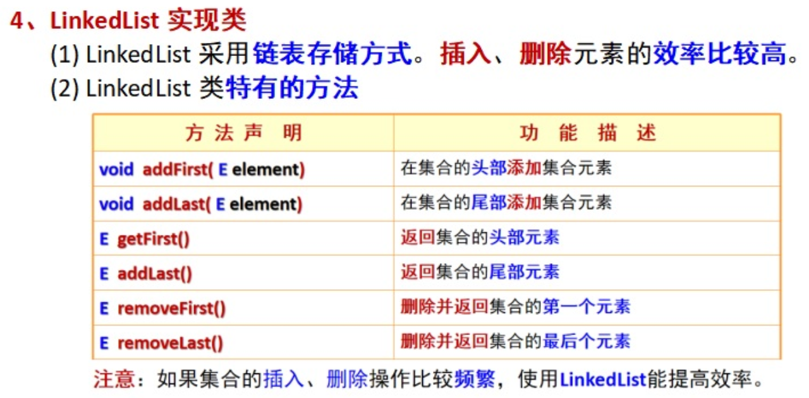

> 使用类似ArrayList

## Set接口

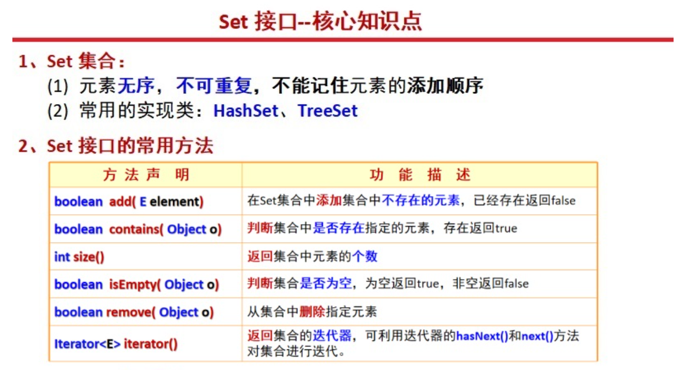

### HashSet

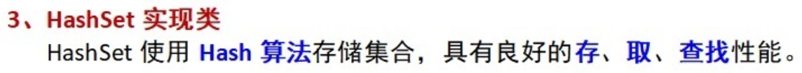

通过迭代器遍历输出：

```java
import java.util.Collection;
import java.util.HashSet;
// 注意别导错包了
import java.util.Iterator;

public class Test {
    public static void main(String[] args) {
        HashSet<String> hashSet = new HashSet<>();
        hashSet.add("你");
        hashSet.add("好");
        hashSet.add("世");
        hashSet.add("界");
        // 用迭代器遍历集合
        Test.outIterator(hashSet);
    }

    public static void outIterator(Collection<String> collection) {
        Iterator<String> iterator = collection.iterator();
        while (iterator.hasNext()) {
            System.out.println(iterator.next() + " ");
        }
    }
}
```

```
你 
世 
界 
好 
```

### TreeSet

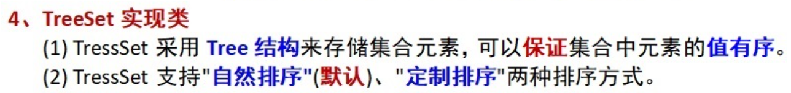

> 使用类似HashSet

## 双列集合(Map)

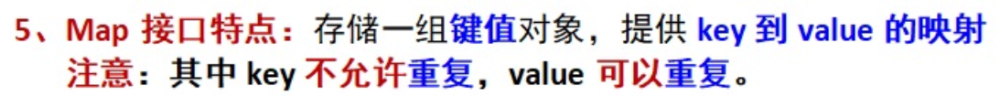

## Map接口

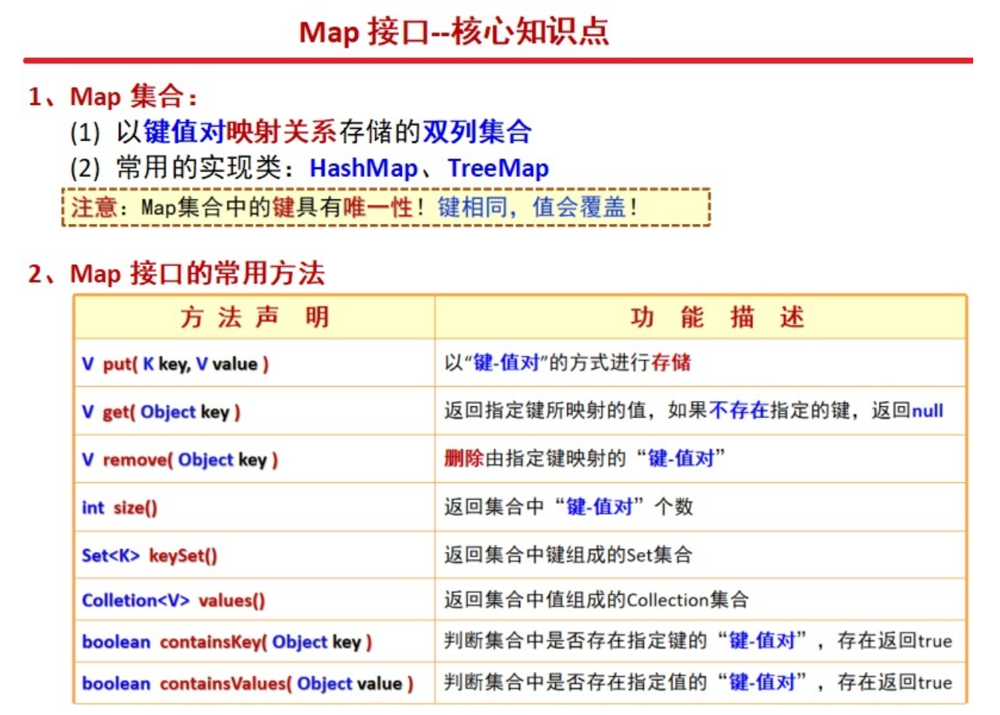

> 勘误：方法名应该为`boolean containsValue(Object value)`，图片中多了一个`s`

### HashMap

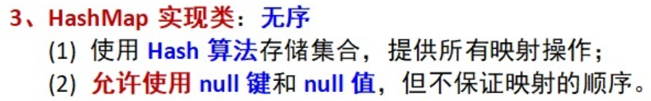

通过迭代器遍历输出：

```java
import java.util.HashMap;
// 注意别导错包了
import java.util.Iterator;
import java.util.Map;
import java.util.Set;

public class Test {
    public static void main(String[] args) {
        HashMap<Integer, String> hashMap = new HashMap<>();
        hashMap.put(97, "你");
        hashMap.put(56, "好");
        hashMap.put(193, "世");
        hashMap.put(146, "界");
        display(hashMap);
    }

    public static void display(Map<Integer, String> map) {
        // 将所有的键值通过Set的方式存储起来
        Set<Integer> key = map.keySet();
        Iterator<Integer> iterator = key.iterator();
        System.out.println("集合元素信息--");
        while (iterator.hasNext()) {
            // 获取键
            int i = iterator.next();
            // 通过键获取值
            System.out.println(map.get(i));
        }
    }
}
```

> HashMap和HashTable的区别：
>
> - 线程安全性：HashMap是非线程安全的，而HashTable是线程安全的
> - 初始容量和扩容机制：HashMap的初始容量为16，扩容时容量翻倍；HashTable的初始容量为11，扩容时容量变为原来的2n+1
> - null值和null键：HashMap允许null值和null键，而HashTable不允许
> - 迭代器：HashMap的迭代器是fail-fast迭代器，而HashTable的迭代器不是
> - 性能：HashMap的性能比HashTable高，因为HashTable需要保证线程安全，所以在并发环境下性能会受到影响

### TreeMap

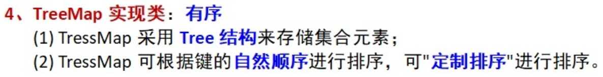

> 基于红黑树数据结构实现的，可以保证键值对按照键的自然顺序或者自定义顺序进行排序，TreeMap的键必须实现Comparable接口或者在构造TreeMap时提供Comparator比较器

## Collections工具类

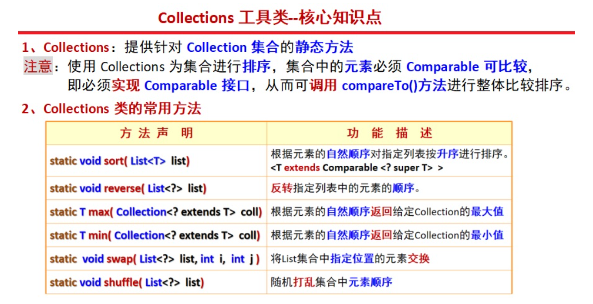

对列表进行排序：

```java
import java.util.ArrayList;
import java.util.Collections;
import java.util.Comparator;
import java.util.List;

public class SortListExample {
    public static void main(String[] args) {
        // 创建一个 List 对象，这里使用 ArrayList
        List<String> fruits = new ArrayList<>();
        fruits.add("Banana");
        fruits.add("Apple");
        fruits.add("Cherry");
        fruits.add("Date");

        // 使用 Collections.sort() 进行自然排序（按字母顺序）
        Collections.sort(fruits);
        // 自然排序后的列表: [Apple, Banana, Cherry, Date]
        System.out.println("自然排序后的列表: " + fruits);

        // 使用 Collections.sort() 进行自定义排序（按字符串长度）
        // 或者直接使用fruits.sort()
        Collections.sort(fruits, new Comparator<String>() {
            @Override
            // 返回值大于0则代表s1排序在s2之后，等于0代表s1和s2相等，小于0则代表s1排序在s2之前
            public int compare(String s1, String s2) {
                return Integer.compare(s1.length(), s2.length());
            }
        });
        // 按字符串长度排序后的列表: [Date, Apple, Banana, Cherry]
        System.out.println("按字符串长度排序后的列表: " + fruits);
    }
}
```

> 这里还可以使用lambda表达式进一步简化`(s1, s2) -> Integer.compare(s1.length(), s2.length())`

返回键值中的最大值：

```java
import java.util.*;

public class Test {
    public static void main(String[] args) {
        HashMap<Integer, String> hashMap = new HashMap<>();
        hashMap.put(97, "你");
        hashMap.put(56, "好");
        hashMap.put(193, "世");
        hashMap.put(146, "界");
        display(hashMap);
    }

    public static void display(Map<Integer, String> map) {
        // 将所有的键值通过Set的方式存储起来
        Set<Integer> key = map.keySet();

        // 输出Collection类型集合中的最大值
        // 返回值为-->193
        System.out.println(Collections.max(key));
        Iterator<Integer> iterator = key.iterator();
        System.out.println("集合元素信息--");
        while (iterator.hasNext()) {
            // 获取键
            int i = iterator.next();
            // 通过键获取值
            System.out.println(map.get(i));
        }
    }
}
```

## Comparable排序接口

若一个类实现了Comparable接口，就意味着该类支持排序。实现了Comparable接口的类的对象的列表或数组可以通过`Collections.sort`或`Arrays.sort`进行自动排序

- 类去实现`Comparable<T>`，重写其中唯一的方法`compareTo(Object o)`，通过`this`和`o`调用属性与本身进行排序**（两着相比，自然顺序：大则返回1，相等返回0，小则返回-1，最终结果为大的在后面，小的在前面）**

```java
import java.util.Arrays;

public class Test2 {
    public static void main(String[] args) {
        // 如果使用list的话就要对应使用Collections.sort()方法
        Student[] students = new Student[]{new Student(1, 1, "a"), new Student(1, 2, "b"), new Student(2, 2, "b")};
        Arrays.sort(students);
        // [Student{id=2, age=2, name='b'}, Student{id=1, age=1, name='a'}, Student{id=1, age=2, name='b'}]
        System.out.println(Arrays.toString(students));
    }
}

class Student implements Comparable<Student> {

    private int id;
    private int age;
    private String name;

    public Student(int id, int age, String name) {
        this.id = id;
        this.age = age;
        this.name = name;
    }

    @Override
    public String toString() {
        return "Student{" +
                "id=" + id +
                ", age=" + age +
                ", name='" + name + '\'' +
                '}';
    }

    @Override
    public int compareTo(Student o) {
        // 按id从大到小排序
        if (this.id > o.id) {
            return -1;
        } else if (this.id == o.id) {
            // 当id相等时，再按age从小到大排序
            return this.age - o.age;
        } else {
            throw new RuntimeException("传入的数据类型不一致！");
        }
    }
}
```

## Comparator比较接口

如果需要控制某个类的次序，而该类本身不支持排序(即**没有实现Comparable接口**)，那么就可以建立一个“该类的比较器”来进行排序，这个**“比较器”只需要实现Comparator接口**即可。也就是说，可以通过实现Comparator来新建一个比较器，然后通过这个比较器对类进行排序

- 可以采用Lambda表达式简化写法
- 如果可以实现，那么可以通过实现`Comparator <T>`，重写其中的一个方法`compare(Object o1, Object o2)（两着相比，自然顺序：大则返回1，相等返回0，小则返回-1）`

```java
import java.util.*;
import java.util.ArrayList;

public class Test<T, V> {
    // 声明数据类型时使用泛型
    private T information;

    private V information1;

    public Test(T information, V information1) {
        this.information = information;
        this.information1 = information1;
    }

    public T getInformation() {
        return information;
    }

    public V getInformation1() {
        return information1;
    }

    @Override
    public String toString() {
        return "Test{" +
                "information=" + information +
                ", information1=" + information1 +
                '}';
    }

    public static void main(String[] args) {
        // 创建链表将数据全部存储起来
        List<Test> list = Arrays.asList(new Test<>(14, "y"), new Test<>(8, "u"), new Test<>(6, "u"), new Test<>(8, "au"), new Test<>(8, "ty"));

        // List排序-->按大小
        System.out.println("按照大小顺序排序");
        list.sort(new Comparator<Test>() {
            @Override
            public int compare(Test o1, Test o2) {
                return Integer.parseInt(String.valueOf(o1.information)) - Integer.parseInt(String.valueOf(o2.information));
            }
        });
        // 输出排序后的结果
        list.forEach(System.out::println);

        // List排序-->按名称
        System.out.println("按照字母名字顺序排序");
        // 按照字母名字顺序排序
        Collections.sort(list, new Comparator<Test>() {
            @Override
            public int compare(Test o1, Test o2) {
                String o11 = String.valueOf(o1.information1);
                String o22 = String.valueOf(o2.information1);
                // 这里调用的是String类型的compareTo方法，Object类型没有，所以需要进行转换，同样"反过来"顺序也会颠倒
                return o11.compareTo(o22);
            }
        });
        // 输出遍历结果
        list.forEach(System.out::println);

        // Map集合类型排序-->将key值进行排序，通过key值遍历获取value进行输出实现排序
        HashMap<Integer, Object> hashMap = new HashMap<>();
        hashMap.put(34, "你");
        hashMap.put(56, "好");
        hashMap.put(193, "界");
        hashMap.put(146, "世");
        sortMinToMax(hashMap);
    }

    // 从小到大排序，只支持List集合类型
    public static void sortMinToMax(Map<? extends Number, ?> map) {
        Set<?> key = map.keySet();
        Iterator<?> iterator = key.iterator();
        // 定义链表用于存储Map当中的键
        List<Object> list = new ArrayList<>();
        while (iterator.hasNext()) {
            // 获取键
            Object i = iterator.next();
            list.add(i);
        }
        // 这里可以替换为list.sort(new Comparator<Object>()
        Collections.sort(list, new Comparator<Object>() {
            @Override
            public int compare(Object o1, Object o2) {
                //这里"反过来"就是从大到小
                return Integer.parseInt(String.valueOf(o1)) - Integer.parseInt(String.valueOf(o2));
            }
        });
        // 通过排序好的键去查询Map中的值
        System.out.println("Map排序后元素信息--");
        int j = 0;
        while (list.size() > j) {
            // 因为已经排序好了，所以通过第一个-->0开始获取list中的键
            Object i = list.get(j);
            // 通过获取到的键获取值并输出
            System.out.println(map.get(i));
            j++;
        }
    }
}
```

```
按照大小顺序排序
Test{information=6, information1=u}
Test{information=8, information1=u}
Test{information=8, information1=au}
Test{information=8, information1=ty}
Test{information=14, information1=y}
按照字母名字顺序排序
Test{information=8, information1=au}
Test{information=8, information1=ty}
Test{information=6, information1=u}
Test{information=8, information1=u}
Test{information=14, information1=y}
Map排序后元素信息--
你
好
世
界
```

通过继承进行操作：

StudentComparator.java

```java
import java.util.Comparator;

public class StudentComparator implements Comparator<Student> {

    @Override
    public int compare(Student o1, Student o2) {
        // 按id从大到小排序
        if (o1.id > o2.id) {
            return -1;
        } else if (o1.id == o2.id) {
            // 当id相等时，再按age从小到大排序
            return o1.age - o2.age;
        } else {
            throw new RuntimeException("传入的数据类型不一致！");
        }
    }
}
```

Test2.java

```java
import java.util.Arrays;

public class Test2 {
    public static void main(String[] args) {
        // 如果使用list的话就要对应使用Collections.sort()方法
        Student[] students = new Student[]{new Student(1, 1, "a"), new Student(1, 2, "b"), new Student(2, 2, "b")};
        // 传入实现了Comparator接口的类同样可以进行排序
        Arrays.sort(students, new StudentComparator());
        // [Student{id=2, age=2, name='b'}, Student{id=1, age=1, name='a'}, Student{id=1, age=2, name='b'}]
        System.out.println(Arrays.toString(students));
    }
}

class Student {

    int id;
    int age;
    String name;

    public Student(int id, int age, String name) {
        this.id = id;
        this.age = age;
        this.name = name;
    }

    @Override
    public String toString() {
        return "Student{" +
                "id=" + id +
                ", age=" + age +
                ", name='" + name + '\'' +
                '}';
    }
}
```

## Comparable排序接口和Comparator比较接口

两者的区别：

- Comparable接口的实现多用于自己写的类，自己写的类去实现接口并重写`compareTo(Object o)`方法，最后只要调用`sort()`方法输入**一个需要排序的对象**就可以完成排序
- Comparator接口多用于对那些写好了的类**进行临时的比较**，通过实现Comparator接口的内部方法`compare(Object o1, Object o2)`实现比较排序，调用`sort()`方法时不仅需要输入需要排序的对象，还要**输入Comparator接口的实现**才能完成排序
- 当类既实现了Comparable接口，又在使用`sort()`时实现了`new Comparator<>()`对象，则以Comparator接口的实现优先

## Arrays方法

- `Arrays.asList()`：输入任意个数需要添加对象，返回list集合
- `Arrays.toString()`：输入数组的地址，将数组的内容以String（[内容]）的方式返回

> `Array.asList()`存在的坑
>
> - 对于将int类型的数组转换为列表时`int[] array = {1,2,3}`，会得到一个长度为1的list，泛型对象为`int []`，而不是`int`。会将数组中的整体看成一个对象，而不会拆开，使用包装类`Integer`避免这个问题
> - 对于存在增删的需求，还是需要转换为ArrayLisy，`List<Integer> list = new ArrayList<>(Arrays.asList(array))`
> - 对数组array的修改会影响到list，相当于传递的是一个地址，而不是创建一个新的对象，如果需要解决这个问题，还是得使用ArrayList去接收
