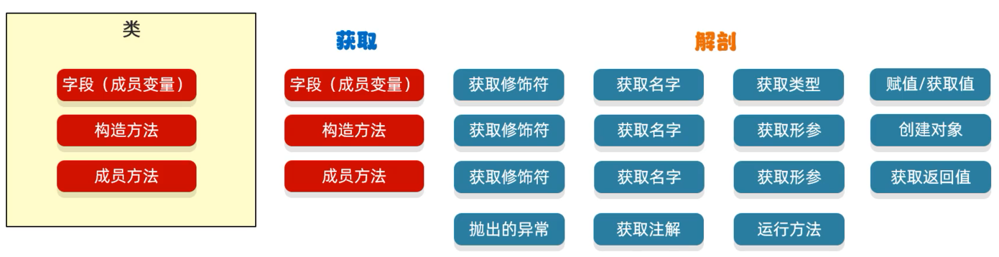
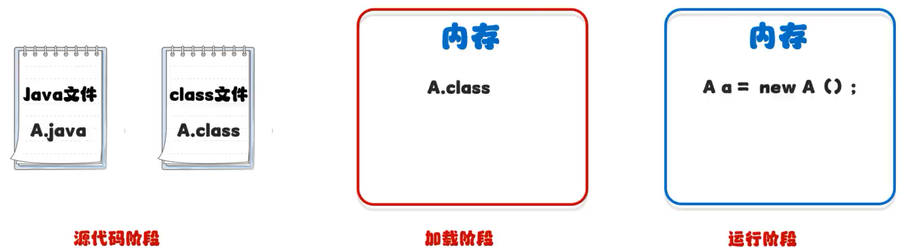

# 反射

反射允许对成员变量、成员方法和构造方法的信息进行编程访问



> 万物皆对象
>
> - 获取class对象：Class
> - 构造方法：Constructor
> - 字段(成员变量)：FieId
> - 成员方法：Method

## 获取对象的三种方式

- `Class.forName("全类名")`：源代码阶段
- `类名.class`：加载阶段
- `对象.getClass()`：运行阶段



User.java

```java
package MyReflect;

import java.io.IOException;

public class User {

    private Integer age;

    private String username;

    public User() {
    }

    private User(Integer age, String username) {
        this.age = age;
        this.username = username;
    }

    protected User(Integer age) {
        this.age = age;
    }

    public User(String username) {
        this.username = username;
    }


    public Integer getAge() {
        return age;
    }

    public void setAge(Integer age) {
        this.age = age;
    }

    public String getUsername() {
        return username;
    }

    public void setUsername(String username) {
        this.username = username;
    }

    private String eat(String something) throws IndexOutOfBoundsException, IOException {
        System.out.println("正在吃" + something);
        return "吃完了";
    }

    @Override
    public String toString() {
        return "User{" +
                "age=" + age +
                ", username='" + username + '\'' +
                '}';
    }
}
```

ReflectDemo.java

```java
package MyReflect;

public class GetClassByReflect {
    public static void main(String[] args) throws ClassNotFoundException {

        // 最为常用
        Class<?> clazz = Class.forName("MyReflect.User");
        System.out.println(clazz);

        // 一般最为参数进行传递，例如：synchronized (User.class)
        Class<User> clazz1 = User.class;
        System.out.println(clazz == clazz1);

        // 有这样类的对象时，才可以使用
        User user = new User();
        Class<? extends User> class2 = user.getClass();
        System.out.println(clazz1 == class2);
    }
}
```

> ```
> class MyReflect.User
> true
> true
> ```

## 获取构造方法

- Class类中用于获取构造方法的方法

  - `Constructor<?>[] getConstructors()`：返回所有公共构造方法对象的数组

  - `Constructor<?>[] getDeclaredConstructors()`：返回所有构造方法对象的数组

  - `Constructor<T> getConstructor(Class<?>... parameterTypes)`：返回单个公共构造方法对象

  - `Constructor<T> getDeclaredConstructor(Class<?>... parameterTypes)`：返回单个构造方法对象

- Constructor类中用于创建对象的方法

  - `T newInstance(Object... initargs)`：根据指定的构造方法创建对象
  - `setAccessible(boolean flag)`：设置为true，表示取消访问检查

ReflectConstructor.java

```java
package MyReflect;

import java.lang.reflect.Constructor;
import java.lang.reflect.InvocationTargetException;
import java.lang.reflect.Parameter;

public class ReflectConstructor {
    public static void main(String[] args) throws ClassNotFoundException, NoSuchMethodException, InvocationTargetException, InstantiationException, IllegalAccessException {

        // 获取class字节码文件对象
        Class<?> aClass = Class.forName("MyReflect.User");

        // 获取公共构造方法
        Constructor<?>[] constructors = aClass.getConstructors();
        for (Constructor con : constructors) {
            System.out.println(con);
        }

        System.out.println("------------------");

        // 获取所有构造方法(包括私有的)
        Constructor<?>[] constructors1 = aClass.getDeclaredConstructors();
        for (Constructor con : constructors1) {
            System.out.println(con);
        }

        System.out.println("------------------");

        // 依据条件获取一个构造方法(无视修饰符，获取第一个符合条件的)
        Constructor<?> constructor = aClass.getDeclaredConstructor(Integer.class, String.class);
        System.out.println(constructor);
        /* 获取方法的修饰符
           abstract:1024
           final:16
           interface:512
           native:256
           private:2
           protected:4
           public:1
           static:0
           strict:2048
           synchronized:32
           transient:128
           volatile:64
         */
        System.out.println("方法修饰符值为：" + constructor.getModifiers());

        // 获取参数(arg0代表为参数的第一个)
        Parameter[] parameters = constructor.getParameters();
        for (Parameter parameter : parameters) {
            System.out.println(parameter);
        }

        // 暴力反射：开启临时取消权限的校验
        constructor.setAccessible(true);

        // 调用此构造方法创建实例
        Object o = constructor.newInstance(18, "yxx");
        System.out.println(o);
    }
}
```

> ```
> public MyReflect.User(java.lang.String)
> public MyReflect.User()
> ------------------
> public MyReflect.User(java.lang.String)
> protected MyReflect.User(java.lang.Integer)
> private MyReflect.User(java.lang.Integer,java.lang.String)
> public MyReflect.User()
> ------------------
> private MyReflect.User(java.lang.Integer,java.lang.String)
> 方法修饰符值为：2
> java.lang.Integer arg0
> java.lang.String arg1
> User{age=18, username='yxx'}
> ```

## 获取成员变量

- Class类中用于获取成员变量的方法
  - `FieId[] getFieIds()`：返回所有公共成员变量对象的数组
  - `FieId[] getDeclaredFieIds()`：返回所有成员变量对象的数组
  - `FieId getFieId(String name)`：返回单个公共成员变量对象
  - `FieId getDeclaredFieId(String name)`：返回单个成员变量对象
- FieId类中用于创建对象的方法
  - `void set(Object obj, Object value)`：赋值
  - `Object get(Object obj)`：获取值

ReflectFieId.java

```java
package MyReflect;

import java.lang.reflect.Field;

public class ReflectFieId {
    public static void main(String[] args) throws ClassNotFoundException, NoSuchFieldException, IllegalAccessException {

        Class<?> aClass = Class.forName("MyReflect.User");

        // 获取成员变量对象
        Field username = aClass.getDeclaredField("username");

        // 获取成员变量修饰符
        System.out.println(username.getModifiers());

        // 获取成员变量参数名称
        System.out.println(username.getName());

        // 获取成员变量数据类型
        System.out.println(username.getType());

        // 解除访问权限的限制
        username.setAccessible(true);

        // 获取成员变量记录的值
        User user = new User("yxx");
        // 获取此对象中age的值
        System.out.println(username.get(user));

        // 修改对象里面记录的值
        username.set(user, "yu");
        System.out.println(username.get(user));
    }
}
```

> ```
> 2
> username
> class java.lang.String
> yxx
> yu
> ```

## 获取成员方法

- Class类中用于获取成员方法的方法
  - `Method[] getMethods()`：返回所有公共成员方法对象的数组，包括继承的
  - `Method[] getDeclaredMethods()`：返回所有成员方法对象的数组，不包括继承的
  - `Method getMethod(String name, Class<?>... parameterTypes)`：返回单个公共成员方法对象
  - `Method getDeclaredMethod(String name, Class<?>... parameterTypes)`：: 返回单个成员方法对象
- Method类中用于创建对象的方法
  - `Object invoke(Object obj, Object... args)`：运行方法
    - 参数一：用obj对象调用该方法
    - 参数二：调用方法的传递的参数(如果没有就不写)
    - 返回值：方法的返回值(如果没有就不写)

ReflectMethod.java

```java
package MyReflect;

import java.lang.reflect.InvocationTargetException;
import java.lang.reflect.Method;
import java.lang.reflect.Parameter;

public class ReflectMethod {
    public static void main(String[] args) throws ClassNotFoundException, NoSuchMethodException, InvocationTargetException, IllegalAccessException {

        Class<?> aClass = Class.forName("MyReflect.User");

        // 获取公共方法(包括父类的)
        Method[] methods = aClass.getMethods();
        for (Method method : methods) {
            System.out.println(method);
        }

        System.out.println("------------------");

        // 获取所有的方法(不包括父类的)
        Method[] methods1 = aClass.getDeclaredMethods();
        for (Method method : methods) {
            System.out.println(method);
        }

        System.out.println("------------------");

        // 获取单个方法(指明方法名和参数)
        Method method = aClass.getDeclaredMethod("eat", String.class);
        System.out.println(method);

        // 获取方法的形参
        Parameter[] parameters = method.getParameters();
        for (Parameter parameter : parameters) {
            System.out.println(parameter);
        }

        // 获取方法抛出的异常
        Class<?>[] exceptionTypes = method.getExceptionTypes();
        for (Class<?> exceptionType : exceptionTypes) {
            System.out.println(exceptionType);
        }

        // 解除访问权限的限制
        method.setAccessible(true);

        // 获取方法的返回值
        User user = new User();
        // 执行方法(user代表对象，"饭"单表方法需要传入的值)
        Object o = method.invoke(user, "饭");
        System.out.println(o);

    }
}
```

> ```
> public java.lang.String MyReflect.User.toString()
> public java.lang.String MyReflect.User.getUsername()
> public java.lang.Integer MyReflect.User.getAge()
> public void MyReflect.User.setAge(java.lang.Integer)
> public void MyReflect.User.setUsername(java.lang.String)
> public final void java.lang.Object.wait() throws java.lang.InterruptedException
> public final void java.lang.Object.wait(long,int) throws java.lang.InterruptedException
> public final native void java.lang.Object.wait(long) throws java.lang.InterruptedException
> public boolean java.lang.Object.equals(java.lang.Object)
> public native int java.lang.Object.hashCode()
> public final native java.lang.Class java.lang.Object.getClass()
> public final native void java.lang.Object.notify()
> public final native void java.lang.Object.notifyAll()
> ------------------
> public java.lang.String MyReflect.User.toString()
> public java.lang.String MyReflect.User.getUsername()
> public java.lang.Integer MyReflect.User.getAge()
> public void MyReflect.User.setAge(java.lang.Integer)
> public void MyReflect.User.setUsername(java.lang.String)
> public final void java.lang.Object.wait() throws java.lang.InterruptedException
> public final void java.lang.Object.wait(long,int) throws java.lang.InterruptedException
> public final native void java.lang.Object.wait(long) throws java.lang.InterruptedException
> public boolean java.lang.Object.equals(java.lang.Object)
> public native int java.lang.Object.hashCode()
> public final native java.lang.Class java.lang.Object.getClass()
> public final native void java.lang.Object.notify()
> public final native void java.lang.Object.notifyAll()
> ------------------
> private java.lang.String MyReflect.User.eat(java.lang.String) throws java.lang.IndexOutOfBoundsException,java.io.IOException
> java.lang.String arg0
> class java.lang.IndexOutOfBoundsException
> class java.io.IOException
> 正在吃饭
> 吃完了
> ```