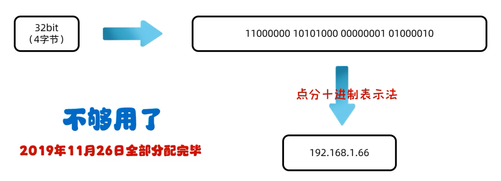
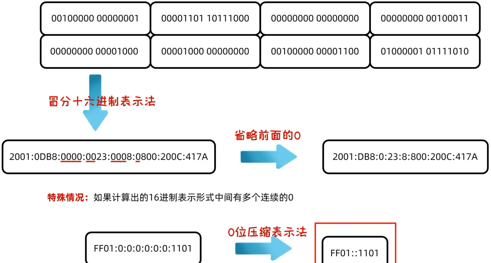
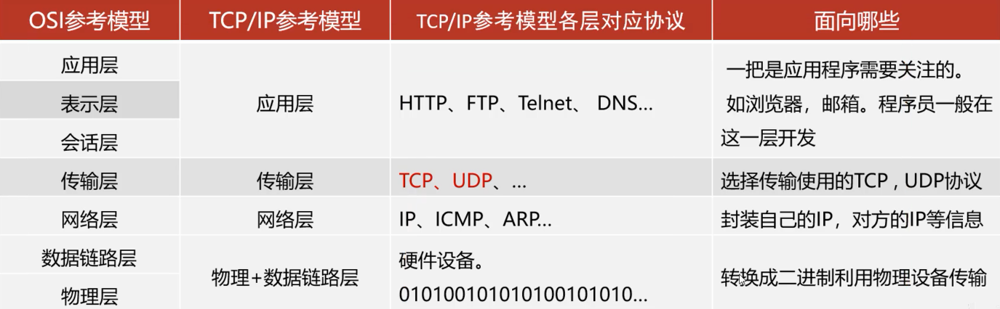
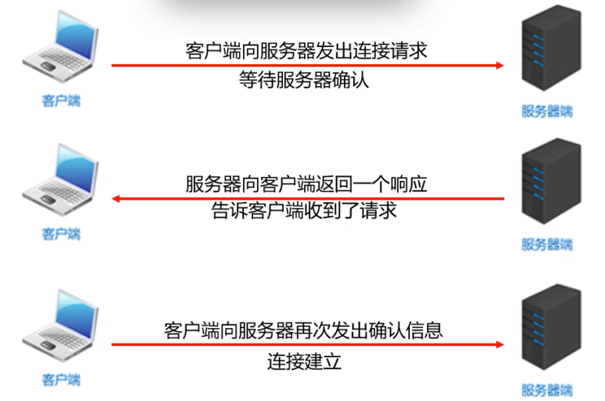
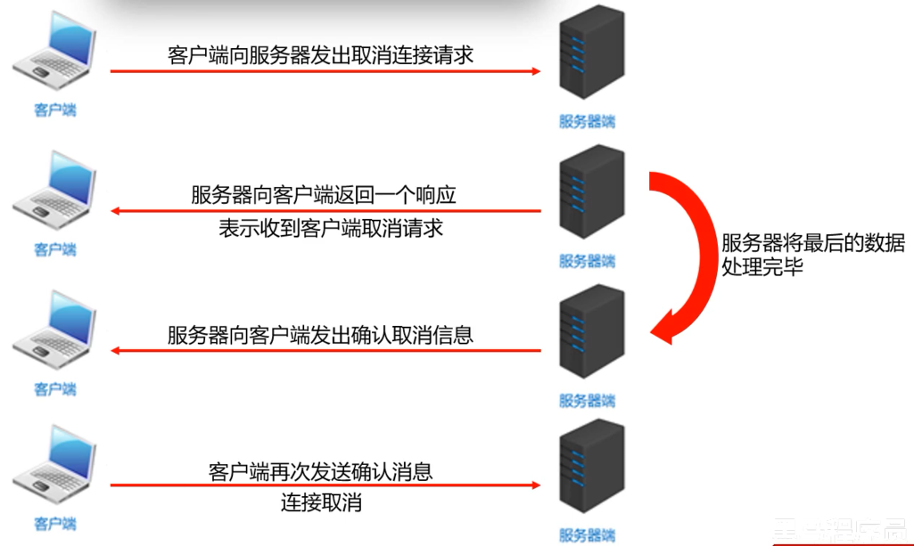

# 网络编程

> 在网路通信协议下，不同计算机上运行的程序，进行的数据传输

## 网络编程三要素

- ip：设备在网络中的地址，是唯一的标识
- 端口号：应用程序在设备中唯一的标识
- 协议：数据在网络中传输的规则，常见的协议有UDP、TCP、http、https、ftp

## ip

> 全称为Internet Protocol，是互联网协议地址，也称IP地址，常见的ip分类为IPV4，IPV6

### IPV4

> 全称为Internet Protocol version 4，互联网通信协议第四版

采用32位地址长度，分成4组



### IPV6

> 全称为Internet Protocol version 6，互联网通信协议第六版，由于互联网的蓬勃发展，IP地址的需求量愈来愈大，而IPv4的模式下IP的总数是有限的

采用128位地址长度，分成8组



MyInetAddressDemo.java

```java
import java.net.InetAddress;
import java.net.UnknownHostException;

public class MyInetAddressDemo {
    public static void main(String[] args) throws UnknownHostException {

        // 可以填主机名，也可以是ip地址，返回一个InetAddress对象
        InetAddress inetAddress = InetAddress.getByName("LAPTOP-NR9S70OA");
        System.out.println(inetAddress); // LAPTOP-NR9S70OA/192.168.138.1

        String hostName = inetAddress.getHostName();
        System.out.println(hostName); // LAPTOP-NR9S70OA

        String hostAddress = inetAddress.getHostAddress();
        System.out.println(hostAddress); // 192.168.138.1
    }
}
```

## 端口号

> 应用程序在设备中唯一标识

由两个字节表示的整数，取值范围:0~65535，其中0~1023之间的端口号用于一些知名的网络服务或者应用，一般自己使用就用1024以上的端口就可以了

## 协议

> 计算机网络中，连接和通信的规则称为网络通信协议



## UDP协议

> 用户数据报协议(User Datagram Protocol)

- 面向无连接协议，速度快，大小限制最多发送64K，数据不安全，易丢失

UDP通信程序(发送数据)

- 创建发送端的DatagramSocket对象
- 数据打包(DatagramPacket)
- 发送数据
- 释放资源

UDPSendMessageDemo.java

```java
import java.net.DatagramPacket;
import java.net.DatagramSocket;
import java.net.InetAddress;

public class UDPSendMessageDemo {
    public static void main(String[] args) throws Exception {

        // 创建发送端的DatagramSocket对象(空参会随机找一个可用的端口，也可指定端口进行数据发送)
        DatagramSocket ds = new DatagramSocket();

        // 数据打包(DatagramPacket)
        String str = "你好呀";
        byte[] bytes = str.getBytes();
        InetAddress address = InetAddress.getByName("127.0.0.1");
        // 指定发送到的端口
        int port = 2077;

        DatagramPacket dp = new DatagramPacket(bytes, bytes.length, address, port);

        // 发送数据(DatagramPacket对象)
        ds.send(dp);

        // 释放资源
        ds.close();

    }
}
```

UDP通信程序(接收数据)

- 创建接收端的DatagramSocket对象
- 接收打包好的数据
- 解析数据包
- 释放资源

UDPReceiveMessageDemo.java

```java
import java.net.DatagramPacket;
import java.net.DatagramSocket;
import java.net.InetAddress;

public class UDPReceiveMessageDemo {
    public static void main(String[] args) throws Exception {

        // 创建接收端的DatagramSocket对象(接收的端口号要和发送端发送到的端口号一致)
        int port = 2077;
        DatagramSocket ds = new DatagramSocket(port);

        // 接收打包好的数据
        byte[] bytes = new byte[1024];
        DatagramPacket dp = new DatagramPacket(bytes, bytes.length);
        ds.receive(dp);

        // 解析数据包
        byte[] data = dp.getData();
        int length = dp.getLength();
        InetAddress address = dp.getAddress();
        int port1 = dp.getPort();

        System.out.println("接收到数据" + new String(data, 0, length)); // 接收到数据你好呀
        System.out.println("该数据是从" + address + "这台电脑中的" + port1 + "这个端口发出的"); // 该数据是从/127.0.0.1这台电脑中的65217这个端口发出的

        // 释放资源
        ds.close();

    }
}
```

三种通信方式

- 单播：对点发送
- 组播：地址为224.0.0.0~ 239.255.255.255，其中224.0.0.0~224.0.0.255 为预留的组播地址，使用`MulticastSocket`对象发送
- 广播：地址为255.255.255.255，`getByName("255.255.255.255")`即代表在局域网内广播

## TCP协议

> 传输控制协议TCP(Transmission Control Protocol)

- 面向连接的通信协议，速度慢，没有大小限制，数据安全

### 三次握手



### 四次挥手



TCP通信程序(发送数据)

- 创建客户端的Socket对象(Socket)与指定服务端连接：`Socket(string host, int port)`
- 获取输出流，写数据：`Outputstream getoutputstream()`
- 释放资源：`void close()`

TCPOutStreamAccept.java

```java
import java.io.OutputStream;
import java.net.Socket;

public class TCPOutStreamAccept {
    public static void main(String[] args) throws Exception{

        // 创建Socket对象，指定IP和指定端口
        Socket socket = new Socket("127.0.0.1", 2077);

        // 从连接通道输出流
        OutputStream os = socket.getOutputStream();

        // 写入数据(默认使用utf-8)
        os.write("bb你好".getBytes());

        // 关闭资源
        os.close();
        socket.close();
    }
}
```

TCP通信程序(接收数据)

- 创建服务器端的Socket对象(ServerSocket)：`ServerSocket(int port)`
- 监听客户端连接，返回一个Socket对象：`Socket accept()`
- 获取输入流，读数据：`InputStream getInputStream()`
- 释放资源：`void close()`

TCPInputStreamClient.java

```java
import java.io.InputStream;
import java.io.InputStreamReader;
import java.net.ServerSocket;
import java.net.Socket;

public class TCPInputStreamClient {
    public static void main(String[] args) throws Exception {

        // 创建ServerSocket对象
        ServerSocket ss = new ServerSocket(2077);

        // 监听客户端的连接
        Socket socket = ss.accept();

        // 从连接通道中获取输入流读取数据
        InputStream inputStream = socket.getInputStream();
        int b;

        // 这里使用的是一次读一个字节，而中文占用三个字节，无法转化为正确的字符
//        while ((b = inputStream.read()) != -1){
//            System.out.print((char) b);
//        }

        // 使用字符流
        InputStreamReader isr = new InputStreamReader(inputStream);
        while ((b = isr.read()) != -1){
            System.out.print((char) b);
        }

        // 关闭资源
        ss.close();
        socket.close();
    }
}
```

> 使用辅助流DataOutputStream简化代码
>
> ```java
>         // 获取Socket的输出流转化为DataOutputStream对象
>         DataOutputStream outputStream = new DataOutputStream(socket.getOutputStream());
> 
>         // 写入要发送的信息
>         outputStream.writeUTF("你好Hello");
> 
> 
>         // 获取需要输入流转化为DataInputStream对象
>         DataInputStream ds = new DataInputStream(clientSocket.getInputStream());
> 
>         // 输出内容
>         System.out.println(ds.readUTF());
> ```

## 上传文件

- 服务器：接收客户端上传的文件，上传完毕之后给出反馈
- 客户端：将本地文件上传到服务器，接收服务器的反馈

TCPFileServer.java

```java
import java.io.*;
import java.net.ServerSocket;
import java.net.Socket;

public class TCPFileServer {
    public static void main(String[] args) throws Exception{
        // 服务器：接收客户端上传的文件，上传完毕之后给出反馈

        // 监听端口，等待客户端连接
        ServerSocket serverSocket = new ServerSocket(2077);

        // 获取套接字数据
        Socket accept = serverSocket.accept();

        BufferedInputStream bis = new BufferedInputStream(accept.getInputStream());
        FileOutputStream fos = new FileOutputStream("src/main/resources/img/a.png");
        BufferedOutputStream bos = new BufferedOutputStream(fos);

        byte[] bytes = new byte[1024];
        int len;
        while ((len = bis.read(bytes)) != -1){
            bos.write(bytes, 0, len);
            // 刷新缓冲区
            bos.flush();
        }

        // 回写数据
        BufferedWriter bw = new BufferedWriter(new OutputStreamWriter(accept.getOutputStream()));
        bw.write("上传成功");
        bw.newLine();
        bw.flush();

        // 关闭资源
        fos.close();
        bis.close();
        bos.close();
        bw.close();
        serverSocket.close();
    }
}
```

TCPFileClient.java

```java
import java.io.*;
import java.net.Socket;

public class TCPFileClient {
    public static void main(String[] args) throws Exception {
        // 客户端：将本地文件上传到服务器，接收服务器的反馈

        // 创建Socket对象，连接服务器
        Socket socket = new Socket("127.0.0.1", 2077);

        // 读取文件流并进行发送
        FileInputStream fis = new FileInputStream("src/main/resources/img/c99e0aab-3cb7-4eaa-80fd-f47d4ffea694.png");
        BufferedInputStream bis = new BufferedInputStream(fis);
        BufferedOutputStream bos = new BufferedOutputStream(socket.getOutputStream());

        byte[] bytes = new byte[1024];
        int len;
        while ((len = bis.read(bytes)) != -1){
            bos.write(bytes, 0, len);
            // 刷新缓冲区
            bos.flush();
        }

        // 写入结束标记
        socket.shutdownOutput();

        // 接收服务器的回写数据
        BufferedReader br = new BufferedReader(new InputStreamReader(socket.getInputStream()));
        String s = br.readLine();
        System.out.println(s);

        // 关闭资源
        fis.close();
        bis.close();
        bos.close();
        socket.close();
    }
}
```

> ```
> 上传成功
> ```