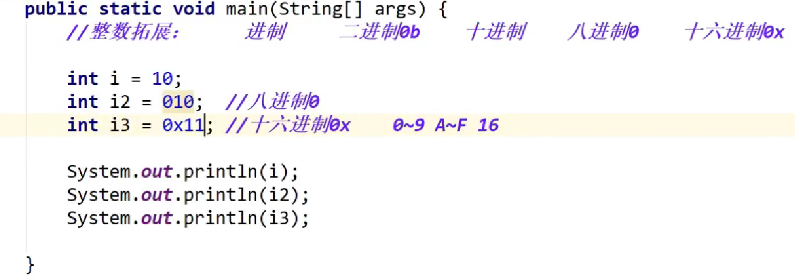
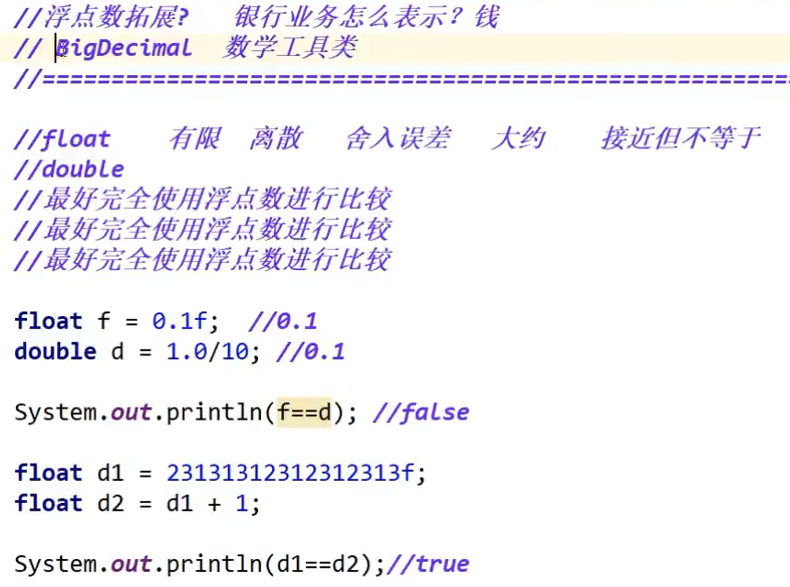
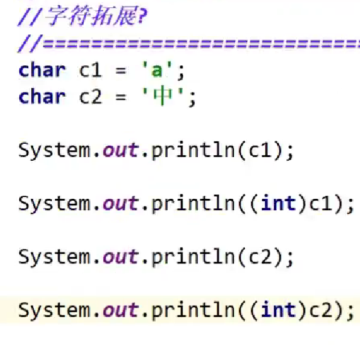
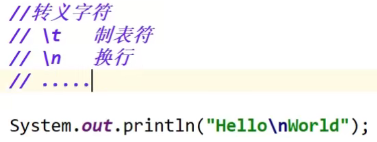

# 数据类型扩展及面试题

## 一，进制

​       运行结果为：10   8   17

## 二，浮点数

​                           **（注释处应为——最好完全避免使用浮点数进行比较）**

## 三，字符型

（int）为强制类型转化，运行结果为a  97  中  20013

**（所有字符本质还是数字，输出结果是依据对Unicode的查表（范围0~65536）进行的输出）**

## 四，转义字符

**（输出结果为：Hello**

​                           **World）**

