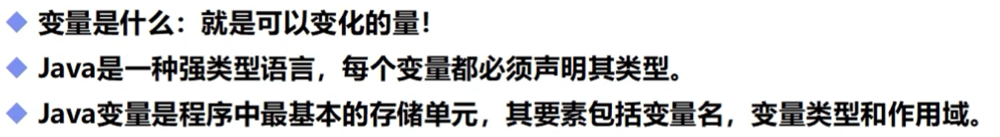
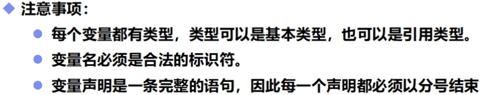
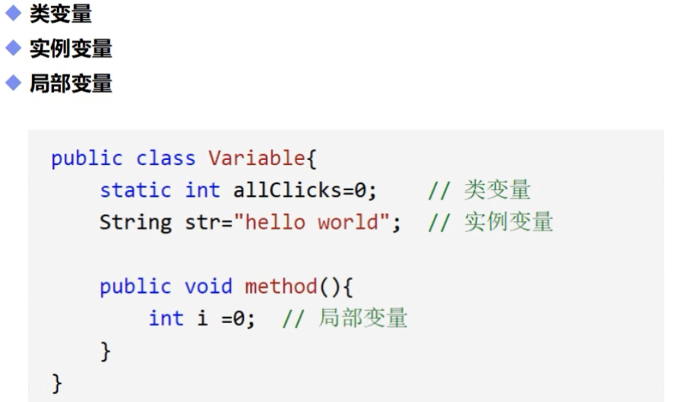
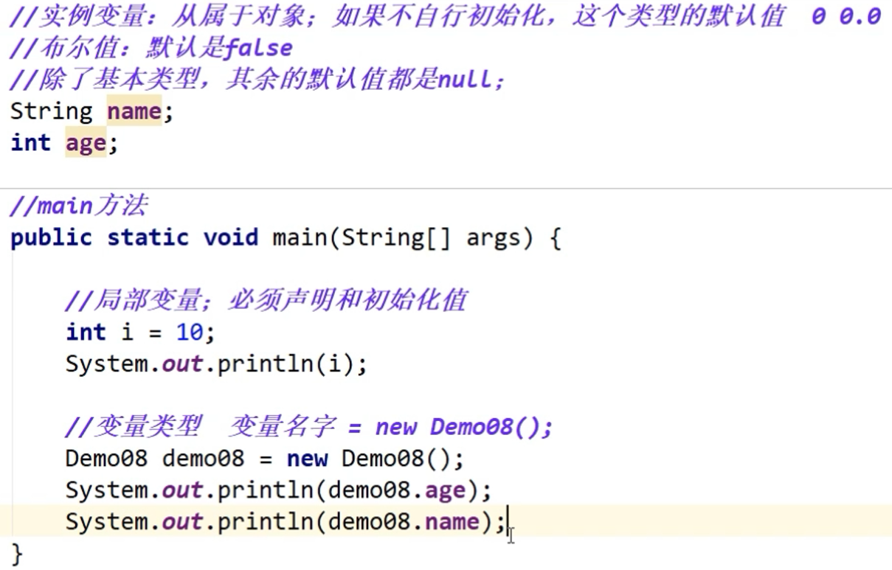
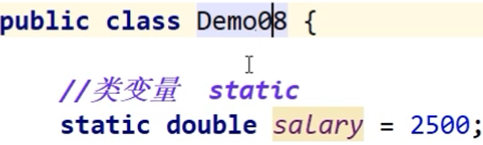
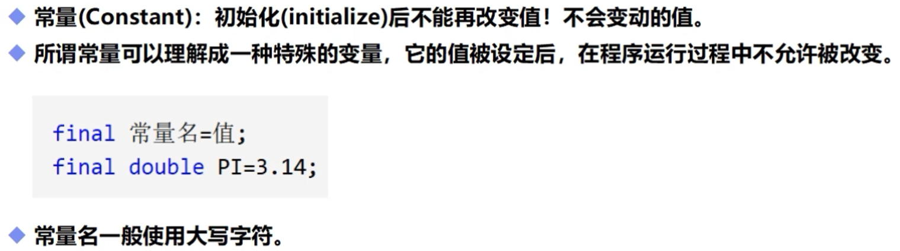
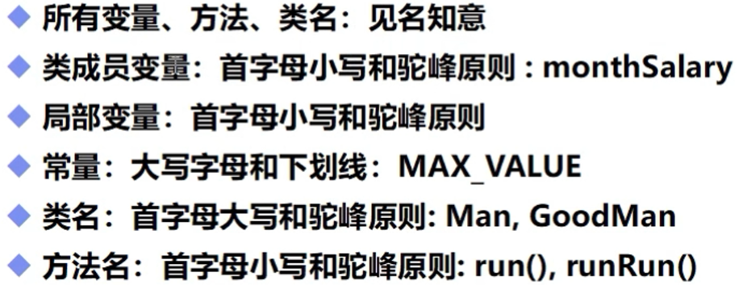

# 变量，常量，作用域和语句

## 一，变量的定义

## 二，变量的作用域

**（一大区别:实例变量有默认值，八大基本类型的默认值是0，其余为null，而局部变量需要定义值才能被使用）**

## 三，类变量

**（类变量从属于类，类变量跟随类一同出现和消失。图例中类变量static从属于类Demo08。）**

## 四，常量

## 五，变量的命名规范

## 六、语句

- **变量本身并不能单独作为语句**，需要对变量进行操作才能形成语句
- 对于方法来说，**无论方法是否有返回值**，只要满足方法要求的参数输入，**调用方法就可以作为语句**

有返回值的方法没有对返回值进行操作，**编译器会调用方法**，但是会**忽略返回的结果**
