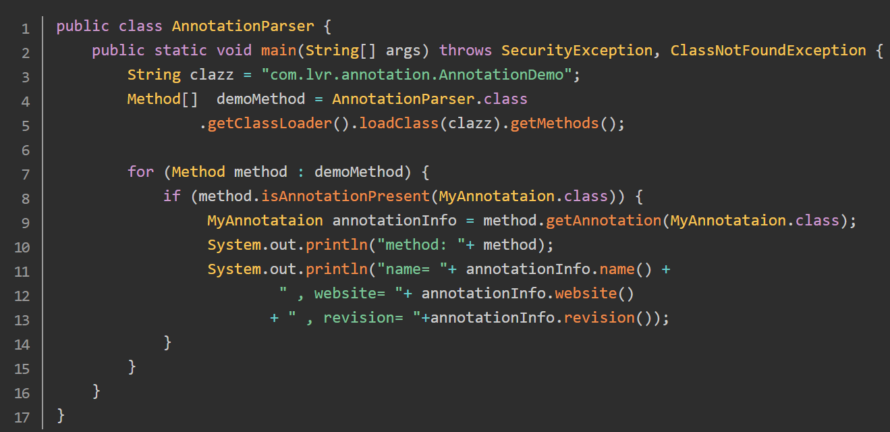

# Java注解(Annotation)

注解(Annotation)在JDK1.5之后增加的一个新特性，注解的引入意义很大，有很多非常有名的框架，比如Hibernate、Spring等框架中都大量使用注解。注解作为程序的元数据嵌入到程序。注解可以被解析工具或编译工具解析

## 内置的注解

Java 定义了一套注解，共有7个，3个在`java.lang`中，剩下4个在`java.lang.annotation`中

**作用在代码的注解是**

- @Override - 检查该方法是否是重写方法。如果发现其父类，或者是引用的接口中并没有该方法时，会报编译错误。

- @Deprecated - 标记过时方法。如果使用该方法，会报编译警告。

  

- @SuppressWarnings - 指示编译器去忽略注解中声明的警告。例如在泛型中使用原生数据类型，编译器会发出警告，当使用该注解后，则不会发出警告。

  

  

**作用在其他注解的注解(或者说元注解)是**

- @Retention - 标识这个注解怎么保存，是只在代码中，还是编入class文件中，或者是在运行时可以通过反射访问。@Retention：表示该注解类型的注解保留的时长。当注解类型声明中没有@Retention元注解，则默认保留策略为RetentionPolicy.CLASS。关于保留策略(RetentionPolicy)是枚举类型，共定义3种保留策略，如下表：

  

- @Documented - 标记这些注解是否包含在用户文档中。@Documented用户指定被该元Annotation修饰的Annotation类将会被javadoc工具提取成文档，如果定义Annotation类时使用了@Documented修饰，则所有使用该Annotation修饰的程序元素的API文档中将会包含该Annotation说明。

  

- @Target - 标记这个注解应该是哪种 Java 成员。@Target：表示该注解类型的所适用的程序元素类型。当注解类型声明中没有@Target元注解，则默认为可适用所有的程序元素。如果存在指定的@Target元注解，则编译器强制实施相应的使用限制。关于程序元素(ElementType)是枚举类型，共定义8种程序元素，如下表：

  

- @Inherited - 标记这个注解是继承于哪个注解类(默认注解并没有继承于任何子类)。@Inherited指定被它修饰的Annotation将具有继承性——如果某个类使用了@Xxx注解（定义该Annotation时使用了@Inherited修饰）修饰，则其子类将自动被@Xxx修饰。

**从 Java 7 开始，额外添加了 3 个注解**

- @SafeVarargs - Java 7 开始支持，忽略任何使用参数为泛型变量的方法或构造函数调用产生的警告。
- @FunctionalInterface - Java 8 开始支持，标识一个匿名函数或函数式接口。
- @Repeatable - Java 8 开始支持，标识某注解可以在同一个声明上使用多次。

## 自定义注解

创建自定义注解，与创建接口有几分相似，但注解需要以@开头。

**自定义注解中定义成员变量的规则：**

- 其定义是以无形参的方法形式来声明的。即：

  - 注解方法不带参数，比如name()，website()；

  - 注解方法返回值类型：基本类型、String、Enums、Annotation以及前面这些类型的数组类型

  - 注解方法可有默认值，比如default "hello"，默认website=”hello”

**当然注解中也可以不存在成员变量，在使用解析注解进行操作时，仅以是否包含该注解来进行操作。当注解中有成员变量时，若没有默认值，需要在使用注解时，指定成员变量的值。**

由于该注解的保留策略为`RetentionPolicy.RUNTIME`，故可在运行期通过反射机制来使用，否则无法通过反射机制来获取。这时候注解实现的就是元数据的第二个作用：**代码分析**。

## 注解解析

通过反射技术来解析自定义注解。关于反射类位于包`java.lang.reflect`，其中有一个接口`AnnotatedElement`，该接口主要有如下几个实现类：`Class,Constructor,Field,Method,Package`。除此之外，该接口定义了注释相关的几个核心方法，如下：

因此，当获取了某个类的Class对象，然后获取其Field,Method等对象，通过上述4个方法提取其中的注解，然后获得注解的详细信息。

