# Java语法糖

## 语法糖

语法糖（Syntactic Sugar），也称糖衣语法，是由英国计算机学家 Peter.J.Landin 发明的一个术语，指**在计算机语言中添加的某种语法，这种语法对语言的功能并没有影响，但是更方便程序员使用**。简而言之，语法糖让程序更加简洁，有更高的可读性。

## 解语法糖

语法糖的存在主要是方便开发人员使用。但其实，Java虚拟机并不支持这些语法糖。这些语法糖在编译阶段就会被还原成简单的基础语法结构，这个过程就是解语法糖。

如果需要查看源码实现过程，需要自己将java编译后的文件`.class`通过反编译程序（JAD）进行反编译

## 糖块一、switch 支持 String 与枚举

从Java 7 开始，Java语言中的语法糖在逐渐丰富，其中一个比较重要的就是Java 7中switch开始支持String。Java中的swith自身原本就支持基本类型。比如int、char等。对于int类型，直接进行数值的比较。对于char类型则是比较其ascii码。

所以，对于编译器来说，**switch中其实只能使用整型**，任何类型的比较都要转换成整型。比如byte。short，char(ackii码是整型)以及int。

那么接下来看下switch对String得支持，有以下代码：

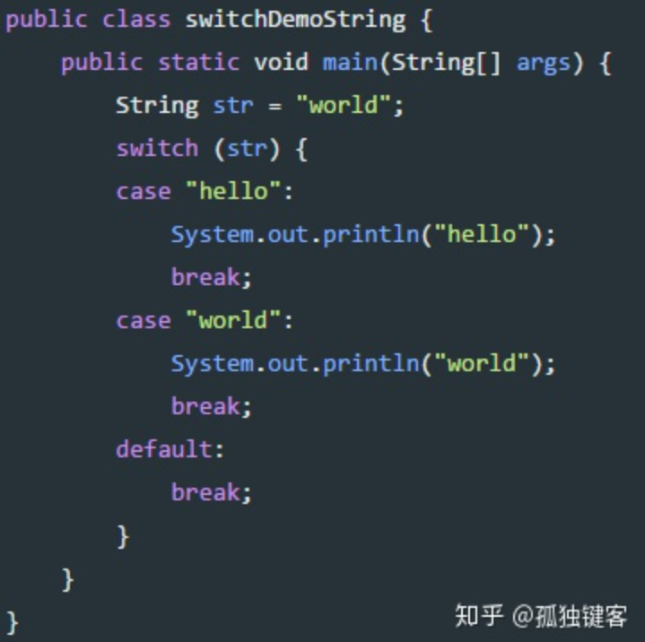

反编译后内容如下：

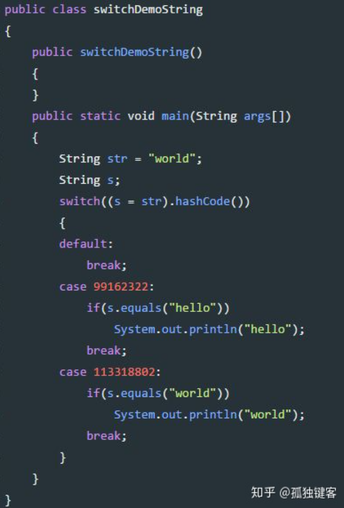

字符串的switch是通过equals()和hashCode()方法来实现的，进行switch的实际是哈希值，然后通过使用equals方法比较进行安全检查，这个检查是必要的，因为**哈希可能会发生碰撞**。因此**它的性能是不如使用枚举进行switch或者使用纯整数常量**，但这也不是很差。

## 糖块二、 泛型

很多语言都是支持泛型的，但是不同的编译器对于泛型的处理方式是不同的。

通常情况下，一个编译器处理泛型有两种方式：Code specialization和Code sharing。

- C++和C#是使用Code specialization的处理机制
- Java使用的是Code sharing的机制。

Code sharing方式为每个泛型类型创建唯一的字节码表示，并且将该泛型类型的实例都映射到这个唯一的字节码表示上。将多种泛型类形实例映射到唯一的字节码表示是通过类型擦除（type erasue）实现的。

对于Java虚拟机来说，它根本不认识Map<String, String> map这样的语法。需要在编译阶段通过类型擦除的方式进行解语法糖。

类型擦除的主要过程如下：

- 1.将所有的泛型参数用其最左边界（最顶级的父类型）类型替换。
- 2.移除所有的类型参数。

以下代码：

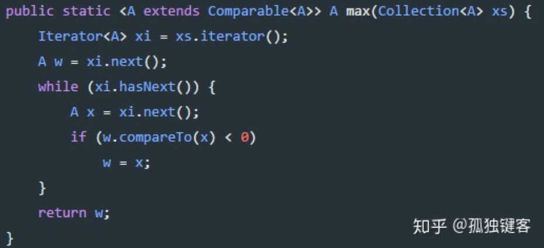

类型擦除之后会变成：

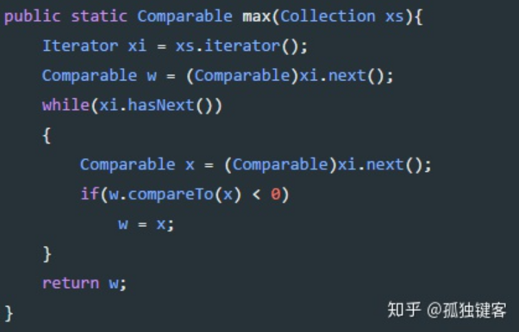

虚拟机中没有泛型，只有普通类和普通方法，所有泛型类的类型参数在编译时都会被擦除，**泛型类并没有自己独有的Class类对象**。比如并不存在`List<String>.class`或是`List<Integer>.class`，而只有List.class。

## 糖块三、 自动装箱与拆箱

自动装箱就是Java自动**将原始类型值转换成对应的对象**，比如将int的变量转换成Integer对象，这个过程叫做装箱，反之将Integer对象转换成int类型值，这个过程叫做拆箱。因为这里的装箱和拆箱是自动进行的非人为转换，所以就称作为自动装箱和拆箱。

原始类型byte, short, char, int, long, float, double 和 boolean 对应的封装类为Byte, Short, Character, Integer, Long, Float, Double, Boolean。

自动装箱的代码：

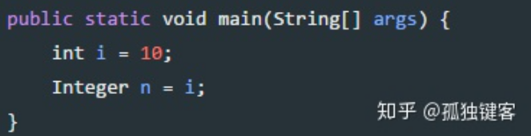

反编译后代码如下：

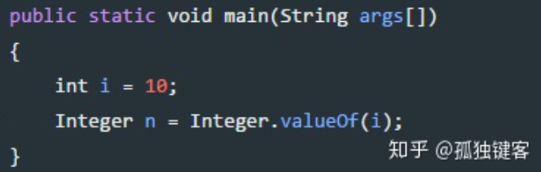

自动拆箱的代码：

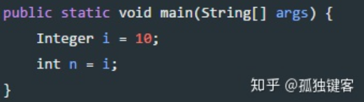

反编译后代码如下：

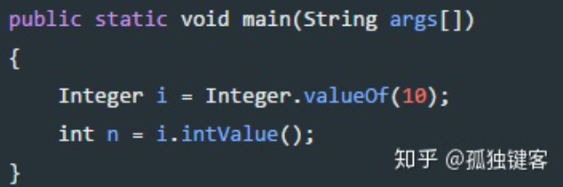

从反编译得到内容可以看出，在装箱的时候自动调用的是Integer的`valueOf(int)`方法。而在拆箱的时候自动调用的是Integer的`intValue`方法。

**装箱过程是通过调用包装器的`valueOf`方法实现**的，而**拆箱过程是通过调用包装器的`xxxValue`方法实现**的

## 糖块四 、 方法变长参数

可变参数(variable arguments)是在Java 1.5中引入的一个特性。它允许一个方法把任意数量的值作为参数。

以下代码：

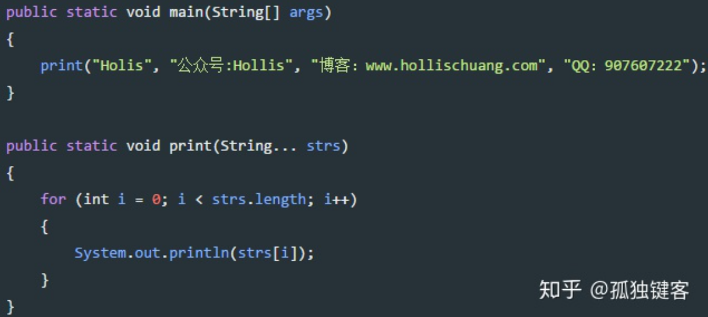

反编译后代码：

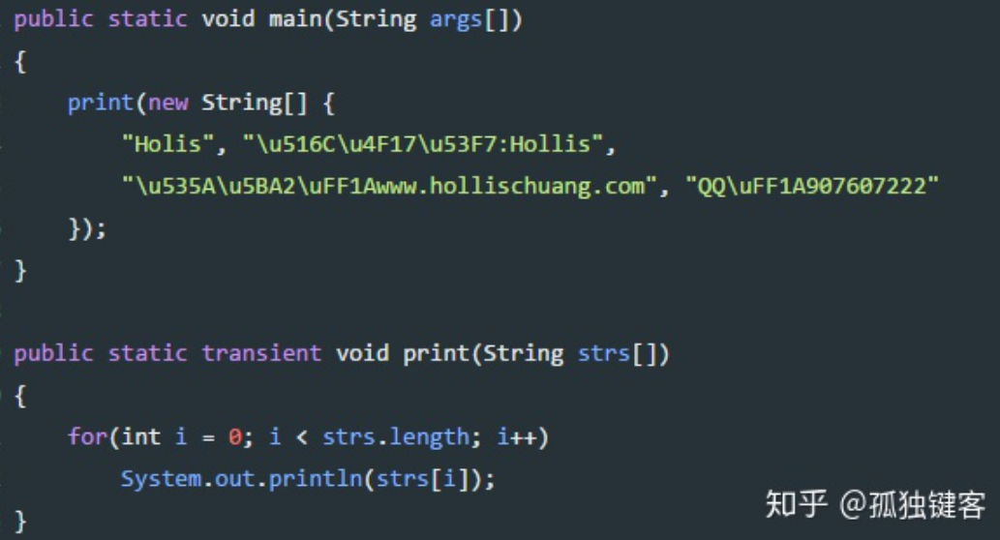

从反编译后代码可以看出，可变参数在被使用的时候，它首先会**创建一个数组**，数组的长度就是调用该方法是传递的实参的个数，然后再把参数值全部放到这个数组当中，然后再把这个数组作为参数传递到被调用的方法中。

## 糖块五 、 枚举

Java SE5提供了一种新的类型-Java的枚举类型，**关键字enum可以将一组具名的值的有限集合创建为一种新的类型**，而这些具名的值可以作为常规的程序组件使用。enum就和class一样，只是一个关键字，它并不是一个类。

以下代码：

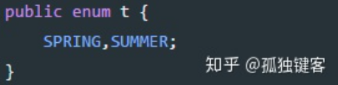

反编译后代码：

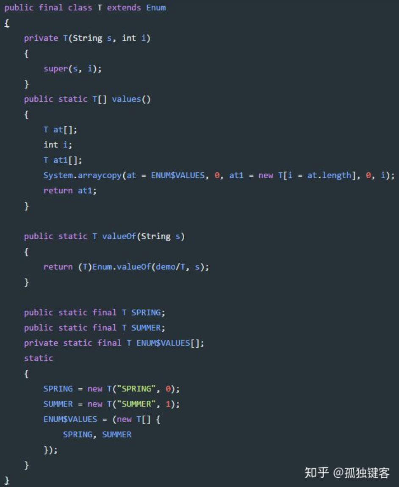

反编译后的代码可以看到`public final class T extends Enum`，说明该类是继承了Enum类的，同时**final关键字也决定了这个类也是不能被继承的**。当enmu来定义一个枚举类型的时候，编译器会自动创建一个final类型的类继承Enum类，所以枚举类型不能被继承。

## 糖块六 、 内部类

内部类又称为嵌套类，可以把内部类理解为外部类的一个普通成员。内部类之所以也是语法糖，是因为它仅仅是一个编译时的概念。

outer.java里面定义了一个内部类inner，一旦编译成功，就会生成两个完全不同的.class文件了，分别是`outer.class`和`outer$inner.class`。所以**内部类的名字完全可以和它的外部类名字相同**

以下代码：

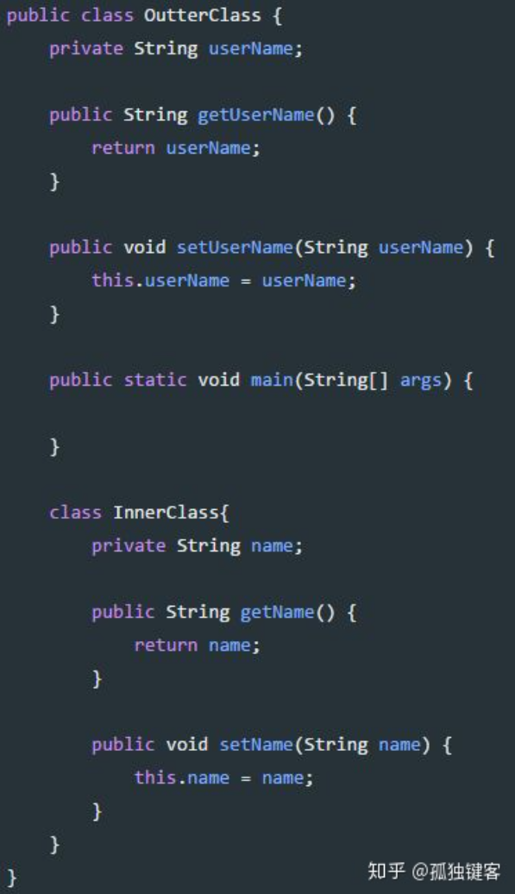

以上代码编译后会生成两个class文件：`OutterClass$InnerClass.class` 、`OutterClass.class `

使用jad对`OutterClass.class`文件进行反编译的时候，命令行会打印以下内容：

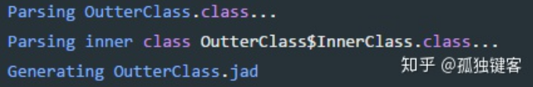

它会把两个文件全部进行反编译，然后一起生成一个OutterClass.jad文件。

反编译后代码如下：

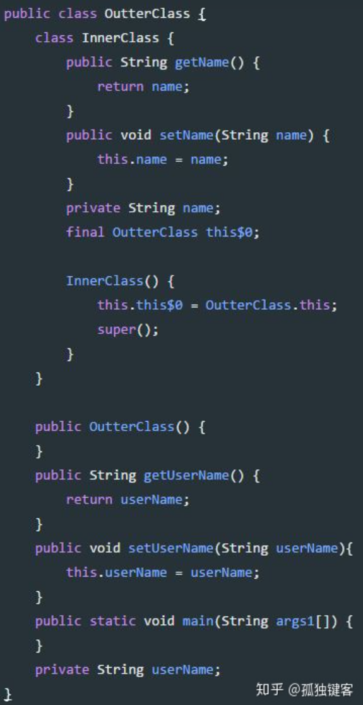

## 糖块七 、条件编译

—般情况下，程序中的每一行代码都要参加编译。但有时候出于对程序代码优化的考虑，希望只对其中一部分内容进行编译，此时就需要在程序中加上条件，让编译器只对满足条件的代码进行编译，将不满足条件的代码舍弃，这就是条件编译。如在C或CPP中，可以通过**预处理语句来实现条件编译**。其实在Java中也可实现条件编译。

以下代码：

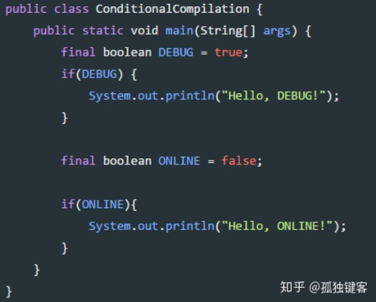

反编译后代码如下：

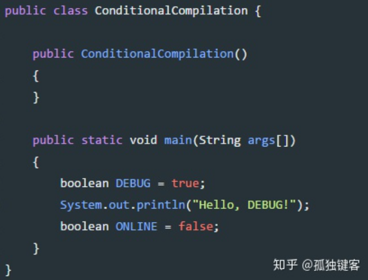

在反编译后的代码中没有`System.out.println("Hello, ONLINE!");`，这其实就是条件编译。当`if(ONLINE)`为false的时候，编译器就没有对其内的代码进行编译。

Java语法的条件编译，是**通过判断条件为常量的if语句实现的**。根据if判断条件的真假，编译器直接把分支为false的代码块消除。通过该方式实现的条件编译，必须在方法体内实现，而无法在正整个Java类的结构或者类的属性上进行条件编译。这与C/C++的条件编译相比，确实更有局限性。在Java语言设计之初并没有引入条件编译的功能，虽有局限，但是总比没有更强。

## 糖块八 、 断言

在Java中，assert关键字是从JAVA SE 1.4 引入的，为了避免和老版本的Java代码中使用了assert关键字导致错误，Java在执行的时候默认是不启动断言检查的（这个时候，所有的断言语句都将忽略！）。如果要开启断言检查，则需要用开关`-enableassertions`或`-ea`来开启。

以下代码：

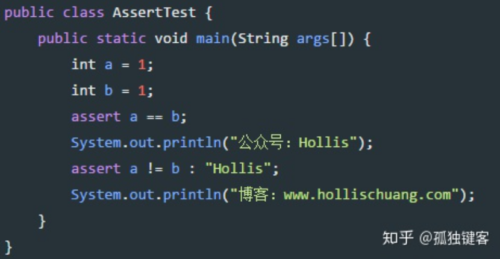

反编译后代码如下：

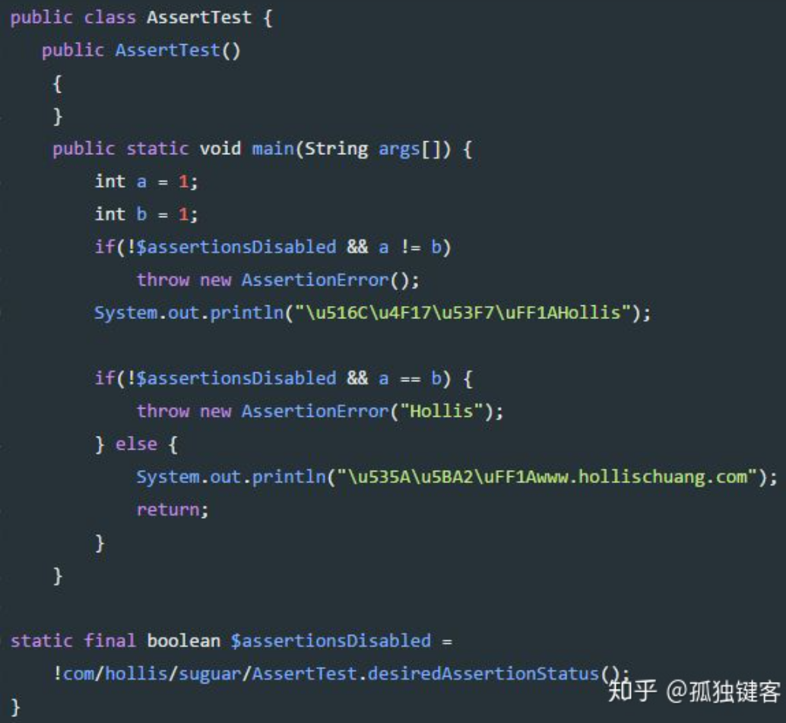

反编译之后的代码会复杂的多。使用assert这个语法糖可以节省了很多代码。断言的底层实现就是if语言，在**开启-ea开关**后，如果**断言结果为true，则程序继续执行**，如果断言结果为false，则程序抛出**AssertError**来打断程序的执行。

`-enableassertions`会设置`$assertionsDisabled`字段的值。

## 糖块九 、 数值字面量

在java 7中，数值字面量，不管是整数还是浮点数，都允许在数字之间插入任意多个下划线。这些下划线不会对字面量的数值产生影响，目的就是方便阅读。

以下代码：

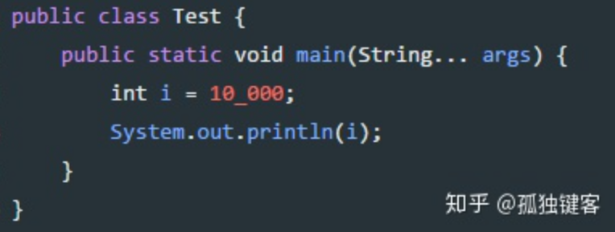

反编译后代码如下：

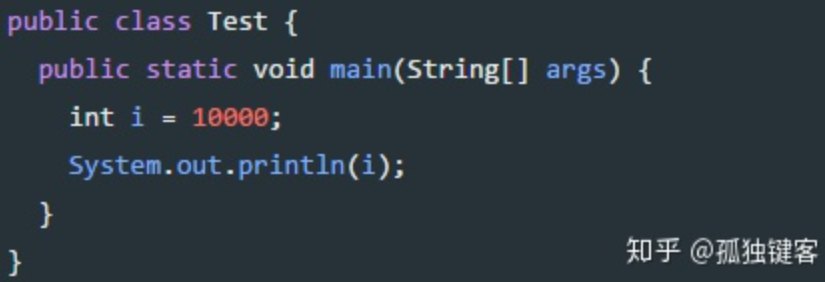

反编译后就是把`_`删除了。也就是说编译器并不认识在数字字面量中的`_`，需要在编译阶段把他去掉。

## 糖块十 、 for-each

增强for循环（for-each）在日常开发经常会用到的，它会比for循环要少写很多代码。

以下代码：

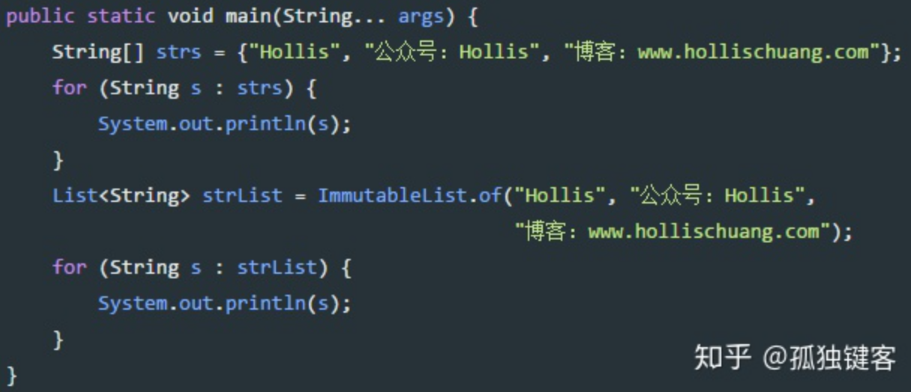

反编译后代码如下：

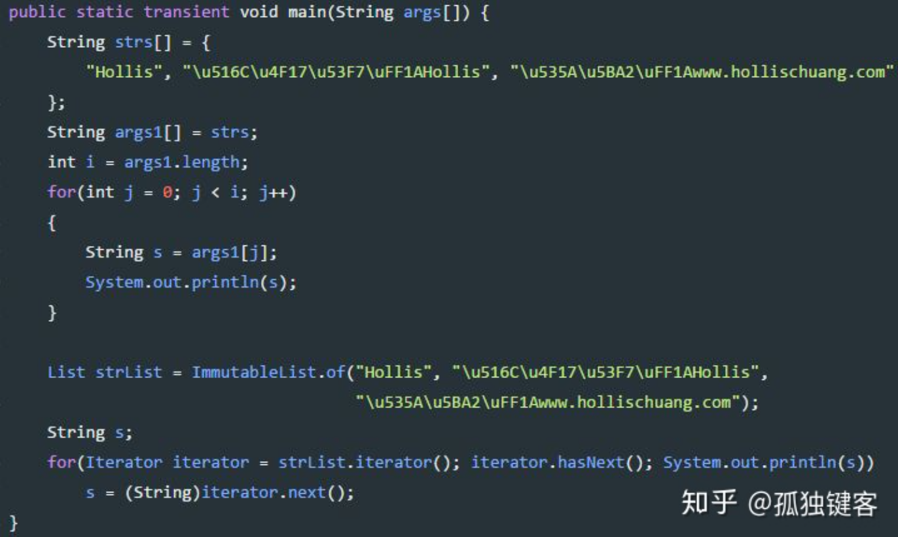

代码很简单，for-each的实现原理其实就是使用了普通的for循环和迭代器。

## 糖块十一 、 try-with-resource

Java里，对于文件操作IO流、数据库连接等开销非常昂贵的资源，用完之后必须及时通过close方法将其关闭，否则资源会一直处于打开状态，可能会导致内存泄露等问题。关闭资源的常用方式就是在finally块里是释放，即调用close方法。

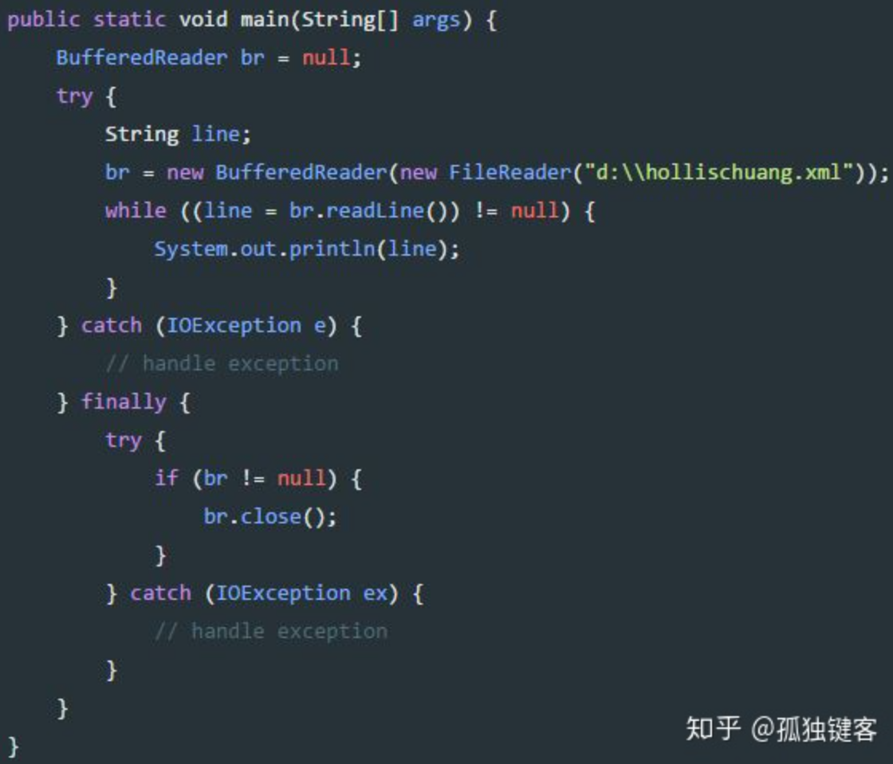

从Java 7开始，jdk提供了一种更好的方式关闭资源，使用try-with-resources语句，改写一下上面的代码，代码如下：

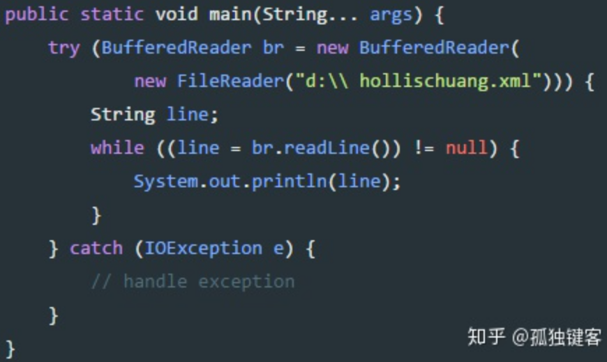

这样的写法大大减少了代码量，反编译后代码如下：

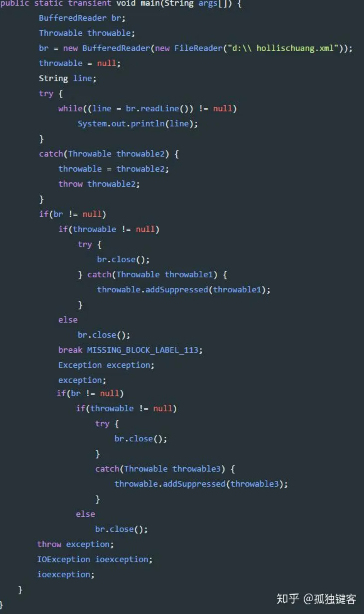

没有做的关闭资源操作，由编译器做了，语法糖的作用就是方便程序员的使用，但最终还是要转成编译器认识的语言。

## 糖块十二、Lambda表达式

Lambda 表达式，也可称为闭包，它是推动 Java 8 发布的最重要新特性，Lambda 允许把函数作为一个方法的参数（函数作为参数传递进方法中），使用 Lambda 表达式可以使代码变的更加简洁紧凑。**Labmda表达式不是匿名内部类的语法糖**，但是它也是一个语法糖。实现方式其实是依赖了几个JVM底层提供的lambda相关api。

以下代码是通过lambda表达式来遍历一个list：

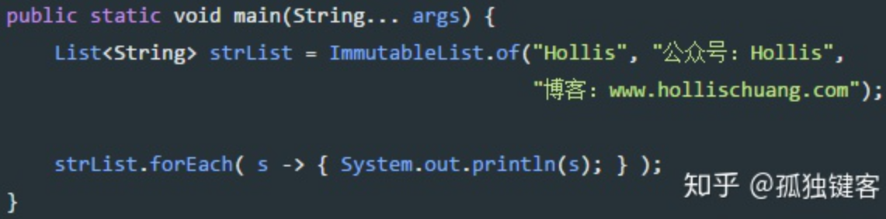

Lambda不是内部类的语法糖，内部类在编译之后会有两个class文件，但是，包含lambda表达式的类编译后只有一个文件。

反编译后代码如下：

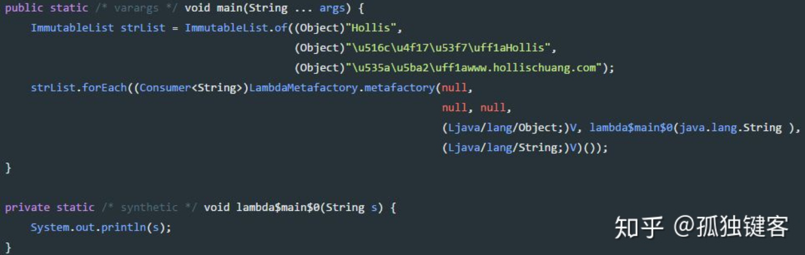

在forEach方法中，其实是调用了`java.lang.invoke.LambdaMetafactory#metafactory`方法，该方法的第四个参数`implMethod`指定了方法实现。可以看到这里其实是调用了一个`lambda$main$0`方法进行了输出。

再使用Lambda对List进行过滤，然后再输出：

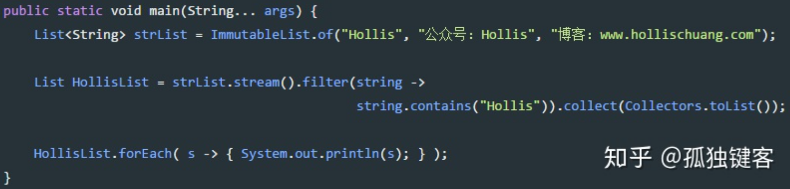

反编译后代码如下：

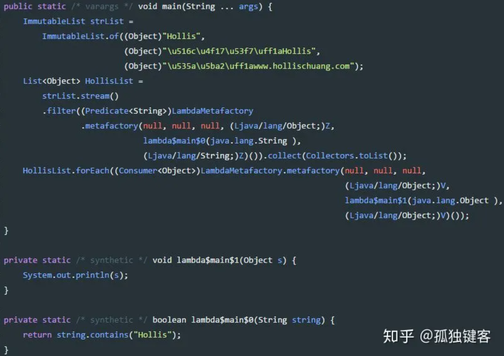

两个lambda表达式分别调用了`lambda$main$1`和`lambda$main$0`两个方法。所以，**lambda表达式的实现其实是依赖了一些底层的api**，在编译阶段，编译器会把lambda表达式进行解糖，转换成调用内部api的方式。

## 一些值得注意的地方

### 泛型——当泛型遇到重载

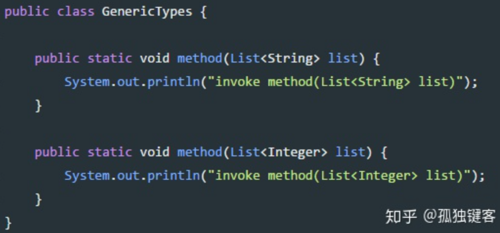

上面这段代码，有两个重载的函数，因为它们的参数类型不同，一个是`List<String>`另一个是`List<Integer>`，但是，这段代码是编译通不过的。参数类型编译之后都被擦除了，变成了一样的原生类型List，擦除动作导致这两个方法的特征签名变得一模一样。

### 泛型——当泛型遇到catch

泛型的类型参数不能用在Java异常处理的catch语句中。因为异常处理是由JVM在运行时刻来进行的。由于类型信息被擦除，JVM是无法区分两个异常类型`MyException<String>`和`MyException<Integer>`的

### 泛型——当泛型内包含静态变量

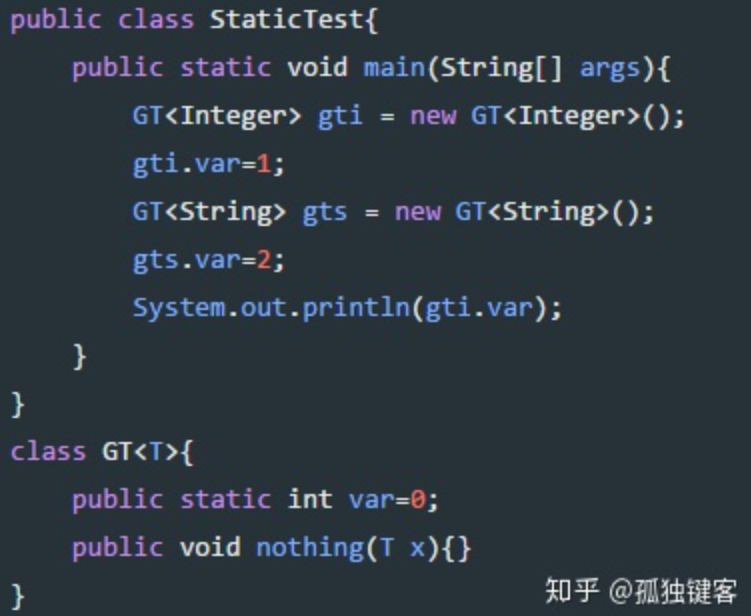

以上代码输出结果为：2。由于经过类型擦除，所有的泛型类实例都关联到同一份字节码上，泛型类的所有静态变量是共享的。

### 自动装箱与拆箱——对象相等比较

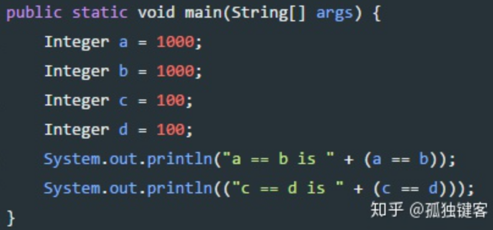

输出结果：

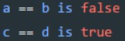

在Java 5中，在Integer的操作上引入了一个新功能来节省内存和提高性能。**整型对象通过使用相同的对象引用实现了缓存和重用**，适用于整数值区间-128 至 +127。只适用于自动装箱，使用构造函数创建对象不适用。

### 增强for循环

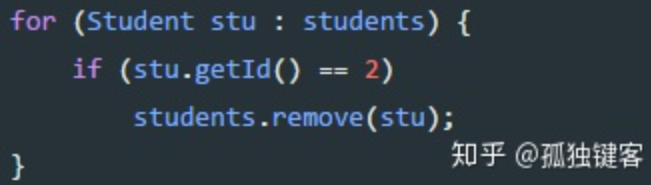

**会抛出ConcurrentModificationException异常**。Iterator是工作在一个独立的线程中，并且拥有一个 mutex 锁。Iterator被创建之后会建立一个指向原来对象的单链索引表，当原来的对象数量发生变化时，这个索引表的内容不会同步改变，所以当索引指针往后移动的时候就找不到要迭代的对象，所以按照`fail-fast`原则，Iterator 会马上抛出`java.util.ConcurrentModificationException`异常。Iterator 在工作的时候是不允许被迭代的对象被改变的。但可以使用 Iterator 本身的方法remove()来删除对象，`Iterator.remove() `方法会在删除当前迭代对象的同时维护索引的一致性。