# JS概述

## WEB标准

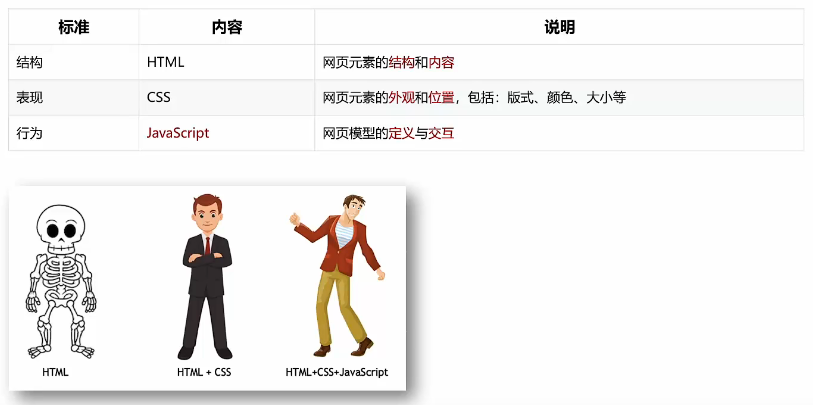

## JavaScript概念

JavaScript是一种运行在客户端（浏览器）的编程语言，实现人机交互效果

作用：

- 网页特征：监听用户的一些行为让网页做出对应的反馈
- 表单验证：针对表单数据的合法性进行判断
- 数据交互：获取后台数据，渲染到前端
- 服务器编程（node.js）

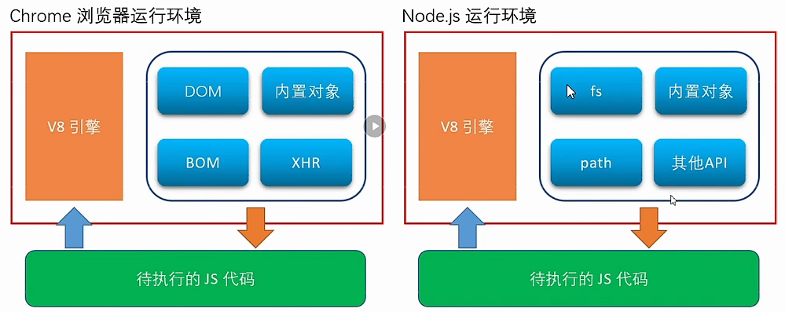

## JavaScript组成

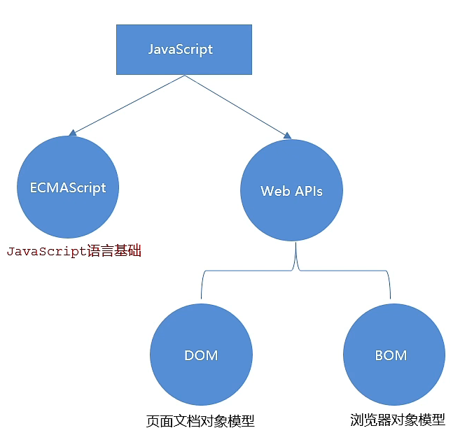

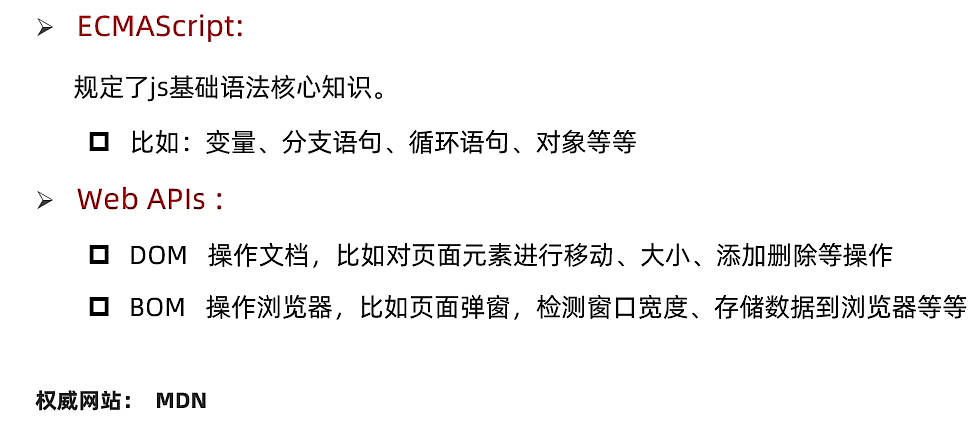

## JavaScript书写位置

## script标签位置

一般放置的位置：`<head>标签内，<body>标签内，<body>标签后`

- `<head>标签内：外部引入的js文件，或者不涉及页面元素操作的js代码块`
- `<body>标签内：放哪都行，只要保证放在操作元素下面就行，但是如果需要自执行js就需要放在这里面`
- `<body>标签后：可以是外部引入文件也可以是对样式操作的js代码，实际与放<body>标签内一样，但是从HTML 2.0起放在body闭标签之后就是不合标准的`

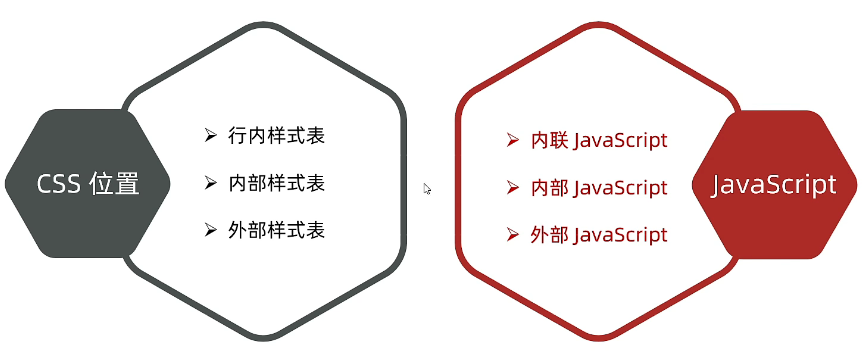

### 内部JavaScript

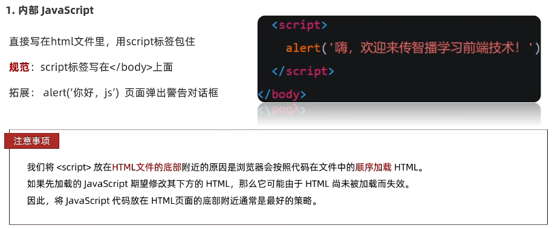

### 外部JavaScript

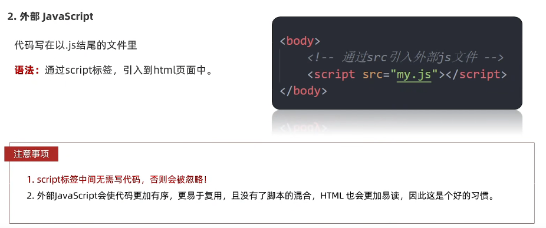

### 内联JavaScript

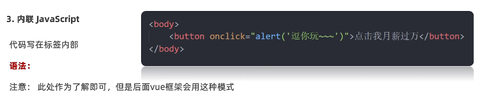

## JavaScript注释

- 单行注释：//
- 多行注释：/**/

## JavaScript结束符

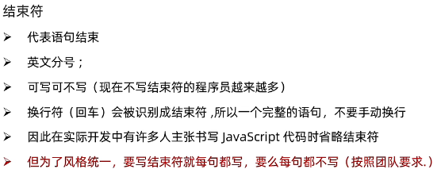

## JavaScript输入输出语法

输入和输出也可以理解为人和计算机的交互，用户通过键盘、鼠标等向计算机输入信息，计算机处理后再展示给用户，这便是一次输入和输出的过程

### 输出语法：

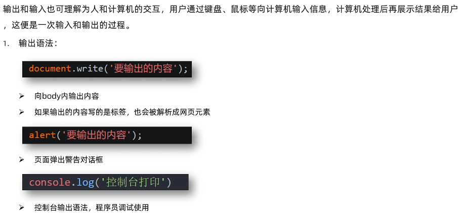

注意：控制台输出语法的需要使用浏览器的"检查"，在控制台查看

### 输入语法：

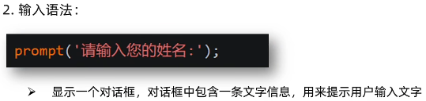

对话框和alter弹出的对话框为相同类型，不过多个一个输入框

## 字面量

在计算机科学中，字面量是在计算机中描述 事/物。例如：工资10000，10000是数字字面量，'黑马程序员'字符串字面量，还有[]数组字面量，{}对象字面量。

## 术语

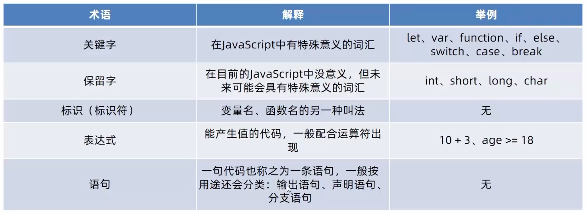