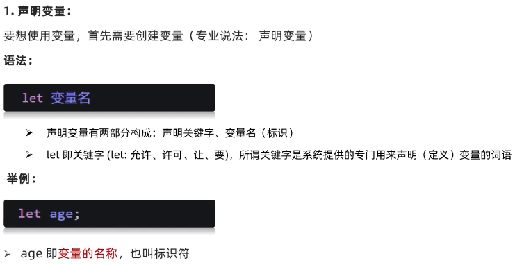
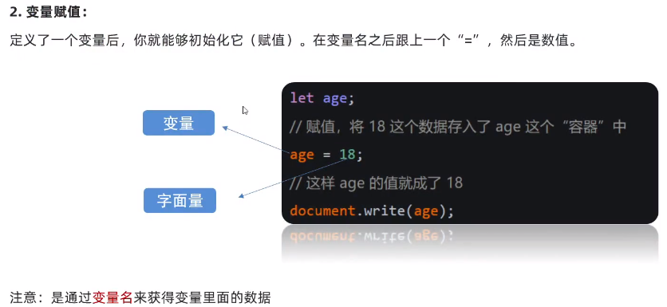
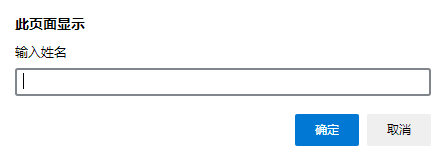
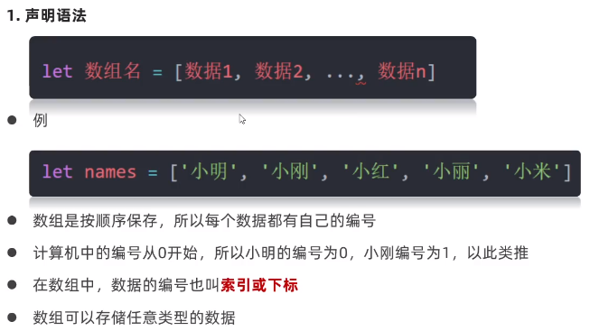
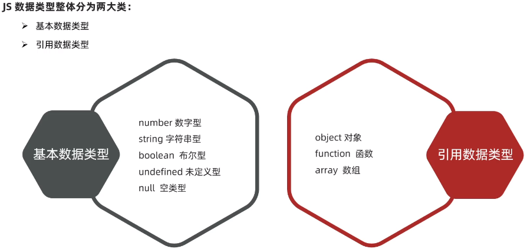
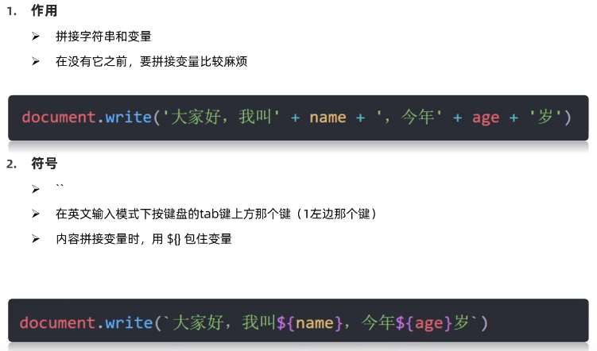
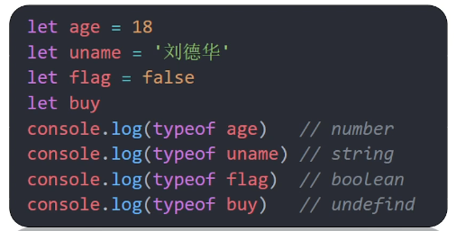
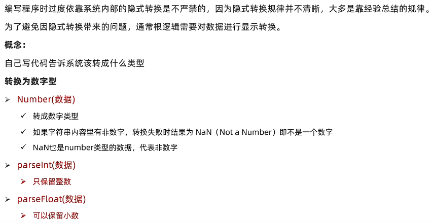
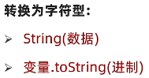
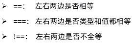

# 基础知识

## 变量

变量是计算机中用来存储数据的“容器”



 

```html
	<script>
		let name = prompt("输入姓名")
		document.write(name)
	</script>
```



## 数组



注意：数组变量不用加"[]"，且可以存储任意数据类型，取值方式与其他语言保持一致。数组名.length为数组长度。

## 数据类型



注意：

- JS为弱数据类型，变量属于哪种类型，只有赋值之后才能确认，未赋值之前为**未定义类型(undefined)**（可以通过检测变量类型确定有没有值传递过来）
- 单引号('')、双引号("")、反引号(`)包裹的数据都叫字符串

### 模板字符串



**支持换行输入**

## 数据类型检测



注意：**type null为Object类型(对象)**

## 数据类型转换



```js
    Number("21.1")
    parseInt("21.1")	//=>21
    parseFloat("21.1")	//=>21.1
```



```js
    String(21.1)
    "21.1".toString()
```

> valueOf()函数用于返回指定对象的原始值
>
> ```js
>     let a = 21.1
>     console.log(a.valueOf())
> ```

> 关于布尔类型的转换，除了**false，数值0，''，undefined，null，NaN**的转换结果为false，其余都为true
>
> ```js
> 	console.log(Boolean(0))	//=>false
> 	console.log(null == undefined) //=> true：因为两个在比较时都会转换为布尔值，所以这两个值会被判定为相等
> ```

## 运算符

### 比较运算符



```js
    5=='5'	//ture
    5==='5'	//false(重点使用这个)
    5!=='5'	//ture
    //NaN不等于任何值，包括本身
```

### 逻辑运算符

有五个值是当false来看的：**false，数值0，''，undefined，null**

## 三元运算符


## NaN和Infinity

NaN用于指示某个值不是数字

可以通过`isNaN()`方法来判断值是否为NaN，如果通过`NaN === NaN; `来判断，结果为false

> Infinity（比其他任何数字都大的数字）和 NaN（表示"Not A Number"概念）
>
> 当把缺少的属性或返回 undefined 的函数用作算术运算中的值时，将生成 “Not A Number”，亦或是将非数字的字符串转换为数字时
>
> 对于一些非法数学运算结果，例如：1/0，返回结果为Infinity，正无穷`Infinity === Infinity`对比结果和负无穷对比`-Infinity === -Infinity`结果都为true

## 字符串字面量

在ES6及之后的版本中，字符串字面量可以用反引号来定界

```js
    let S = `hello world`;
```

模板字面量可以包含任意 JavaScript表达式。反引号中字符串字面量最终值的计算，涉及对其中包含的所有表达式求值、将这些表达式的值转换为字符串，然后再把这些字符串与反引号中的字面量组合：

```js
        let name = "Bill";
        let greeting = `Hello ${name}`	// greeting == "Hello Bill"
        console.log(greeting)
```

