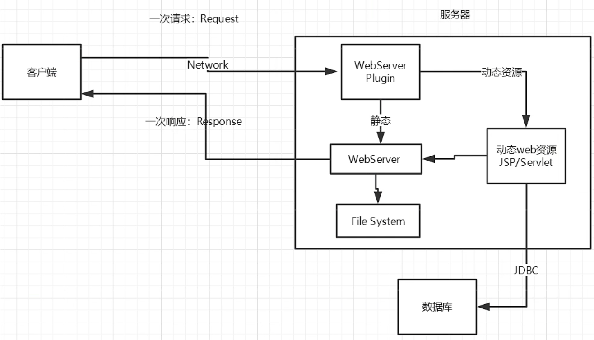

# JavaWeb

## 基本概念

- 静态网页：HTML，CSS。提供给所有人看的数据始终不会发生变化
- 动态网页：Servlet/JSP，ASP，PHP

Java中，动态web资源开发的技术统称为JavaWeb

- 静态web的特点：Web页面无法动态更新，所有用户都是一个界面，无法与数据库交互
- 动态web的特点：可以实现静态web不能实现的功能，如果加入服务器的动态web资源出现了错误，需要重新编写后台程序，重新发布

## web服务器

### 技术

- ASP：微软，国内最早流行的就是ASP，C#语言，在HTML中嵌入了VB的脚本，在开发中页面容易混乱，维护成本高
- php：开发速度很快，功能很轻大，跨平台，代码很简单，70%以上的web采用php，但是无法承载大访问量的情况
- JSP/Servlet：sun公司主推的B/S架构，基于Java语言，所有的大公司，或者一些开源的组件，都是Java写的，可以承载高并发、高可用、高性能带来的影响，语法像ASP

### 服务器

服务器是一种被动的操作，用来处理用户的一些请求和给用户一些响应信息

- IIS：微软，和ASP相关，Windows中自带的
- Tomcat：和ISS一样具有处理静态HTML的功能，另外它还是一个Servlet和JSP容器

**（IDEA和Tomcat的配置word文档中都有写，注意的是记得导入包，否则一些方法将不可用）**

